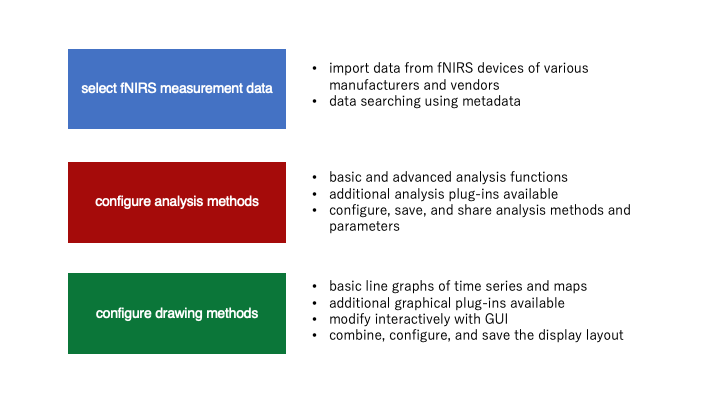

# Overview of Open PoTATo

[Open PoTATo Document List](index.md)

<!-- TOC -->

- [Overview of Open PoTATo](#overview-of-open-potato)
    - [What is Open PoTATo?](#what-is-open-potato)
    - [How to start](#how-to-start)
    - [Overview of analysis](#overview-of-analysis)
    - [Usage requirements](#usage-requirements)

<!-- /TOC -->

## What is Open PoTATo?

Open PoTATo is software for fNIRS users that provides an integrated data analysis environment.

Users can use Open PoTATo to select fNIRS measurement data, configure analysis methods, configure drawing methods, and perform analysis. The following functions are offered for each of these items.

Plug-ins for importing data into Open PoTATo are provided by the manufacturers and vendors of fNIRS devices. Imported data can be searched by metadata associated with experimental data, such as age or sex. Metadata can be added in text form. Special searches can be performed using added metadata, such as searching for “students with scores of 80 or higher.”

For analysis, it offers basic functions such as band pass filters, baseline correction, and moving averages, as well as body motion checking, etc. Analysis methods can also be added in the form of plug-ins. Generally speaking, signal analysis procedures consist of combinations of analysis methods. Appropriate parameters must be configured for the type of data used by each analysis method. Open PoTATo can be used to configure and save these analysis methods and parameters, speedily perform analysis, and share analysis methods.

Analysis results can be displayed, for example, in the form of line graphs of changes in hemoglobin concentration over time, maps, etc. The GUI can be used to interactively change the content displayed in figures (vertical axes, horizontal axes, color bars, etc.). Open PoTATo offers numerous display methods. These display methods can also be combined, configured, and saved as layouts.

Open PoTATo’s functionality can also be extended by adding analysis and display functions (plug-ins). By offering the ability to extend its functions, Open PoTATo seeks to provide the ability to use the latest methods and perform analyses tailored to diverse usage applications.

## How to start

Install Open PoTATo as indicated in the installation manual, and launch it as indicated in the “Basic operation” section of the manual.

The “Step guide” contains examples of typical analysis.

“Basic operation” contains basic operation methods used by all functions. “Normal-Mode” is used for basic operation methods, while “Research-Mode” is used for more detailed analysis.

## Overview of analysis

With Open PoTATo, users perform analysis by selecting the data to be analyzed, the analysis methods to use, and the drawing methods used to show the results. The data that indicates the analysis methods to use is called a “recipe,” while the data that indicates the drawing methods is called a “layout.” Recipes and layouts can be saved independently. This makes it easy to apply the same analysis and drawing methods to other data and to share analysis methods.

Open PoTATo has three modes: Normal, Research, and Developers.

In Normal mode, users can perform data analysis with a single click by selecting analysis methods (recipes) and display methods (layouts) created in advance.

In Research mode, users can freely create recipes by combining multiple analysis methods. They can also add new analysis methods (plug-ins).

Developers mode is for use by developers, and allows them to create their own new analysis method plugins. This enables analysis with analysis procedures that are not available in Normal or Research mode. Detailed analysis methods are indicated in the FAQ.

## Usage requirements

Always check the following before using Open PoTATo.

- Open PoTATo is a released under an MIT license.

- MATLAB, software from The MathWorks, Inc., is required to use Open PoTATo.

- The following toolboxes are necessary to use some Open PoTATo functions.

  - Signal processing Toolbox

  - Statistics and Machine Learning Toolbox 

  - Wavelet Toolbox

- Check the [MathWorks website](https://jp.mathworks.com/support/requirements/matlab-system-requirements.html) for computer requirements for MATLAB usage.

- This software was developed using MATLAB2018a. It may not function with other MATLAB versions.

