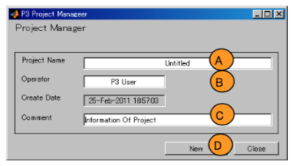
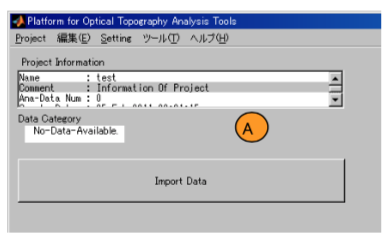
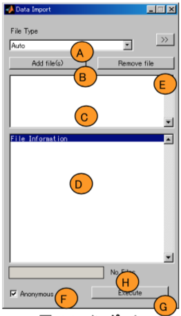
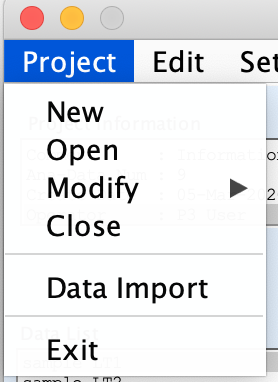
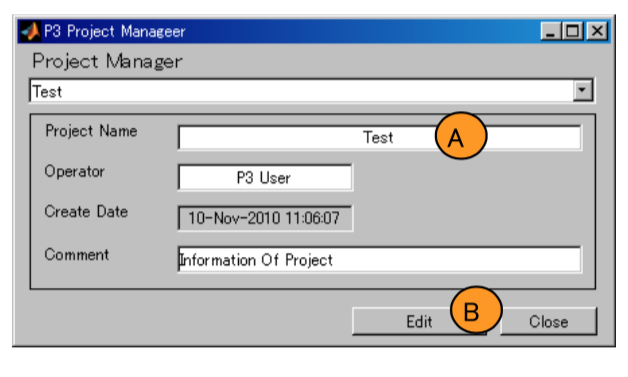
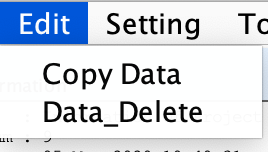
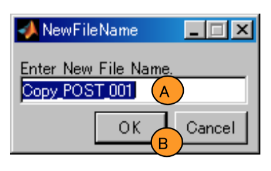
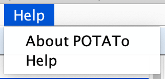

# Basic operation

[Open PoTATo Document List](index.md)

<!-- TOC -->

- [Basic operation](#basic-operation)
- [Overview](#overview)
    - [Analysis mode](#analysis-mode)
    - [Startup and shutdown](#startup-and-shutdown)
- [Open PoTATo data](#open-potato-data)
    - [Experimental data](#experimental-data)
        - [Changes in hemoglobin concentration](#changes-in-hemoglobin-concentration)
        - [Time information and stimulus information](#time-information-and-stimulus-information)
        - [Position information](#position-information)
        - [Experiment information](#experiment-information)
        - [Other information](#other-information)
    - [Relationships between data and analysis methods](#relationships-between-data-and-analysis-methods)
- [Importing and managing experimental data](#importing-and-managing-experimental-data)
    - [Creating a project](#creating-a-project)
    - [Importing experimental data](#importing-experimental-data)
        - [Detailed settings](#detailed-settings)
- [Searching data](#searching-data)
    - [Basic searching and confirming data information](#basic-searching-and-confirming-data-information)
    - [Searching using regular expressions](#searching-using-regular-expressions)
- [Main window menu](#main-window-menu)
    - [Project menu](#project-menu)
        - [New menu](#new-menu)
        - [Open menu](#open-menu)
        - [Modify menu](#modify-menu)
            - [Rename menu](#rename-menu)
            - [Import menu](#import-menu)
            - [Export menu](#export-menu)
            - [Merge menu](#merge-menu)
            - [Remove menu](#remove-menu)
        - [Data Import menu](#data-import-menu)
        - [Exit menu](#exit-menu)
    - [Edit menu](#edit-menu)
        - [Copy Data menu](#copy-data-menu)
        - [Data Delete menu](#data-delete-menu)
    - [Setting menu](#setting-menu)
        - [Stim-Diff-Limit menu](#stim-diff-limit-menu)
        - [My Filter List menu](#my-filter-list-menu)
        - [Project Directory menu](#project-directory-menu)
        - [P3 Mode menu](#p3-mode-menu)
    - [Tools menu](#tools-menu)
        - [Layout Editor menu](#layout-editor-menu)
        - [Plugin Wizard menu](#plugin-wizard-menu)
        - [Position Setting menu](#position-setting-menu)
        - [Reset Layout menu](#reset-layout-menu)
        - [Project Repair menu](#project-repair-menu)
    - [Help menu](#help-menu)
        - [About PoTATo menu](#about-potato-menu)
        - [Help menu](#help-menu-1)
- [Open PoTATo data format](#open-potato-data-format)
    - [Continuous data format](#continuous-data-format)
    - [Segment data format](#segment-data-format)

<!-- /TOC -->

# Overview

This document provides a basic explanation of how to launch and operate Open PoTATo. It also provides an overview of analysis using Open PoTATo.

Users can use Open PoTATo to select experimental data, configure analysis methods, configure drawing methods, and perform analysis. To prepare for data analysis, start Open PoTATo and import experimental data. Experimental data is saved in a format called “PoTATo data.”  Searching can be performed when selecting data for analysis.  The procedure varies depending on the analysis mode from the analysis method selection onwards, so please the procedures are explained in their corresponding chapters. The addition of new functions to Open PoTATo is also explained in a separate chapter.

## Analysis mode

Open PoTATo has three modes: Normal, Research, and Developers.

In Normal mode, users can select experimental data, existing analysis methods (recipes), and display methods (layouts) to perform analysis without the need for complex configuration.

In Research mode, users can combine analysis methods to perform their own unique analyses. In Normal mode, users simply select analysis methods, but in Research mode, they can change the functions and parameters used in analysis. Furthermore, analysis functions can be embedded (through plug-ins) to use new analysis functions.

Developers mode is an experimental mode for platform developers, and is not normally used.

This document primarily explains Normal mode and Research mode. The table below shows each mode and its contents.

| State              | Content                                          |

| ----------------- | --------------------------------------------- |

| Normal mode     | Analysis is performed using procedures defined in advance.               |

| Research mode   | Analysis procedures can be customized.                 |

| Developers mode | This mode is for use by developers.  It is not normally used.  |

## Startup and shutdown

Start Matlab.

Once Matlab has started, switch to the directory in which P3 is installed, type “P3” in the Command Window, and press the “Enter” key.


When PoTATo starts, the following main window will be displayed.


To exit the program, click the button used to close the window. You can also exit by clicking “Exit” on the Project menu.

# Open PoTATo data

## Experimental data

fNIRS is used to measure changes in blood flow near the surface of the brain. The surface of the brain is illuminated with near infrared light and the amount of near infrared light (absorption) is measured at another point.  Absorption varies depending on the substances between the illumination position and the detection position, their concentration, and the measurement wavelength. 

fNIRS therefore uses two or more wavelengths of near-infrared light and measures the differences in their absorption to calculate changes in the amounts of oxygenated hemoglobin and deoxygenated hemoglobin in the blood passed through the brain’s tissues (or, to be more precise, the product of hemoglobin concentration changes and light path lengths). The experimental data output by fNIRS devices consists of absorption data and hemoglobin concentration change data. Measurement can be performed using multiple illumination positions and detection positions.

Other information related to fNIRS experiments and analysis includes experiment contents and information concerning test subjects.

### Changes in hemoglobin concentration

Changes in the amount of oxygenated/deoxygenated hemoglobin are detected at each time and each measurement point.

### Time information and stimulus information

Blood flow changes are measured on a continuing basis. The time between one measurement and the next is referred to as the sampling interval.

With the fNIRS experimental model used by Open PoTATo, some sort of stimulus is applied to the test subject at a given time, and the changes in blood flow resulting from that stimulus are measured. It is therefore important to have data concerning what time the stimulus was applied and what kind of stimulus was applied. This makes it important to have the stimulus time, stimulus type, time before the stimulus, and time after the stimulus.

Open PoTATo uses different names depending on whether the data is from a time when a stimulus was applied, or from a certain block of time. Stimuli applied at a certain time are called events, while stimulus applied over certain blocks of time are called blocks.

This is shown in the figure below. B is an event, while A and C are blocks.


### Position information

Data can be acquired from multiple measurement points when using fNIRS. In Open PoTATo, these measurement points are called channels.

Channel position information is used to display and manage data.

### Experiment information

Data used in experiments and analysis includes test subject information, experiment start times, numbers for managing information, comments, and the like. These are used when organizing data.

### Other information

The data output by fNIRS devices indicates absorption of multiple wavelengths of near infrared light.  There is also other measurement-related information, such as detector gain. Test subject pulse rate information measured while performing fNIRS, experiment videos, and other information can also be useful.

## Relationships between data and analysis methods

The procedure for analyzing one type of experimental data with Open PoTATo is shown below.


First, experimental data output by the device is imported. Next, this data is read into Open PoTATo as **continuous data**. When analysis processing is performed on this continuous data, the continuous data is updated.

The continuous data can also be converted into **block data** by performing blocking. When analysis processing is performed on this block data, the block data is updated.

Block data consists of continuous data for a specific period of time. In Open PoTATo, this process of creating block data is called blocking.


Block data includes not data from when stimulus was applied, but also data from before and after the stimulus (pre period and post period data). Unique numbers are assigned to each item of block data to distinguish between them.


Block data assumes that the same kinds of stimulus are applied in each block.

# Importing and managing experimental data

When experimental data is imported into Open PoTATo to perform analysis, the imported experimental data is converted into the Open PoTATo data format, saved, and managed. With Open PoTATo, several types of experimental data are managed together. These collections of data are called **projects**. When analysis procedures are modified, the changes are applied to all data at once.

Before performing analysis, a “project” is created to contain the data, and experimental data is imported into the project.

## Creating a project

When Open PoTATo is first installed, there are no projects. When it is started for the first time, a window such as the one shown below will be displayed.


To create a project, click the [Make Project] button (A). To make a new project, select “New” on the Project menu. The project creation window will appear.



Enter the project name in (A), the user name in (B), and any comments in (C).

The project name is used to select a project. Project names can include only the characters allowed for use in directory names by respective operating systems. Multiple projects cannot be given the same name. Once you have entered this information, click the “New” button (D). If there are no problems, the project will be created normally and the new project will be opened.

```markdown

### Hint ###

Dividing projects too finely will cause the data to be scattered, making it difficult to manage.

Making projects too large has its own disadvantages, such as slow processing and increased complexity when selecting data.

Manage each experimental project appropriately.

```

## Importing experimental data

This section explains how to import experimental data into the newly created project and save it as analysis data.

 Click the “Import Data” button (A) to import experimental data into the newly created project. Experimental data can also be imported by selecting “Data Import” from the Project menu.



When the above is performed, the Data Import window will appear.

First, select the data format. Open PoTATo can import experimental data in various formats output by multiple fNIRS devices. From the File Type popup menu (A), select the appropriate data format.

Next, create a list of files to import. Click the “Add file(s)” button (B) and select the files. The file selection window will be displayed. Select the files output by the fNIRS device. Multiple files can be selected for importing. When files are selected, they will be added to the list (C). Information regarding the files selected in the list (C) is displayed in area (D). To remove a selected file from the list, click the “Remove file” button (E).

Next, import the files in the list. To anonymize test subjects’ names when importing them, check the “Anonymous” check box (F). Click the “Execute” button (G) to begin importing. The progress status is shown in the bar (H).

```markdown

### Hint ###

Importing files takes some time.

```



### Detailed settings

To configure detailed settings when importing, click the [>>] button at the top right of the Data Import window. Clicking this will cause the following window to be displayed.


In the detailed settings, you can configure additional processing to be performed after importing files and customize the name of the data. (By default, the name is automatically generated from the name of the experimental data file.)

Additional processing can be performed after importing files to add information to experimental data or modify it. To perform additional processing, select the processing to perform from the popup menu (B). When there is online help, the contents of processing can be viewed using the “Help” button (C). After selecting the additional processing (B) to perform, click the “Add” button (D). This will update the additional processing list (E). To modify the additional processing list, use the [UP], [Enable] and other buttons to the right of (E).

To customize data names, check the [Rename with] check box and select the naming rules (F) to apply to the data name.

To close the detailed settings menu, click the [<<] button (A).

# Searching data

With Open PoTATo, users can search for data within the large amount of data contained in projects.

Open PoTATo has two types of search functions. The first filters data by name. Data can be searched by entering a string of data that appears within the data name. The other type is the extended search function. This can be used to search by test subject names, ages, or other information found within the analysis data. The values used for searching can also be added to the analysis data.

Below is an explanation of how to confirm data information, followed by an explanation of the function for searching by data name.  Please refer to the “Extended search function” manual for information regarding the extended search function.

## Basic searching and confirming data information

Data information is displayed on the left side of the main window.


Information regarding the project is shown in Project Information (A).

Enter a search string in the search box (B) to search the data. When (B) is blank, all data in the project will be displayed in list form in (D). When a character string is entered in (B) and the “Enter” key is pressed, only files with data names that include the character string will be displayed in (D).

Click the data list (D) to select data. When data is selected, detailed information regarding the selected data will be displayed in (F). When multiple items of data are selected, the data that is displayed can be switched using the popup menu (E).

Information regarding the data may also be displayed in or near the (D) list. For example, in the figure above, the number of data selected/number of data displayed is shown in (d1). 

When data is selected in the data list (D), the analysis status (ANA-Stat) may automatically change, depending on what data was selected.  When the analysis status changes, the changed status is added to the status log information (G). 

An extended search can be performed by pressing the button (b1).  (This button may not be displayed in certain circumstances.) 

## Searching using regular expressions 

Regular expressions may be used in the character strings entered in the search box.  Regular expressions can be used to express multiple character strings with a single character string.  Regular expressions can be used to perform advanced data searches. 

Below are examples of using regular expression to perform searches on ten items of data named as shown in the figure below. 


For example, to search for data 002, 003, and 004 in this list, enter “00[2-4]”.  This search will only find data such as TEST 002, TEST 003, and the like. 

To search for data containing TEST or COST, use “(TEST)|(COST)”.  This will display TEST_001 to TEST_003 and COST_001 to COST_005. 

Likewise, to search for data which begins with T or C, enter “^[TC]”. 

The regular expressions that can be used in searches are those supported by MATLAB’s regexp function.  For details, see the regexp help.  There are various other regular expressions, in addition to those shown above. 

# Main window menu

There are five menus in the main window: the Project, Edit, Setting, Tool, and Help menus.


## Project menu

This is used to perform project-related operations.



### New menu

This is used to create a new project. For details, see [Creating a project] (Creating a project).

### Open menu

The Open menu is used to open an existing project.

When this menu is selected, a dialog box like that shown below will be displayed.

From the popup menu (A), select the project and click the “Open” button (B) to open the project.


### Modify menu

This is used to modify a project.

#### Rename menu

The Rename menu is used to change the name of a project.

When “Rename” is selected on the Modify menu, a dialog box like that shown below will be displayed.

Change the project name in the Project Name edit text (A) and click the “Edit” button (B) to change the name. You can also change the Operator and Comment.



#### Import menu

The Import menu is used to import a project.

When “Import” is selected on the Modify menu, a file selection dialog box will appear.  Select zipped project data. When the file is selected, a Project Import dialog box like the one shown below will be displayed.

Confirm the contents and click the “Import” button to begin importing.


#### Export menu

The Export menu is used to export a project.

When “Export” is selected on the Modify menu, a dialog box like that shown below will appear.

Select the project to output from the popup menu (A) and click the “Export” button (B).

The file output dialog box will be displayed. Enter the name of the file.

The existing project will be exported in the form of a zip file.  The file created here can be imported using the Import menu.


#### Merge menu

The Merge menu is used to read all data from a different project into the currently opened project, merging it into a single project.

When “Merge” is selected on the Modify menu, a dialog box like that shown below will appear.

Select the project you wish to merge from the popup menu (A) and click the “Open” button (B).

Data from the selected project will be added to the currently opened project.


#### Remove menu

The Remove menu is used to delete a project.

When “Remove” is selected on the Modify menu, a dialog box like that shown below will appear.

Select the project you wish to delete using the popup menu (A) and click the “Remove” button (B) to delete the selected project.

After deletion, click the “Close” button.


### Data Import menu

The Data Import menu is used to import experimental data files into PoTATo. For details, see “Importing experimental data” (Importing experimental data).

### Exit menu

The Exit menu is used to shut down Open PoTATo.

## Edit menu

The Edit menu is used to copy or delete data.



### Copy Data menu

When an item of data is selected on the data list and the Copy Data menu is selected, a dialog box like that shown below will appear.

Enter the name of the data at the destination into the text box (A) and click the “OK” button (B). The data will be copied using the name entered in the text box (A), and it will be added to the list.



### Data Delete menu

When an item of data is selected on the data list and the Data Delete menu is selected, the selected data will be deleted.  A confirmation box such as the one shown below will be displayed when deleting data.

If the selected data is used for processing such as statistical testing, the data to be deleted is listed based on its dependencies.

To delete the data, click the “Yes” button (A). If you do not wish to delete the data, click the “No” button (B).

To answer “Yes” for all data, click the “Always” button (C).


## Setting menu

The Setting menu is used to change overall settings.


### Stim-Diff-Limit menu

When segmenting analysis data into separate block data for each stimulus, the times for each segment may differ.

The Stim-Diff-Limit menu is used to set the maximum time difference.

When the Stim-Diff-Limit menu is selected, a dialog box like that shown below will appear. Set the maximum time difference tolerance in msec.


### My Filter List menu

The My Filter List menu is used to edit the list of frequently used filters. When the My Filter List menu is selected, a window like that shown before will appear.


The name of the filter list will be shown in the text box (A). Edit this to change the name of the filter list. In this example, the name “My Filters” will be used.

On the list at left (B), all filters are shown. In the list at right (C), the My Filters filters are shown.

To add a filter to My Filters, select the filter to add in the list at left (B) and click the “[>>]” button (D). To remove a filter from My Filters, select to filter to remove in the list at right and click the “[<<]” button (E).

When editing has been completed, click the “OK” button (F). To cancel, click the “Cancel” button (G). The window will close.

### Project Directory menu

The Project Directory is the directory in which Open PoTATo projects are saved. The Project Directory menu can be used to change the Project Directory used in analysis.

When the Project Directory menu is selected, the directory selection dialog box will appear. Select the Project Directory to use in analysis.

The default Project Directory is the op/Projects directory of the folder in which Open PoTATo was installed.

**Note** The directory selection dialog box will vary depending on the OS. For details regarding the dialog box, refer to information regarding MATLAB’s uigetdir function.. In Windows operating systems, the directory will be displayed as a folder.

```shell

### Caution ###

Performing operations on the same Projects Directory from multiple Open PoTATo instances at the same time can result in data destruction. Therefore, in environments in which multiple users will use Open PoTATo, use different Project Directories for each user.

```

### P3 Mode menu

This is used to select the Open PoTATo mode. For reference regarding modes, see [Analysis mode] (#Analysis mode).

## Tools menu

The Tools menu contains a list of tools that can be used when using Open PoTATo.


### Layout Editor menu

This launches layout editing tools containing recorded drawing methods. For information regarding how to edit layouts, see the “Display and layout” section of the manual.

### Plugin Wizard menu

This is used to launch auxiliary programs embedded in PoTATo, known as “plug-ins.” For details, see the attached “3 Step-by-step Guide for Creating Analysis Tools.pdf”.

### Position Setting menu

Clicking this menu starts PoTATo’s position setting tool. For details, refer to “Position settings” in the manual.

### Reset Layout menu

Clicking the Reset Layout menu causes the program to search for the layout file again. Use this when the layout is not reflected in PoTATo’s main window, such as when the layout file was manually copied.

### Project Repair menu

If a project file is damaged for some reason, such as the computer being shut down while calculation was in progress, this menu is used to launch the tool used to attempt to repair the file.


To perform all checks and repairs, click the “All” button (A).  The “Fix Path” button (B) is used to detect and correct path errors in internal data.  The “Check Relation” button (C) checks data relations and deletes invalid relations. Click the “LostFile” button (D) to detect lost data and completely delete it. Click the “Raw-Data Check” button (E) to delete unnecessary data. Click the “Exit” button to close the Project Repair window.

If the relations are irreparably damaged, click the “Remake Relation” button (G) to remake file relations.

## Help menu

Clicking this will cause Help to be displayed.



### About PoTATo menu

Click this to display PoTATo’s version information.

### Help menu

Click this to display the manual.

# Open PoTATo data format

The PoTATo data format is composed of headers and footers.

## Continuous data format

The data portions of continuous data consist of the change of oxygenated/deoxygenated hemoglobin for each channel at each moment of time. It has three dimensions: times, channels, and data.

The header contains data related to the testing, such as the timing and position of the stimulus.

The header is a structure comprising the following fields.


Fields marked “Mandatory” in the table are always required. Fields marked “Reserved” may or may not exist.  Fields that are neither marked “Mandatory” nor “Reserved” are not included.

This TAGs structure contains the following fields.


The content of the TAGs.data is dependent on the fNIRS testing device and varies accordingly. In some cases, it may not exist.

The second dimension of the TAGs.data contains N types of wavelength data for each channel, so its length is the number of channels x N.

Data included in device output that is not recorded in PoTATo’s data format can be included in PoTATo data by creating a new field for the data. For example, the wavelength can be included as TAGs.wavelength.

Location information is managed using meauremode and the Pos structure. Detailed position information is recorded in the Pos structure. meauremode is an integer used to specify if the Pos structure is to be referenced or if the stipulated position information is to be referenced. When the meauremode value is -1, the Pos structure information is referenced. When the meauremode number is as shown in the table below, the indicated position is read, using the exposure and detection position as an M x N grid.

| meauremode number | Irradiation/detection position grid size/content |

| -------------- | ------------------------------- |

| -1             | Pos structure is referenced                 |

| 1              | 3 x 3 (2 positions)                   |

| 2              | 4 x 4                           |

| 3              | 3 x 5                           |

| 50             | 8 x 8                           |

| 51             | 4 x 4                           |

| 52             | 3 x 5                           |

| 53             | 3 x 9                           |

| 54             | 3 x 11                          |

| 99             | Unknown                         |

| 199            | Unknown                         |

| 200            | 2 x 10                          |

| 201            | 2 x 8                           |

| 202            | 2 x 4                           |

For example, if the measuremode value is 2, this indicates that the irradiation/detection position are arranged in a 4 x 4 grid as shown in the figure at bottom left. This information is referenced when displaying analysis results in a graph. For example, the figure at bottom right shows the graph layout when the meauremode value is 2.


The grid meauremode graph layout can also be confirmed using MATLAB. The time_axes_position function is used to confirm the graph layout.

```matlab

time_axes_position(m, [1 1], [0 0],1);

```

m represents the meauremode number.

When the meauremode value is -1, the Pos structure information is used to manage detailed position information. The table below shows the content of the Pos structure. In addition to two dimensional information, three dimensional coordinates can be read in using a position digitizer, etc.


Groups are used, for example, collect experimental data measured using multiple probes into a single file. When interpolating data, such as when creating a topography map, groups must be defined appropriately. Channel numbers within Pos are recalculated as sequential numbers starting from 1. Channel numbers assigned in device output are saved as OriginalCh numbers.


## Segment data format

Block data is four-dimensional data, consisting of “block numbers”, “times”, “channels”, and “data types”.

The header is a structure comprising the following fields. It includes times, stimulus data, and graph data, but the contents may be different than the continuous data. It has the same fundamental structure as the continuous data. Differences are shown in red.


Block data assumes that the same kinds of stimulus are applied in each block. The stimulus information (stim) and stimulus type (stimTC) are therefore not defined for each block, but instead a single value is assigned for all of the block data. Use stimTC2 to perform analysis for which this information would be insufficient.

