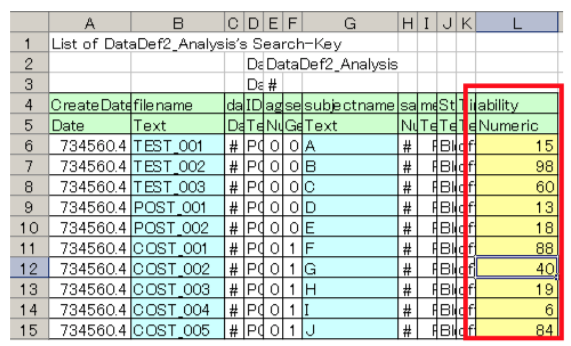

# Extended search

[Open PoTATo Document List](index.md)

<!-- TOC -->

- [Extended search](#extended-search)
- [Overview](#overview)
- [Basic operation](#basic-operation)
    - [Startup and extended search window](#startup-and-extended-search-window)
    - [Search condition format](#search-condition-format)
    - [Editing the search condition list](#editing-the-search-condition-list)
    - [Adding and editing search keys](#adding-and-editing-search-keys)
        - [Special data types](#special-data-types)
- [Step-by-step guide](#step-by-step-guide)
    - [Adding a search key](#adding-a-search-key)
        - [Opening the extended search window](#opening-the-extended-search-window)
        - [Adding and editing a search key](#adding-and-editing-a-search-key)
        - [Checking the results](#checking-the-results)
    - [Creating groups that use search keys](#creating-groups-that-use-search-keys)
        - [Recipe settings](#recipe-settings)
        - [Select Group 1 data and display the average waveform](#select-group-1-data-and-display-the-average-waveform)
        - [Select Group 2 data and display the average waveform](#select-group-2-data-and-display-the-average-waveform)
    - [Advanced operation](#advanced-operation)

<!-- /TOC -->

# Overview

The advanced search function can be used to filter analysis data included in a project using items (search keys) such as test subject names, ages, etc. The values used for searching can also be added to the analysis data.

# Basic operation

## Startup and extended search window

To perform an extended search, select “Extended Search” on the main window Tool menu. The extended search window will be displayed and the main window will be updated.

If there is an “Extended” button to the right of the search edit box, the extended search window can also be displayed using the “Extended” button.

In the figure below, the extended search window is shown at left and part of the main window can be seen at right.


To display the online manual for the extended search window, click the “Help” button (A). To close the extended search window, click the “Close” button (G).

Search keys can be selected using the extended search window Key menu (B). Furthermore, search conditions can be entered in the Search Option (D). The formats to be used for filter conditions are defined for each search key. Click the “[Add]” button to add an item to the extended search window condition list and update the data list on the main window.

Selecting a search key on the Key menu (B) will cause the data type (Type)(C) to be displayed. Examples of formats for search conditions are shown in Search Option (D).

The Key menu (B) on the extended search window is synchronized with the Menu (B) on the main window. Search item information is displayed on the main window’s data list.

Click the “Ascending” or “Descending” buttons (E) on the extended search window to change the order in which the analysis data is displayed.

To add or configure search keys based on experiment data, click the “Input/output” button (F) for the search key and edit the key. See [Adding and editing search keys] (#Adding and editing search keys) for information regarding this method. 

## Search condition format

The Search Option format is defined for each search key. For example, when the search key is set to “data type” the data type will be displayed as “Numeric” data. Multiple values can be entered in Search Options. The data types and formats for each search key are shown in the table below.

Internal data is information for software developers and refers to MATLAB formats.

**Search formats** 

| Data type      | Format             | Internal data|

| -------------| --------------------|---------|

| Text| Character string (regular expression)| Character string|

| Date| Data searches are performed using dates in the ‘dd-mm-yyyy’ format.<br> To specify a date range, <br>select the start date and end data in the cell.|MATLAB<br>Serial time number|

| Gender| Character string, ‘Male’ or ‘Female’| Value:  0: Male 1: Female|

| Numeric| Number and one inequality sign, like 10> or >10, or a span specifying the minimum and maximum value, like [0 10].| Number|

| Cell| -| Cell|

| unknown| -| -|

Enter dates with the Date data type as a character string consisting of the date enclosed with single quotes, like ‘26-Feb-2011’. You can also use MATLAB functions such as datestr(now). For example, to search for data from the previous day, you can enter datestr(now-1). To search for data from January 1 to February 26, 2011, you can enter {‘01-Jan-2011’,’26-Feb-2011’} in the Date cell.

For the Gender data type, likewise, the character string must be enclosed with single quotes.

For the Numeric data type, searching is performed using a number and a single character comparison operator. To search for a number greater than 10, enter >10 or 10<. Please not that operators such as >= are not supported. Minimum and maximum values can be used in searches. For example, to search for numbers greater than or equal to 10 and less than or equal to 20, use [10, 20]. Please note that this includes equal signs.

If the data type is Cell, unknown when a search key is selected, the search key cannot be used to perform a search.

## Editing the search condition list

With the extended search function, files can be searched by editing the search condition list.


To add a new search key to the search condition list, use the Key menu (X) to select the key to search with. Then use the search key’s data type (Y) for reference to enter the search condition’s Search Option in the search condition text (A). You can also select whether to perform And or Or searches, etc. The click the “Add” button (B) to add the search condition and update the search condition list (E).

The added search condition will be inserted at the selected position in the search condition list (E). When the close parentheses symbol “)” is selected, a new “()” will be inserted at that position and the search condition will be inserted within the parentheses.

To change or delete configured search settings, select the search condition to change in the search condition list (E) and click the “Modify” button (C) or the “Delete” (D) button.

The search settings can be saved in a file and loaded. To load search settings, click the “Load” button (F). To save search settings, click the “Save” button (G).

## Adding and editing search keys

In addition to the search keys provided by default, you can also add and edit your own search keys.

To add or edit a search key, use the search key “Input/output” button.


Editing search keys is a four-step process.

1. Load the related experimental data.

1. Use the “Export Search Table” button (A) to export the search key data as a CSV file.

1. Edit the CSV file containing the search key.

1. Use the “Import Search Table” button (B) to import the search key data from the CSV file.

When the output CSV file is opened with Microsoft Excel, it will appear as shown before.


The fourth line contains the name of the search key and fifth line contains the data type. To add a new search key, add a line with the same format.

The sixth line and onwards contain the values of the analysis data’s search keys. To change a search key value, change the value of its cell. Note that the filename cannot be changed.

```markdown

### Caution ###

When using a spreadsheet program to edit a CSV file, the number of significant digits for data such as times may be rounded.

```

### Special data types

There are two special data types not shown in the table above: NumericB and TextB.

These data types can be used to set search values for individual stimuli within files, instead of the files themselves. These values can be used for Research mode Statistical Tests.

Setting examples are shown below.


The fourth row contains a series of columns, each containing the same name. The number of columns is the number of stimuli contained in each file. In the fifth row, if a value is a number, it is indicated by ‘NumericB’. If it is a character string, it is indicated by ‘TextB’.

In this example, columns N to R are named Nbtest and are configured for NumericB values, and columns S to W are named Tbtest and are configured for TextB values.

The order of the columns corresponds to the chronological order of the stimuli. In this example, the cell in row 6, column N, contains the Nbtest value for the first stimulus block of the 6th row of analysis data, the cell in row 6, column O, contains the Nbtest value for the next stimulus block of the 6th row of analysis data, and so on.

If the number of stimuli does not match, the maximum value in the column will be used. When measurement is not possible, NaN can be used for NumericB values and blanks can be used for TextB values.

After entering the search key, when experimental data is loaded, numerical values which have not been entered will be configured as Nan and text values which have not been entered will be configured as blanks.

# Step-by-step guide

OpenPoTATo can be used to perform statistical verification on a large amount of experimental data. When comparing groups, groups must be created from these large amounts of data.

This section shows an example of how to use extended searches to select data.

In this example, the envisioned analysis to be performed is as indicated below.

- fNIRS testing is performed on multiple test subjects.

- In addition to the fNIRS data, the performance for each test subject is indicated by a score between 1 and 100.

- The average waveforms of test subjects with scores between 10 and 20 and the average waveforms of test subjects with scores of 80 or above are to be visually compared.

The procedure for doing this uses the extended search function. The score for each test subject has been added as a search key. The scores are then grouped as search keys and the average waveforms for the selected data are displayed.

## Adding a search key 

We will register a search key for searching experimental data. The search key will be a score between 1 and 100 indicating the performance of each test subject.

### Opening the extended search window

Register a new search key using the extended search function. Select “Extended Search” on the main window menu’s Tool menu to open the extended search window.


### Adding and editing a search key

Search keys can include information stored in experimental data files, creation dates, genders, and the like. To add or edit a search key or value, use the search key “Input/output” button.

Use the “Export Search Table” button (A) in the extended search window to export the search key data as a CSV file.


You will be asked to name the output file. Save the file on the desktop as “key.csv”.

Open the output “key.csv” file with an easy to use editing application. (In this example, Microsoft Excel is used.)



To add a search key, add another column after the final column of the output CSV file. In this example, column L, containing test subject scores (numbers between 1 and 100) will be registered as a search key.

Enter “ability” as the key name in cell L4 and enter “Numeric” as the data type in cell L5. Next, in the rows below L6, enter the test subject score for that corresponds to each test subject's name (subjectname).

Save the edited CSV file and use the “Import Search Table” button (A) on the extended search window to load the edited CSV file.


### Checking the results

When the search key is imported correctly, “ability” will be added as a search key.

Select “ability” using the search key popup menu (A) and check the results.


## Creating groups that use search keys

You can use registered search keys to compare the average waveforms of test subjects with scores between 10 and 20 (Group 1) and the average waveforms of test subjects with scores of 80 or above (Group 2).

### Recipe settings

First, select all the data.

If recipes differ, the system will switch to Different Recipes Control Mode. Click the “Apply to all” button (A) to set all data to use the same recipe.


Click the “OK” button on the following dialog window.


This recipe contains “Blocking” to calculate average waveforms.

### Select Group 1 data and display the average waveform

The average waveform for test subjects with scores between 10 and 20 (Group 1) will be output.


From the search key menu (A) on the extended search window, select “ability” and enter “[10 20]” for Search Option (B). Then click the “Add” button (C) to display only data for test subjects with scores between 10 and 20 on the data list (E). To check the data, click the “Descending” button (D) to arrange the data in descending order.

Next, to display the average waveform, select all of the data in the data list (E) and click the “Plot Average” button (F).

When the above steps are performed, the average waveform for test subjects with scores of 10 to 20 will be displayed.

### Select Group 2 data and display the average waveform

Next, output the average waveform for test subjects with scores of 80 or above (Group 2).


In the search condition list (A), select the item containing search condition “**  ability *** : [10 20]” configured when Group 1 data is selected. When selected, Search Option (B) will become “[10 20]”. Change it to “> 79”. Next, click the “Modify” button (C). This will cause data for test subjects with scores of 80 or above to be displayed in the data list (D).

Select this data and click the “Plot Average” button (E) to display the average waveform for test subjects with scores of 80 or above.

Following the above procedure will cause the average data for the two groups to be displayed side by side.


## Advanced operation

In this step-by-step guide, data was selected using a single search key. However, multiple search keys can be added to perform searches with multiple search conditions at the same time.

This can be used to perform statistical verification and quantify group data. Furthermore, when there are values such as scores for individual stimuli given to test subjects, these values can be used in statistical verification.

See the “Research-Mode” section of the manual for information regarding how to do this.

