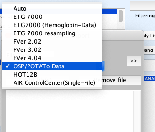

# Installing loading plug-ins

[Open PoTATo Document List] (index.md)

<!-- TOC -->

- [Installing loading plug-ins](#installing-loading-plug-ins)
    - [How to obtain plug-ins](#how-to-obtain-plug-ins)
    - [Installing loading plug-ins](#installing-loading-plug-ins-1)
    - [Checking the installation](#checking-the-installation)
    - [Inquiries](#inquiries)

<!-- /TOC -->

## How to obtain plug-ins

Open PoTATo loading plug-ins are provided by fNIRS device manufacturers and vendors.

Click [here](https://github.com/hkwgc/open-potato-add-on-lists/blob/master/list-add-on.md#Loading plug-ins) for a list of loading plug-ins.

## Installing loading plug-ins

This section explains the aspects of the installation process that apply to all loadings plug-ins from different companies.

If a separate installation method has been defined for a plug-in, use that method.

Loading plug-ins are Matlab files (M files or P files) with names formatted like “prepro_XXXX.m” or “prepro_YYYY.p”. The XXXX and YYYY portions of the name will vary by file.

Place this file in the **preprocessor folder** of the **op folder** used when launching Open PoTATo.

This completes the installation process.

## Checking the installation

Let us assume that Project has been completed and the Open PoTATo main window has been opened.

On the Project menu of the main window, select Data Import.

 

The data import dialog window will open. Select the popup menu.

If the loading plug-in is installed correctly, you will see that the name of the loading plug-in for the device has been added to the list.

## Inquiries

Please direct any inquiries about a loading plug-in to the plug-in’s creator.

[Back to Open PoTATo Document List](index.md)

