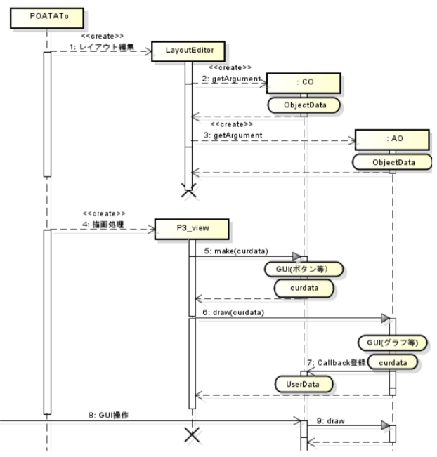

# LAYOUT manual

[Open PoTATo Document List](index.md)

<!-- TOC -->

- [LAYOUT manual](#layout-manual)
- [Overview](#overview)
    - [Explanation contents](#explanation-contents)
    - [Display function and LAYOUT](#display-function-and-layout)
    - [Data structure](#data-structure)
        - [Open PoTATo data](#open-potato-data)
        - [ObjectData](#objectdata)
        - [AO:  Draw processing and associated data](#ao--draw-processing-and-associated-data)
        - [CO:  Callback processing and associated data](#co--callback-processing-and-associated-data)
    - [Auxiliary function](#auxiliary-function)
        - [Acquiring Open PoTATo data](#acquiring-open-potato-data)
        - [AO-related data I/O](#ao-related-data-io)
    - [AO: Axis-Object creation](#ao-axis-object-creation)
        - [AO function interface](#ao-function-interface)
        - [createBasicInfo](#createbasicinfo)
        - [getArgument](#getargument)
        - [drawstr,draw](#drawstrdraw)
    - [CO: Control-Object creation](#co-control-object-creation)
        - [createBasicInfo](#createbasicinfo-1)
        - [getArgument](#getargument-1)
        - [drawstr,make](#drawstrmake)
        - [mycallback](#mycallback)
- [Appendix: How to use ScriptAO](#appendix-how-to-use-scriptao)
    - [Overview](#overview-1)
    - [Settings](#settings)
    - [Axis script](#axis-script)
    - [Drawing script](#drawing-script)

<!-- /TOC -->

# Overview

This document provides an explanation of Open PoTATo’s data extended drawing functions.

Please read [Drawing function manual - Basics] (LayoutEditor.md) before proceeding.

Open PoTATo’s display functions can be extended by creating new AO and CO LAYOUT components.

This document provides an explanation from the program side assuming that program code is to be created.

To provide background information related to this creation, below is an explanation of the display processing used by Open PoTATo. This section does not re-explain data handover between LAYOUT components.

This explanation is for typical AOs and COs. Operations may differ for some AOs and COs.

## Explanation contents

## Display function and LAYOUT

This section explains display processing, paying special attention to mutual interaction between CO and AO LAYOUT objects.

The explanation of mutual interaction will use a UML sequence diagram. First, let’s look briefly at the sequence diagram used in this description. The diagram below is an example of a sequence diagram. The vertical axis of the diagram is the time axis, progressing from top to bottom.

The object to be considered (A) is indicated with a square and a dotted line. The dotted line indicates the period of time of the object’s existence. The X indicates the point in time when it was deleted. “Objects” here refers to windows, COs, and AOs. In MATLAB, COs and AOs are simply data with specific structures. Each of these is referred to as an object.

Objects operate using specific functions (or their subfunctions). In the figure, these operations are indicated as messages (B). Arguments are indicated in parentheses only for arguments of special note.

When a message is received and there is data that has been properly initialized within an object, that data is indicated in a state invariant (C).


This shows the main sequence for COs and AOs when drawing.



During drawing, from Open PoTATo’s perspective, there are three states. The first is the state when a Layout is created using the Layout Editor. The second is when drawing is being performed using the P3_view function. The third is when a figure is being redrawn by controls, etc.

When Open PoTATo is used to launch the 1. LayoutEditor, the state will switch to Layout state.

The CO’s 2.getArgument subfunction is called by the LayoutEditor, generating a CO. The CO is created as ObjectData at this time and saved in the Layout.

Likewise, the AO’s 3.getArgument subfunction is called by the LayoutEditor, generating an AO. The actual modification work is not affected by the order in which the COs and AOs are generated, nor by the number of COs or AOs generated. Deletion, modification, and other messages have been omitted.

When a Layout is created, Open PoTATo performs four drawing processes. At this point, processing is performed by P3_View. During the drawing processing, the Area and Axis-Area LAYOUT components each have their own curdata, use and modify this curdata, and pass the curdata on from parent to child.

When drawing COs, the drawing process (P3_View) performs 5.make on the CO, using the curdata of the Area that corresponds to the CO as an argument. At this point, the CO creates GUI elements such as buttons, and the curdata is stored within the CO. The curdata of the upper level Area is also updated.

When drawing AOs, the drawing process (P3_View) performs 6.draw on the AO, using the curdata of the Axis-Area that corresponds to the AO as an argument. At this point, the AO creates GUI elements such as by drawing graphs, and the curdata is stored within the AO. If there are any COs wishing to receive callbacks from ancestors, data is registered in the CO in order to have 7.Callback performed. Registered data is saved within the CO as UserData.

Finally, when a GUI element created by a CO is used by a user, etc., to perform an 8. operation, the CO rewrites the AO’s curdata and executes the 9.draw function.

Please note that this explanation is focused on the mutual interactions between COs and AOs, and omits a great deal of the drawing management processing performed within Open PoTATo. Omitted processes include Area and Axis-Area-related processes, the createBasicInfo method for checking basic CO and AO data, and the drawstr method that performs drawing processing. It also omits details regarding ObjectData and curdata inheritance and storage methods.

## Data structure

This section explains the data structures necessary for extending COs and AOs. Please refer to [LAYOUT structure and data hand-over](LAYOUT structure and data hand-over) for more information regarding the LAYOUT’s structure and curdata.

The data structure is affected by the three states -- LAYOUT editing in progress, drawing in progress, and GUI callback.

### Open PoTATo data

Continuous data, block data, and summary statistics passed by as analysis results Open PoTATo while drawing are stored as Figure ApplicationData. Data that does not exist is left blank ([]).

| Name of data  | Contents                | Related curdata                                     |

| -------- | ------------------ | ---------------------------------------------- |

| CHDATA    | Continuous data (header) | curdata.region=’Cntinuous’                      |

| CDATA     | Continuous data          | curdata.cid0                                    |

| BHDATA    | Block data (header) | curdata.region=’Block’                          |

| BDATA     | Block data          | curdata.stimkind<br>curdata.flag.MarkAveraging  |

| SSHDATA   | Summary statistic information (header) | curdata.region=’Summary’                        |

| SSDATA    | Statistics (header)     | -                                              |

The data of interest to be drawn is contained in curdata. The data type is designated by the curdata’s .region.

If there are multiple items of continuous data, a sequential number for the continuous data is designated with cid0. If there are multiple items of block data, the stimulus type of interest is designated with stimkind.

p3_LayoutViewTool’s ‘getCurrentData’ is used to acquire data.

### ObjectData

ObjectData is data created by getArgument, a subfunction of AO and CO. It contains data such as the names of used functions, arguments, etc.

AO ObjectData is created by getArgument when a LAYOUT is being modified, and is stored as an AxisArea component (Object) within the LAYOUT.

While drawing is in progress, this data can be referenced as obj{idx} in the AxisArea. Normally, referencing is performed via the AO drawstr subfunction, and the data is passed as the objdata argument of the AO’s draw subfunction. It is also saved as the ApplicationData that corresponds to the AO being drawn while the draw process is underway.

During a callback by a GUI element, the ObjectData is called by the ApplicationData in a CO and passed to the AO’s draw subfunction.

The I/O with the ApplicationData can be used by the p3_ViewCommonCallback function. AO:  When the drawing process is completed, the AO is stored in “checkin” and the CO is called by “getData”.  When redrawing the AO, “update” is used to update data. For details, please refer to the auxiliary function.

An example of the ObjectData is shown below. AO subfunctions are dependent on the getArgument function.

| Field name  | Contents                | Example                       |

| ------------ | ------------------ | ----------------------- |

| str           | Display name              | ‘3D_BrainSurf’           |

| fnc           | AO function name           | ‘LAYOUT_AO_3DBrainSurf'  |

| ver           | Version: for internal management  | 1                       |

| (Arg1)       | Arguments, etc.            | 4                       |

CO ObjectData is created by getArgument when a LAYOUT is being modified, and is stored as an Area component (CObject) within the LAYOUT.

While drawing is in progress, this data can be referenced as cbobj{idx} in the Area. Normally, referencing is performed via the CO drawstr subfunction, and the data is passed as the obj argument of the AO’s make subfunction. obj data is normally destroyed after make processing is performed, but it can also be saved by the CO as ‘UserData’ within the created uicontrol.

ObjectData is not normally used during a callback by a GUI element.

An example of the ObjectData is shown below. CO subarguments are dependent on the getArgument function.

### AO:  Draw processing and associated data

Now let’s look at the other data that is necessary when using the AO’s draw subfunction. One related handle is the handle of the Axes to be drawn by the AO, which is passed as input. The group of handles created by the Draw process is also output. The handle group is used to perform deletion before redrawing a figure. The AO also has an ObjectID. Much of the data required for an AO to perform Draw processing is stored as ApplicationData, and the ObjectID is used when acquiring this data. The ObjectID is normally issued using the p3_ViewCommonCallback function.

### CO:  Callback processing and associated data

This section explains the data that is necessary when a typical CO is called back via the GUI.

When the GUI performs a callback, the argument used is the handle of the GUI. The data necessary when executing the callback is stored in the UserData properties in the handle.

UserData is defined as a cell array and includes the list of AOs registered in the callback. However, when ObjectData exists during drawing, the UserData may be stored in the first cell.

In many cases, the names of variables registered in the callback in the CO Userdata contain are referred to as ud. ud contains the following data.

| Field name  | Contents                       | Example                                            |

| ------------ | ------------------------- | -------------------------------------------- |

| axes          | Handle of target Axes       | 347.0016                                     |

| ObjectID      | ObjectID of AO             | 1                                            |

| name          | Name of AO                  | ‘Layout_AO_TimeLine_ObjectData’               |

| str           | Character string used for callback  | ‘Layout_AO_TimeLine_ObjectData(‘’draw’’, ...  |

This ud can be used to acquire the information related to Draw processing by the AO stored in the ApplicationData (AO-related data). The p3_ViewCommonCallback auxiliary function is used to acquire this data, as shown below.

data=p3_ViewCommonCallback(‘getData’,ud.axes,ud.name,ud.ObjectID);

The ud.axes that executes the function is changed to the current Axes and the data that corresponds to the name and ObjectID are extracted from the Application-Data. The structure of the data is shown below.

| Field name  | Contents                   | Main use          |

| ------------ | --------------------- | ---------------- |

| handles       | Handles created by the AO  | Deletion before drawing  |

| axes          | Axes corresponding to the AO       | Drawing (ud.str)     |

| curdata       | curdata in the AO      | Updating and drawing    |

| obj           | ObjectData of AO       | Drawing              |

handles  Handles created by the AO  Deletion before drawing  axes  Axes corresponding to the AO  Drawing (ud.str)  curdata  curdata in the AO  Updating and drawing  obj  ObjectData of AO  Drawing

## Auxiliary function

This section provides an explanation of the auxiliary functions used when creating AOs and COs.

| Function name               | Subfunction name                    | Contents                                                          |

| ------------------- | ---------------------------- | ------------------------------------------------------------ |

| p3_LayoutViewerTool  | getCurrentData                | Acquires PoTATo data for the figure to be drawn                            |

| p3_ViewCommonCallck  | checkin<br>update<br>getdata  | Stores AO-related data and registers it in Common CO<br>Updates AO-related data<br>Acquires AO-related data  |

### Acquiring Open PoTATo data

The following function is used to acquire Open PoTATo data that corresponds to curdata.

| Item          | Explanation                                                          |

| ------------ | ------------------------------------------------------------ |

| Syntax  | [hdata, data] = p3_LayoutViewerTool(‘getCurrentData’, fh, curdata); |

| Function          | Acquires PoTATo data that corresponds to the curdata for the figure that is being drawn.         |

| Input          | **fh** Figure handle (handle of figure being drawn)                         |

|              | **curdata** curdata                                           |

| Output          | **hdata** PoTATo data (header)                              |

|              | **data** PoTATo data                                        |

The function looks at the curdata.region and acquires the corresponding Open PoTATo data. If the region is “Block”, normally the data is three-dimensional data after grand-averaging is performed, except when curdata.flag.MarkAveraging=false. An empty matrix is returned when there is no target data.

See [Open PoTATo data] (Open PoTATo data) for details regarding directly acquiring Open PoTATo data from ApplicationData and other related curdata.

### AO-related data I/O

The following function is used to store AO-related data and perform callback registration in Common-CO.

| Item          | Explanation                                                          |

| ------------ | ------------------------------------------------------------ |

| Syntax  | ID= p3_ ViewCommonCallck (‘checkin’,h,name, ah, curdata, obj); |

| Function          | Saves AO-related data and performs callback registration in Common-CO         |

| Input          | **h** Handle array created by AO (only that which will be rewritten during redrawing) |

|              | **name** Name registered in Application Data (the name must be unique to the AO) |

|              | **ah** Parent Axes to the AO                                     |

|              | **curdata** curdata                                           |

|              | **obj** ObjectData of AO                                      |

| Output          | **ID** ObjectID of AO                                         |

The checked in data is turned into AO-related data (Table 4.5 CO:AO-related data (data)). This AO-related data is added to the end of the cell array in the Application data with the AO-specific name “name”.

The number used to reference the cell array is returned as the ObjectID.

The checked in AO-related data is updated.

| Item          | Explanation                                                          |

| ------------ | ------------------------------------------------------------ |

| Syntax  | p3_ViewCommonCallck(‘update’,h,name, ah, curdata, obj,ID);   |

| Function          | Updates the AO-related data that corresponds to the designated name, ID          |

| Input          | **h** Handle array created by AO (only that which will be rewritten during redrawing) |

|              | **name** Name registered in Application Data (the name must be unique to the AO) |

|              | **ah** Parent Axes to the AO                                     |

|              | **curdata** curdata                                           |

|              | **obj** ObjectData of AO                                      |

|              | **ID** ObjectID of AO                                         |

The following function is used to call the saved AO-related data.

| Item          | Explanation                                                          |

| ------------ | ------------------------------------------------------------ |

| Syntax  | p3_ViewCommonCallck(‘update’,h,name, ah, curdata, obj,ID);   |

| Function          | Saves AO-related data and performs callback registration in Common-CO         |

| Input          | **ah** Parent Axes to the AO                                     |

|              | **name** Name registered in Application Data (the name must be unique to the AO) |

|              | **ID** ObjectID of AO                                         |

| Output          | **data** AO-related data                                        |

Normally, this is called by the CO, but the data necessary for execution is stored in the UserData (Table 4.4 CO: Callback registration data (in UserData)).

## AO: Axis-Object creation

### AO function interface

AO processing is described in LAYOUT_AO_*.m created in the LAYOUT/AxisObject folder in Open PoTATo. This function has the following interface.

LAYOUT_AO_*(‘subfncname’,[arg1,arg2,・・・])

The subfncname portion is replaced with the actual subfunction name, and arg1, arg2, etc., by actual subfunction arguments. The following subfunctions should be prepared.

| Subfunction name       | Contents                        |

| --------------- | -------------------------- |

| createBasicInfo  | Configures basic information                |

| getArgument      | Configures ObjectData        |

| drawstr          | Provides the execution method when performing drawing  |

| (draw)          | Performs drawing processing                    |

The arguments and uses of each subfunction are fixed. This section provides an explanation of each subfunction. The code that serves as the framework of these functions can be created by copying another AO or using the “P3_wizard_plugin” ViewerAxis-Object.

### createBasicInfo

This configures basic information when editing or drawing.

| Item          | Explanation                                             |

| ------------ | ----------------------------------------------- |

| Syntax  | info=createBasicInfo                             |

| Function          | Updates the AO-related data that corresponds to the designated name, ID  |

| Output          | **info** Basic information (structure)                     |

ccb is used to determine whether or not to perform callback registration for a Common-CO with p3_ViewCommonCallck/checkin. When the value of ccb is ‘all’, callback registration is performed for all COs.

Using ‘all’ makes configuration easy, but the COs for which callback registration is performed should be limited to prevent AOs which take a long time to draw from being redrawn when it is not necessary to do so.

| Field name  | Contents                               | Example                               |

| ------------ | --------------------------------- | ------------------------------- |

| MODENAME      | AO name                           | '2DImage(2.0)';                 |

| fnc           | AO function name                         | mfilename                        |

| ver           | Version                         | 2.0                             |

| ccb           | List of Common-COs for which to perform callback registration  | {'Data','DataKind','stimkind'};  |

### getArgument

This sets arguments used when executing drawing processes.

| Item          | Explanation                                                          |

| ------------ | ------------------------------------------------------------ |

| Syntax  | obj=getArgument(obj)                                         |

| Function          | AO:  Sets the arguments used when drawing                                |

| Input/output        | **obj** See the AO:ObjectData table for AO ObjectData ([ObjectData](ObjectData)  |

This is called by the Layout Editor.

During new creation, obj will be empty. During updating, the obj will be configured like the previous obj. To cancel, set obj=[]; before returning.

### drawstr,draw

This passes over the character strings used when executing drawing processing. The character string will be executed by AO drawing processing within the Axis-Area, so care must be taken with regard to the variable scope.

| Item          | Explanation                                               |

| ------------ | ------------------------------------------------- |

| Syntax  | str=drawstr(varargin)                             |

| Function          | AO: Creates a character string for use in drawing processing                     |

| Input          | **varargin**  varargin{1} contains ObjectData  |

| Output          | **str** Character string used in AO drawing processing in the Axis-Area    |

The following notation is normally used.

```matlab

function str = drawstr(varargin) %#ok

str=[mfilename, ' (''draw'', h.axes, curdata, obj{idx})'];

```

The following explanation of draw processing is based on the assumption that the above notation is used.

| Item          | Explanation                                                 |

| ------------ | --------------------------------------------------- |

| Syntax  | hout=draw(gca0,curdata,objdata,ObjectID)            |

| Function          | AO: Performs drawing processing                                         |

| Input          | **gca0** Parent axes to the AO                            |

|              | **curdata** curdata                                  |

|              | **objdata** ObjectData of AO                           |

|              | **ObjectID** ObjectData of AO (only for redrawing)   |

| Output          | **hout** Structure containing the handles and tags created by the AO  |

Here, hout creates hout.h, an array of handles, and hout.tag, a cell array of tags.

The following section explains the contents of general draw processing.

To use Open PoTATo data, add the following line to acquire Open PoTATo data.

```matlab

[hdata,data]=osp_LayoutViewerTool(... 'getCurrentData',curdata.gcf,curdata);

```

Next, draw a graph. For example, code such as the following could be used.

```matlab

h.h = surf(peaks(10)); % This sets the handle (required)

h.tag = {‘test’}; % This sets the tag

```

The drawing of this graph constitutes the core part of the AO.

Also, perform registration in ApplicationDataI/O and CommonCO to enable the callback to be called.

```matlab

%=====================================

%= Callback registration in Common-CO  =

%=====================================

myName='LAYOUT_AO_hoge'; % Name to register in the Application Data

if exist('ObjectID','var'),

	% When redrawing is performed

	p3_ViewCommCallback('Update', ...

      h.h, myName, ...

			gca0, curdata, obj, ObjectID);

	return; % Update and end

else

% Register Application Data and register callback

	ObjectID = p3_ViewCommCallback('CheckIn', ...

      h.h, myName, ...

			gca0, curdata, obj); % Acquire ObjectID

end

```

Lastly, register callback in COs other than CommonCOs. The following is only performed when callback is necessary. The method of registering callbacks varies by CO, but is identical for typical COs.

First, create the UserData (Table 4.4 CO: Callback registration data (in UserData)) as registration data.

Next, add UserData to the CO in the curdata for which callback is to be performed.

```matlab

% ================================================================

% = Callback registration  =

% ================================================================

% Create callback registration data

udadd.axes = gca0;

udadd.ObjectID = ObjectID; % ID issued by Common CO registration

udadd.name = myName;       % Same as when Common CO registration was performed

udadd.str = [objdata.fnc,...

    '(''draw'',data.axes, data.curdata, data.obj, ud.ObjectID);'];

%------------------------

% Callback registration ( XX)

%------------------------

% Check if CO_XX exists

if isfield(curdata,'Callback_XX') && ...

        isfield(curdata.Callback_XX,'handles') && ...

        ishandle(curdata.Callback_XX.handles)

    % See also LAYOUT_CO_XX

    % Acquire handle

    h = curdata.Callback_XX.handles;

    % Add UD

    ud=get(h,'UserData'); % Acquire current ud

    if isempty(ud)

        ud = {udadd};

    else

        ud{end+1}=udadd;

    end

    set(h,'UserData',ud); % Update UD

end

```

## CO: Control-Object creation

CO processing is described in LAYOUT_CO_*.m or LAYOUT_CCO_*.m created in the LAYOUT/ControlObject folder in Open PoTATo.

Here, “CO” is used to refer to typical COs and “CCO” is used to refer to Common-COs.

This function has the following interface.

LAYOUT_[C]CO_*(‘subfncname’,[arg1,arg2,・・・])

The subfncname portion is replaced with the actual subfunction name, and arg1, arg2, etc., by actual subfunction arguments. The following subfunctions should be prepared.

| Subfunction name       | Contents                    |

| --------------- | ---------------------- |

| createBasicInfo  | Configures basic information            |

| getArgument      | Configures ObjectData    |

| drawstr          | Provides the CO creation method  |

| (make)          | Creates a CO                  |

| (mycallback)    | Performs callback            |

The getDefaultCObject subfunction is required for some COs that configure Variables within Areas in the LayoutEditor, but this subfunction is not explained herein.

The arguments and uses of each subfunction are fixed. This section provides an explanation of each subfunction.

Copy another CO or use the following code for the code that serves as the framework of these functions.

```matlab

function varargout=LAYOUT_CO_XX (fcn,varargin)

% Lists help

if nargin==0, fcn='help';end

%====================

% Switch by Function

%====================

switch fcn

    case {'help','Help','HELP'}

        POTATo_Help(mfilename);

    case {'createBasicInfo','drawstr','getArgument'}

        % Basic Information

        varargout{1} = feval(fcn, varargin{:});

    case 'make'

        varargout{1} = make(varargin{:});

    otherwise

        % Default

        if nargout

            [varargout{1:nargout}] = feval(fcn, varargin{:});

        else

            feval(fcn, varargin{:});

        end

end %===============================

return;

```

### createBasicInfo

This configures basic information when editing or drawing.

| Item          | Explanation                                             |

| ------------ | ----------------------------------------------- |

| Syntax  | info=createBasicInfo                             |

| Function          | Updates the CO-related data that corresponds to the designated name, ID  |

| Output          | **info** Basic information (structure)                     |

The structure of the basic information uses the following format.

| Field name  | Contents        | Example                  |

| ------------ | ---------- | ------------------ |

| name          | CO name    | 'XX';               |

| fnc           | CO function name  | mfilename           |

| rver          | Version  | ‘ Revision: 1.1’    |

| date          | Last update date  | ‘Date: 2012/09/01’  |

rver and date are not used, but it is recommended that they be included.

The uicontrol field is required for some COs that configure Variables within Areas in the LayoutEditor, but it is not explained herein.

### getArgument

This sets arguments used when executing drawing processes.

| Item          | Explanation                                                          |

| ------------ | ------------------------------------------------------------ |

| Syntax  | obj=getArgument(obj)                                         |

| Function          | CO: Sets the arguments used when drawing                                |

| Input/output        | **obj** See the CO:ObjectData table for CO ObjectData ([ObjectData](ObjectData)) |

This is called by the Layout Editor.

During new creation, obj will be empty. During updating, the obj will be configured like the previous obj.

To cancel, set obj=[]; before returning.

### drawstr,make

This passes over the character strings used when executing CO drawing processing. The character string will be executed by CO drawing processing within the Axis-Area, so care must be taken with regard to the variable scope.

| Item          | Explanation                                               |

| ------------ | ------------------------------------------------- |

| Syntax  | str=drawstr(varargin)                             |

| Function          | CO: Creates a character string for use in drawing processing                     |

| Input          | **varargin**  varargin{1} contains ObjectData  |

| Output          | **str** Character string used in CO drawing processing in the Axis-Area    |

The following notation is normally used.

```matlab

function str = drawstr(varargin)

% Execute on ViewGroupCallback 'exe' Function

str=['curdata=’ mfilename ‘(''make'',handles, abspos,' ...

      'curdata, cbobj{idx});'];

return;

```

The following explanation of make processing is based on the assumption that the above notation is used.

| Item          | Explanation                                               |

| ------------ | ------------------------------------------------- |

| Syntax  | curdata=make(hs,apos,curdata,obj)                 |

| Function          | CO: Performs drawing processing                                       |

| Input          | **hs** Upper level handle                                |

|              | **abspos** Absolute position of upper level Area (Normalized Units) |

|              | **curdata** curdata                                |

|              | **objdata** ObjectData of CO                         |

| Output          | **curdata** curdata                                |

The following section explains the contents of general make processing.

For CommonCO, basic configuration is performed for CommonCO structures.

```matlab

%=====================

% Common-Callback-Data

%=====================

CCD.Name         = 'XX';        % CO name

CCD.CurDataValue = {'XX','xx'}; % AO basic information ccb designation name

CCD.handle       = [];          % Callback registration handle

```

In this example, callback registration is configured to only be performed for AO basic information (Table 4.8 AO: Basic information) whose ccb contains ‘XX’ or ‘xx’. (However, callback registration is performed when the value of ccb is ‘all’.)

Next, the GUI is created.

```matlab

h0       = uicontrol;

```

There is no need to create the actual h0 handle, but for convenience’s sake the following explanation will refer to an h0 handle.

The position of the GUI is relative, so it must be changed as follows.

```matlab

pos=getPosabs(obj.pos,apos);

function lpos=getPosabs(lpos,pos)

% Get Absolute position from local-Position

lpos([1,3]) = lpos([1,3])*pos(3);

lpos([2,4]) = lpos([2,4])*pos(4);

lpos(1:2)   = lpos(1:2)+pos(1:2);

```

The unit is ‘Normalized’, so before setting the position, the ‘Units’ property of the uicontrol, etc., must be set to ‘Normalized’.

The callback configuration is as follows.

```matlab

set(h0, 'Callback',....

    [mfilename ' (''mycallback'',gcbo)']);

```

Here, the callback function is configured as the mycallback subfunction. The subfunction name may be chosen freely. In the following explanation, the subfunction has been named mycallback.

Lastly, the data for which make processing was performed is reflected is reflected in the curdata. If values are changed by changing the default values, etc., the following is used.

```matlab

curdata.foovar = obj.defaultfoovar; % This CO changes foovar.

```

For COs, handles are inherited.

```matlab

curdata.Callback_XX.handles =h0;

```

For CommonCOs, handles are inherited as shown below.

```matlab

CCD.handle =h0;

if isfield(curdata,'CommonCallbackData')

curdata.CommonCallbackData{end+1}=CCD; else

curdata.CommonCallbackData={CCD}; end

```

### mycallback

The following explanation of mycallback processing is based on the assumption that the above make processing is performed.

| Item          | Explanation                  |

| ------------ | -------------------- |

| Syntax  | mycallback(h)        |

| Function          | Performs callback processing for the CO  |

| Input          | **h** CO handle      |

The following section explains the contents of general mycallback processing. First, the values to be changed during redrawing are prepared.

```matlab

foovar = get(h,’Value’);

```

In this example, CO changes curdata.foovar, and foovar is specified by h’s ‘Value’.

Next, loop processing is performed and stopped for the AO for which the callback is registered.

```matlab

ud=get(h,'UserData');

for idx=1:length(ud), % The name of the loop variable in the for loop must be idx. 

    % <<<The following is an explanation of this internal processing>>>

end

return;

```

The content of ud is indicated in the Table 4.4 CO: Callback registration data (inside UserData).

In the loop, first AO-related data (Table 4.5 CO: AO-related data (data)) is acquired.

```matlab

% Get Data

data = osp_ViewCommCallback('getData', ...

    ud{idx}.axes, ...

    ud{idx}.name, ud{idx}.ObjectID);

```

Next, the curdata of the target AO is updated.

```matlab

% Update curdata

data.curdata.foovar =foovar;

```

In this case, foovar is updated. Before performing redrawing, the figure previously drawn by the AO is deleted.

```matlab

% Delete handle

for idxh = 1:length(data.handle),

    try

        if ishandle(data.handle(idxh))

            delete(data.handle(idxh));

        end

    catch

        warning(lasterr);

    end % Try - Catch

end

```

Last, redrawing is performed.

```matlab

% Evaluate (Draw)

try

    eval(ud{idx}.str);

catch

    warning(lasterr);

end % Try - Catch

```

# Appendix: How to use ScriptAO

## Overview

This explanation uses an AO known as ScriptAO as an example.

ScriptAO is an AO for performing drawing relatively freely using a script.

AO has two input scripts.

The first is a script for modifying curdata that affects an Axis or subsequent AOs within the same Axis. This is known as an Axis script. This script is only executed once while drawing.

The other is a script that performs drawing. This is known as a drawing script. This script is executed when drawing and when redrawing.

## Settings

As with other AOs, ScriptAO is added to a Layout using the LayoutEditor.

Create a Layout, move to the AxisArea for which you wish to configure the Script, and select “Script” on the AO popup menu.

The Script settings window will open.


When configuring the script, a dialog window like that shown at right will be displayed. Enter the Axis script in the top edit box (A) and enter the drawing script in the bottom edit box (B).

Check that the contents are correct and click the “OK” button (C).

Below are detailed explanations of the Axis script and the drawing script.

## Axis script

The Axis script is used to modify curdata that affects an Axis or subsequent AOs within the same Axis. This script is only executed once while drawing.

AOs are called back by all Common-COs, so Axis scripts are used for processing which only needs to be performed once and which takes a large amount of time.

Axis scripts are executed within Axis-Area drawing processing.

Because of this, changes affect the parent Axis and subsequent AOs. The main data that can be used within the Axis is indicated below.

| Field name  | Contents                  |

| ------------ | -------------------- |

| h.axes        | Axes handle          |

| curdata       | Curdata within Axis-Area  |

| obj{idx}      | ObjectData of ScriptAO  |

For example, to display only all hemoglobin as the data type (kind) on the target Axis, add the following settings to the Axis.

```matlab

% Configures the curdata

% (lines beyond here affect the entire Axis)

curdata.kind=3;

% Processing that should only be performed once

title('Kind =3');

xlabel('time [sec]');

ylabel('Total HB data');

```

Assuming that the function (foo) for acquiring certain information (foovar) takes time, and this value is not affected by the callback, calculate the value in advance, as shown below.

```matlab

[hdata,data]=p3_LayoutViewerTool('getCurrentData',curdata.gcf,curdata);

curdata.foovar=foo(hdata,data);

```

## Drawing script

The drawing script is a script that performs draw processing. This script is executed when drawing and when redrawing.

It is executed within the ScriptAO’s draw subfunction processing.

Because of this, curdata changes are only inherited when redrawing. The main data that can be used within the AO: draw subfunction is indicated below.

| Field name  | Contents                              |

| ------------ | -------------------------------- |

| gca0         | Parent Axes handle                    |

| curdata      | Curdata within AO                     |

| objdata      | ObjectData of ScriptAO              |

| ObjectID     | Only exists when redrawing is performed. ObjectID.  |

| hout         | Output handle                      |

In this example, Line-Property is ignored and HB data is shown as a line.

```matlab

% Acquire PoTATo data

[hdata,data]=p3_LayoutViewerTool('getCurrentData',curdata.gcf,curdata);

% Calculate time axis

unit = 1000/hdata.samplingperiod;

t0=1:size(data,1);

t=(t0 -1)/unit;

kind=curdata.kind;

% Configure display and output handle

hout.h(end+1)=line(t,data(:,1,kind));

hout.tag{end+1}=['XX' hdata.TAGs.DataTag{kind}];

```

Note that if hout.h is not configured, deletion will not be performed upon redrawing.

