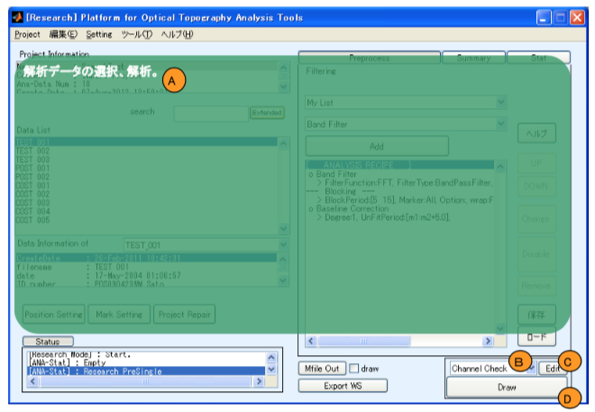
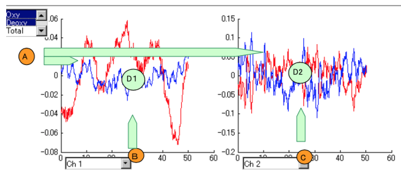
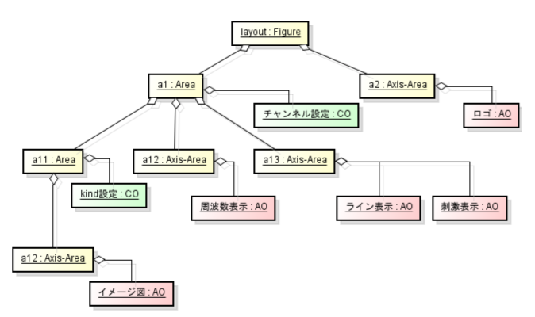
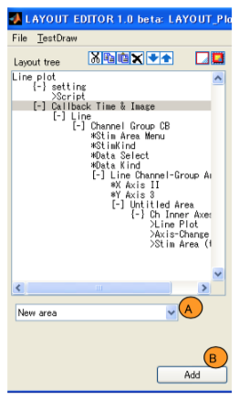
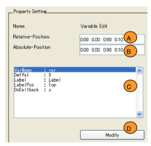

# LAYOUT manual

[Open PoTATo Document List] (index.md)

<!-- TOC -->

- [LAYOUT manual](#layout-manual)
- [Overview](#overview)
    - [Open PoTATo’s data drawing function](#open-potatos-data-drawing-function)
    - [LAYOUT](#layout)
    - [Document contents](#document-contents)
- [Open PoTATo’s drawing function](#open-potatos-drawing-function)
    - [Performing drawing](#performing-drawing)
    - [Changing drawing contents](#changing-drawing-contents)
- [Using the Layout Editor](#using-the-layout-editor)
    - [LAYOUT components](#layout-components)
    - [LAYOUT structure and inheriting information](#layout-structure-and-inheriting-information)
    - [Overview of the Layout Editor](#overview-of-the-layout-editor)
        - [Startup](#startup)
        - [File I/O](#file-io)
        - [Test display](#test-display)
    - [Layout tree](#layout-tree)
        - [Tree display](#tree-display)
        - [Tree operation](#tree-operation)
    - [LAYOUT Overview](#layout-overview)
    - [Figure settings](#figure-settings)
    - [Area settings](#area-settings)
        - [Area Primary settings](#area-primary-settings)
        - [Area Variables settings](#area-variables-settings)
        - [Area Others settings](#area-others-settings)
    - [CO:  Control-Object](#co--control-object)
    - [Axis-Area settings](#axis-area-settings)
    - [AO: Axis-Object settings](#ao-axis-object-settings)
- [Advanced operation](#advanced-operation)

<!-- /TOC -->

# Overview

## Open PoTATo’s data drawing function

This document provides an explanation of Open PoTATo’s data drawing function.

Open PoTATo has the following display functions.

- They can be used to select various display methods.

- Displayed figures can be changed interactively.

- Display methods can be changed (for experienced users))

## LAYOUT

In Open PoTATo, LAYOUTs can be used to draw data. A **LAYOUT** specifies the content to be displayed on graphs, images, and the like, as well as their arrangement. In Open PoTATo, LAYOUTs can be created and modified freely. LAYOUTs are created and modified using the Layout Editor.

In Open PoTATo, data is displayed as indicated in the LAYOUT. Data here refers to continuous data and block data obtained from Open PoTATo analysis results and to summary statistic information.

The figure below shows Open PoTATo’s drawing processing procedure.

## Document contents

First, we will look at how Open PoTATo’s display function works and what can be done with LAYOUTs.

Then we will explain how to edit LAYOUTs. We will look at the structural elements and the scope of the variables (curdata) necessary for editing LAYOUTs.

Last, we will look at how to extend LAYOUTs. In this section, we will describe how to create the COs used to control Figures and the AOs used to draw actual data.

# Open PoTATo’s drawing function

## Performing drawing

In this section, we will look at the procedure from starting at the Open PoTATo main screen to performing drawing.

Before drawing, select the analysis data to display in the analysis area (A).  You can also edit the analysis procedure as necessary.

To display drawing processing, select LAYOUT from the popup menu (B).  Open PoTATo provides numerous LAYOUTs by default.

Next, click the “Draw” button (D) to create Open PoTATo data based on the analysis specified in (A) and draw the data as specified in the LAYOUT (B).

Click the “Edit” button (C) to edit the LAYOUT.  The LAYOUT that can be edited here is the one selected in (B).

## Changing drawing contents

The channels, data types, etc., shown in figures can be changed.

Drawing contents can be changed via the popup menu or list box using control parts. Each control part is associated with a drawing part for a graph, image, etc.

In the example below, the contents of graphs (D1) and (D2) will be changed using control parts. The list box used to control data types (A) is associated with (D1) and (D2), so this control part can be used to simultaneously change both figures. Each of the popup menus for controlling channel numbers (B) and (C) are only associated with the graph indicated at their top. In other words, actions performed on (B) will only affect (D1), and actions performed on (C) will only affect (D2).

These associations are defined in the LAYOUT settings. The Layout Editor is used to modify LAYOUT settings.

# Using the Layout Editor

LAYOUTs can be edited or added using the Layout Editor. For example, the Layout Editor can be used to edit an existing layout, add control parts and drawing parts, or extend functions.

## LAYOUT components

LAYOUTs are composed of five elements: **Figure**s, **Area**s, **Axis-Area**s, control objects (Control Objects, or **CO**), and drawing objects (Axis Objects, or **AO**). These elements can be combined to provide LAYOUTs with a variety of drawing functions.

- Figure elements rewrite MATLAB’s figure properties. Figures are associated with Areas and Axis-Areas.

- Areas are areas in which control parts drawing parts are drawn. Areas themselves are not drawn. Areas can be associated with other Areas, Axis-Areas, and Layout structure COs that perform control functions.

- Axis-Areas are used to draw MATLAB axes.

- COs are objects used to draw MATLAB GUI parts (uicontrols, uimenus, etc.). These GUI parts have information and processes necessary for changing channels, data types, and other aspects of drawn figures.

- AOs are used to draw Lines and Images within Axis-Areas. AOs contain the processes used to configure, draw, and redraw these elements.

LAYOUT components have parent-child relationships. When parent component information is changed, it affects child components as well. Of the LAYOUT components, Figure, Area, and Axis-Area components have parent-child relationships, and each parent has 0 or more children. Figures are always parents, and can have Area/Axis-Area components as children. Areas can have other Areas or Axis-Areas as children. Axis-Areas cannot have children.

Areas are associated with COs. Axis-Areas are associated with AOs.

## LAYOUT structure and inheriting information

Of the LAYOUT components, Figure, Area, and Axis-Area components have parent-child relationships, and each parent has 0 or more children. Figures are always parents, and can have Area or Axis-Area components as children. Areas can have other Areas or Axis-Areas as children. Axis-Areas cannot have children.

Areas are associated with COs. Axis-Areas are associated with AOs. These relationships are visually shown in the class diagram below.

These parent-child relationships are closely linked to the information handover methods used when drawing. Drawing involves a large variety of information, such as the channels to be drawn, data types, line colors, and the like. This information is collectively stored and managed with the curdata(current-data) structure. Every component in the LAYOUT has curdata, and it is passed from parents to children. In other words, changes are not made by children or siblings.

COs are set by the curdata of associated Areas. However, when separate curdata is set for a CO, the curdata for the Area is rewritten.

AOs are set by the curdata of associated Areas. When a CO is associated as an ancestor, after drawing the curdata is rewritten by a CO Callback.

The following explanation of the scope of effects on data uses the example Layout object diagram below.

When drawing the LAYOUT shown in the example, curdata is created by layout:Figure. The same curdata is inherited by the layout’s children, a1 and a2.

a1 contains a CO that performs channel configuration and changes the curdata channel value. While a2’s curdata is not changed, the changed channel values are inherited by its children, a11, a12, and a13.

a11 contains a CO that performs kind configuration and changes the curdata kind. The results are inherited by AO in the conceptual image.

After drawing is completed, if the channel CO belonging to a1 performs redrawing, a1’s ancestors, namely the conceptual image, frequency display, line display, and stimulus display, will all be redrawn.

When redrawing an image, only the channel values in the image’s curdata is updated.

If the kind setting CO that corresponds to a12 performs redrawing, only the image is redrawn. When this redrawing is performed, only the kind in the image's curdata is updated.

## Overview of the Layout Editor

The Layout Editor uses two windows to edit LAYOUTs.

The first window is the **Layout Editor main window**. This is used to perform basic layout editing. The LAYOUT tree is shown at left and the properties of the selected component are shown at right.

The second window is the **Layout Overview window**. This is used to see an overview diagram that makes it possible to visualize layouts that are difficult to visualize with the main window alone. It is also used to adjust the arrangement of components.

### Startup

There are two ways to start the Layout Editor.

To create a new LAYOUT or manually select a LAYOUT to edit, start the Layout Editor from the menu. To do this, select Layout Editor (A) from the Open PoTATo main window tool menu.

To edit a LAYOUT managed with Open PoTATo, click the “Edit” button (C). The LAYOUT selected in the popup menu (B) will be editable.

### File I/O

When the Layout Editor starts, the File menu will be visible on the main window. The File menu’s functions are listed below.

### Test display

To quickly confirm what a drawing will look like with the LAYOUT being edited, select the Test Draw menu item on the Layout Editor main window. Sample data will be drawn using the LAYOUT currently being edited.

Note that the sample data is a small set of data and contains little information. Because of this, expected values may not be displayed by some AO. To change the sample data, modify the LayoutEditTestDatadata0.mat file.

## Layout tree

### Tree display

Layouts are composed of five elements: Figures, Areas, Axis-Areas, COs, and AOs. Each LAYOUT uses a tree configuration, with a Figure as the root and Areas and Axis-Areas as leaves.

The Layout tree list box (A) expresses this as a character string. The Layout tree list box indicates component parent-child relationships in hierarchical form, starting from the left.

There is only one Figure at top, and it is indicated with the LAYOUT name. In this figure, the LAYOUT name is “Line plot”.

The Figure’s children Areas and Axis-Areas are shown one level below the Figure. Areas are indicated with a character string that begins with [+], [-], or []. The Areas in the figure include “[-] Callback Time & Image” and “[-] Channel Group C8”, etc.

Axis-Areas are indicated with a character string that begins with {+}, {-}, or {}. Axis-Areas in the figure include “{-}setting”.

Double-clicking an Area or Axis-Area will expand or collapse it. Expanded Areas are indicated with a “[-]”. Collapsed Areas are indicated with a “[+]”. Areas with no children are indicated with a “[]”.

COs associated with Areas are indicated with a character string that begins with “※”. COs in the figure include “※StimAreaMenu”.

AOs associated with Axis-Areas are indicated with a character string that begins with “>”. AOs in the figure include “>Script”.

### Tree operation

To edit the Layout tree, right-click the operation button (A) and use the context menu (B) that appears. When working with files on a computer, cutting, pasting, copying, and other functions can be used. <u>However, the Undo function cannot be used. </u>

First, click the component you wish to edit. The selected component will be highlighted.

Use the “Cut” button or Cut menu item to cut the selected component. The selected component and all associated components (children, CO, AO, etc.) will be cut.

Use the “Copy” button or Copy menu item to copy the selected component. The selected component and all associated components (children, CO, AO, etc.) will be copied.

Use the “Paste” button or Paste menu item to paste the data stored by copying or cutting.

Use the “Delete” button or Delete menu item to delete the selected component. The selected component and all associated components (children, CO, AO, etc.) will be deleted.

Use the “Up” button or Up menu item to move the component up one level.

Use the “Down” button or Down menu item to move the component down one level.

These can only be used to move components within the same hierarchy. To move a component to another hierarchy, use the cut and paste functions.

## LAYOUT Overview

You can select a component on the Layout tree to see the LAYOUT Overview window for related components. On the LAYOUT Overview window, you can also change the positions of components.

When a component is selected on the Layout tree, the selected component will be outlined in red on the LAYOUT Overview window. To move the selected component, drag its outline. To change the size, drag the bottom right corner.

This window also visually shows the selected component’s parent and siblings. The parent Area of the selected component is the largest element shaded in light blue and surrounded with a blue dotted line. Within the parent Area, Areas and Axis-Areas are outlined with blue dotted lines and COs are shaded light green and surrounded with green dotted lines. When an Axis-Area is associated with an AO, the inside of the Axis-Area will be shaded beige.

## Figure settings

The top of the Layout is always a Figure. The Figure’s children are Areas and Axis-Areas. To add a Figure child, select Area or Axis-Area from the popup menu (D) and click the “Add” button (E).

When a Figure is selected in the Layout tree, you can set the Figure’s LAYOUT name, size, and color.

- The layout name in the layout selection popup menu will be used as the Name (A). It will also be set in the Figure’s Name property.

- Position (B) indicates the position of the Figure. The Position coordinate system uses [0,0] to represent the bottom left of the display and [1,1] to represent the top right. Positions are set using four values. In order from left, they are “Left, Down, Width, Height”. In MATLAB, these coordinates are called “normalized” coordinates.

- Color (C) indicates the background color of the Figure. The background color is defined using the additive color system, with three values ranging from 0 to 1. In order from left, they are “Red, Green, Blue”. Refer to the uisetcolor function for information about setting values.

## Area settings

Areas can be created as children of Figures or other Areas.

When an Area is selected on the Layout tree, the Area’s properties can be modified.

Areas can have Areas or Axis-Areas as children. They can also be associated with COs as objects. To add one of these, select area, axis, or specialcontrol from the popup menu (A) and click the “Add” button (B). special controls are COs (some COs are not included).

Area properties can be broadly divided into three categories: Primary, Variables, or Others.

Primary is used to specify Area arrangement and positions. Variable is used to configure commonly used COs related to data selection, channel selection, and data type selection. Others is used to change other curdata.

### Area Primary settings

Basic Area settings are configured as Area Primary settings.

First, use the arrangement method list box (A) to select “Simple Area” or “Channel Order Area”. The difference between “Simple Area” and “Channel Order Area” is in the method used to generate the Area’s children. With “Channel Order Area”, children are created by copying, with one for each channel, and the children are arranged within the Area.

When “Channel Order Area” is selected, the list box (B) will be displayed. Use this list box (B) to select the arrangement method. If the “Normal” arrangement method is selected, elements will be arranged in accordance with Open PoTATo data rules. If “Array (Square)” is selected, the rules will be disregarded and elements will be lined up in an array-like arrangement.

The name of the Area is specified in Name (C). This name will be displayed in the tree.

(D) and (E) indicate the Area display position. (D) is the relative position, in relation to the parent. (E) is the absolute position in the Figure. When one is changed, the other will be automatically updated. Dragging the element on the LAYOUT Overview window will change its size and position, and these values will be updated automatically. Coordinate system (D) is set based on the parent and coordinate system (D) is set based on the Figure. The coordinate system uses [0,0] to represent the bottom left of the display and [1,1] to represent the top right. Positions are set using four values. In order from left, they are “Left, Down, Width, Height”.

To set the properties for the lines in graphs, etc., within an Area, check the Line Property checkbox (F). When the box is checked, it will be possible to change line colors and widths. This information is passed along as curdata, so when individual properties are set for individual components, the information will be overwritten.

### Area Variables settings

Variable is used to configure commonly used COs related to data selection, channel selection, and data type selection.

First, press the Area Variable toggle button.

In the Variable settings, each row is a CO type and each column contains setting values.

The type of CO is indicated in the character string (A) at left. The CO can be enabled or disabled using the checkbox (B) at the right of the character string. When it is enabled, configuration values can be edited.

(C) is used to select the GUI display style. The default is “None”. When set to “None”, no CO will be created, and curdata will be changed when drawing is performed. When set to a style other than “None”, the CO will be enabled and added to the LAYOUT tree.

When a style with a position is selected, the relative position input box (D) will be displayed. Enter the corresponding relative position within the Area here. Finalize the setting by using the “Set” button (E).

### Area Others settings

When the Others toggle button for the Area is pressed the script configuration window will be displayed. Scripts can be run here to perform detailed configuration. The variables that can be used or modified by scripts are those in the curdata structure. Curdata structure fields may be added as desired. The main fields are shown below.

| Field name         | Contents                                            | Example            |

| ------------------- | ---------------------------------------------- | ------------ |

| region               | Type of analysis data  (Continuous/Block/Summary)  | ‘Continuous’  |

| cidmax               | Number of items of continuous data                                  | 1            |

| bidmax               | Number of blocks                                      | 2            |

| time                 | Time range                                        | [-Inf Inf]   |

| ch                   | Channel number                                  | 1            |

| kind                 | Data type                                    | [1 2]        |

| gcf                  | Handle of figure being drawn                          | 2            |

| menu_current         | Menu handle                                | 10.01        |

| path                 | Position of component within LAYOUT of the curdata’s component  | [1 2 2]      |

| LineProperty         | Line properties <(normally set using the GUI)>              | -            |

| CommonCallback-Data  | Common CO callback data                              | -            |

Below is an example of the creation of a script for the following layout. The Area "Callback Time Image” script contains “curdata.foovar=10”.

## CO:  Control-Object

COs are created as objects associated with Areas and do not have children.

When a CO is selected on the Layout tree, the editing window will be displayed.

The CO’s position and fixed properties are configured on the editing window.

(A) and (B) contain the relative position relative to the parent and the absolute position in the Figure. The details are identical to those of Area Primary settings.

Unique values for the CO are shown in the list box (C). Click the “Modify” button (D) to change these values.

## Axis-Area settings

Axis-Areas are created as the children of Figures or Areas. Although they do not have children themselves, they have AOs as associated objects.

(A) is the name of the Axis-Area.

(B) and (C) contain the relative position relative to the parent and the absolute position in the Figure. The details are identical to those of Area Primary settings.

To add an AO to an Axis, select AO from the AO popup menu (A) at the bottom left of the window and click the “Add” button (B).

## AO: Axis-Object settings

AOs are created as objects associated with Areas and do not have children.

When an AO is selected on the Layout tree, the editing window will be displayed.

The AO’s fixed parameters are configured on the editing window. AO fixed parameters that have been configured are displayed in the list box (A). Click the “Modify” button (B) to change these values.

# Advanced operation

Refer to [Drawing function manual - Advanced] (LayoutEditor-advanced.md) for information on extending the LAYOUT function.

