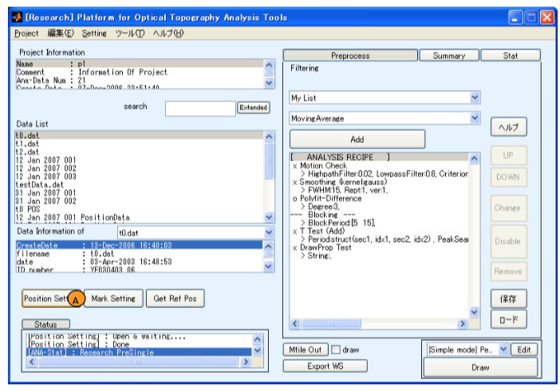
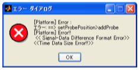
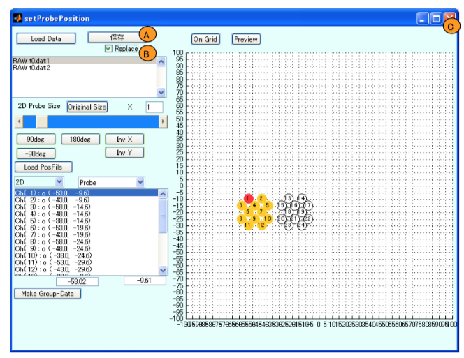
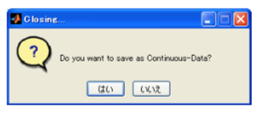
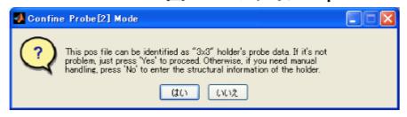
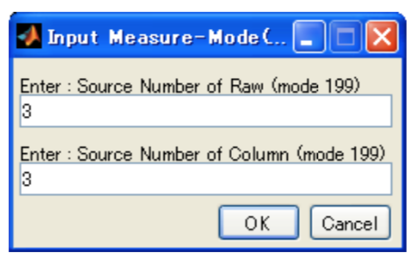
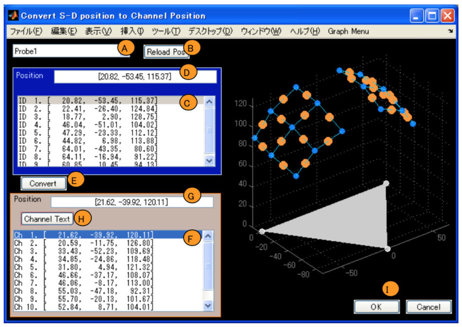
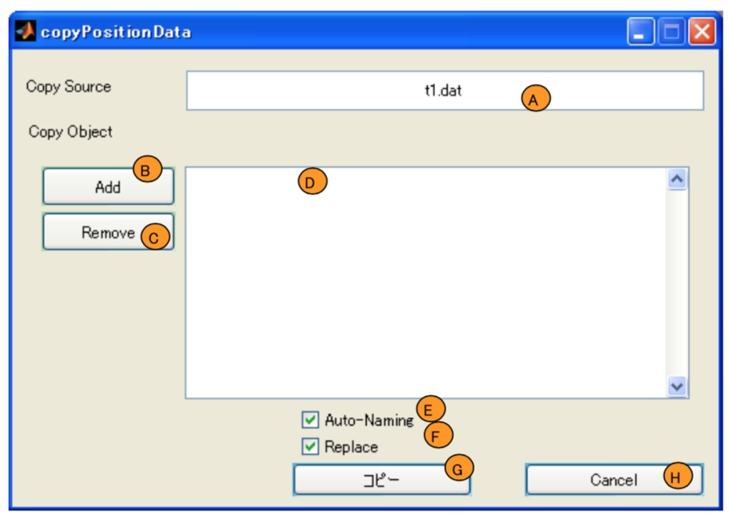

# Measurement position information settings

[Open PoTATo Document List ](index.md)

<!-- TOC -->

- [Measurement position information settings](#measurement-position-information-settings)
- [Overview](#overview)
    - [Position settings window](#position-settings-window)
- [Position information settings](#position-information-settings)
    - [Opening the position settings window](#opening-the-position-settings-window)
    - [Selecting experimental data to edit](#selecting-experimental-data-to-edit)
    - [Saving/exiting](#savingexiting)
    - [Deleting unnecessary channel data](#deleting-unnecessary-channel-data)
    - [Virtual 2D position information settings](#virtual-2d-position-information-settings)
    - [Loading position data files](#loading-position-data-files)
    - [Copying position data](#copying-position-data)

<!-- /TOC -->

# Overview

Measurement position information is information regarding the positions of probes and channels when performing fNIRS experiments.

Open PoTATo can save position information in various ways.

The simplest is with **measurement mode**. Measurement mode is a system that manages patterns of pre-defined probe and channel two-dimensional positions using ID numbers.

Open PoTATo also has a function for modifying position information and a function for loading position information acquired by a 3D position measurement unit and converting this information into channel position information. A 3D position measurement unit can also be used to work with head surface measurement positions from a real coordinate system.

When applying spatial analysis, MNI (Montreal Neurological Institute) coordinates can be used to calculate standard brain positions that correspond to measurement positions, but this is not explained herein.

## Position settings window

Position information can be set using the position settings window.

The functions of the position settings window are as indicated below.

- Loading the experimental data

- Load multiple items of experimental data obtained with a single measurement as a single item of experimental data

- Set the channel position

- Delete unnecessary channel data

- Apply channel position information to different experimental data (copy the information)

- Load the output file from the position measurement unit and convert it into channel information

- Reflect editing results and overwrite experimental data

- Save editing results as separate experimental data

The information set in the position settings window is saved as experimental data. This information is used when displaying, analyzing, and outputting data.

Unnecessary channel deletion completely deletes information for channels that are not used. Unused channels can be deleted to prevent unnecessary calculation and display.

# Position information settings

## Opening the position settings window

Position information is set using the position settings window. The procedure for opening the position settings window is described below.

On the Research mode window, press the [Pre] toggle button to switch the system to the analysis preparation state (Preprocess). In this state, pressing the “Position Setting” button (A) will open the position settings window.



The position settings window can also be started by selecting Position Setting from the Tool menu on the main window.

## Selecting experimental data to edit

First, a dialog window will be displayed for selecting the experimental data whose position information is to be edited.


Select the file to which you wish to add position data using the list box (A).

If there are multiple items of experimental data obtained by the same measurement, these can be combined into a single item of experimental data. Files which are inferred to be from the same measurement based on naming rules will be displayed as a single item of experimental data, such as ETG4000_3x3_MES_Probe[1,2,3,4].csv. To disable this function, uncheck the File Grouping checkbox (B).

Select a file and click the “Select” button (C). A position information settings window like that shown before will open. Clicking the “Cancel” button (D) will cancel this process. The position information settings window contains a data list (A), channel list (B), and position information display area (C).


**Error case: ** Ungroupable files

If multiple selected items of data cannot be handled as experimental data from a single measurement, an error such as the one below will be displayed.



```shell

## Note: About experimental data  ##

The list of selectable position settings may differ from the list of data shown in the main window. This is because the data to which position settings apply is experimental data, while the data displayed on the PoTATo main window is analysis data.

Normally, there is no need for users to be aware of the difference between experimental data and analysis data, but this difference is explained below.

Experimental data is the set of data read into Open PoTATo from a file output by the fNIRS device. This includes additional information such as position settings. Analysis data is data used to identify the above experimental data and the recipes used to analyze that data. It does not contain the actual measurement data. When experimental data is loaded, Open PoTATo creates experimental data and, simultaneously, analysis data that corresponds to that experimental data.

When changing position settings, the position information in the experimental data is modified and saved.

When analysis data is copied, only the analysis data itself is copied. The experimental data is not modified. Therefore, it will look like there is little experimental data. To copy the experimental data itself, read the “RAW” data within the project.

When analysis data is deleted, the experimental data itself is not deleted. Therefore, only the experimental data will remain. The unnecessary experimental data can be deleted by performing Raw Data Check within Project Repair on the Tool menu.

```

## Saving/exiting

To save a file after editing its position information, click the “Save” button (A). To overwrite the file, check the “Replace” checkbox.



To complete the position setting process, click the close button (C) on the window.  A dialog box will appear asking if you wish to save the data. To save the data, select “Yes”. If you do not wish to save the data, select “No”.



<!--The below has not been revised, and operation has not been confirmed-->

## Deleting unnecessary channel data

The experimental data selected in the dialog window that is shown when the position information settings window is opened is displayed in the list (A).

If there is data for any channels which will not be used in the analysis, select the channels in the list box (B). Each time a channel is selected, its status will toggle between enabled and disabled. Disabled channels are indicated with an “X”. Enabled channels are indicated with a “O”.

<!--Is this function actually necessary? -->

When a channel is disabled, all data for the corresponding channel will be deleted upon saving. This can speed up and simplify later processing. Note that after saving, it is not possible to restore channel data.


Virtual 2D positions are shown on Axes (C). When a channel number is selected on the Axes, the list box (B) selection position will also change.


To delete all channels, right-click the Axes (C) and select the ProbePosition/MaskSetting/Maskon menu item.

Conversely, to enable all channels, select Mask off.

## Virtual 2D position information settings

2D positions can be set for use in displaying waveforms and for interpolation when creating topographies.

Position settings are first set for “Probe" units. “Probes” here refers to collections of light sources and detectors also called “holders” or “caps”. The coordinates are virtual and can be set as desired. However, they must be set appropriately given the analysis functions and display objects (AO) that will be used.

Configure the environment. Configuration is performed from the menu displayed when the Axes are right-clicked.

To add a Probe number in the character string displayed for each channel, select Probe Position/Text of Channel Probe.

To delete the color for the selected Channel, select and uncheck Channel Color.

When positions are set via the GUI, channels will be snapped to grid lines. To change the spacing of the grid, select Grid.


After configuring the environment, set the positions.


First, set the Probe’s size and general placement method. The Probe size can be changed using the slider bar (A1).

There are buttons (A2) for rotating the Probe 90°, -90°, or 180°, flipping it over the X axis, and flipping it over the Y axis.

Next, modify the Probe’s position. Select Probe on the popup menu (B). Then enter the X and Y coordinates of the selected Probe’s smallest channel in the edit text (C). The position can also be changed by dragging the Probe within the Axes (D).

Last, if you wish to move in channel units, instead of Probe units, select Channel from the popup menu (B) and drag the channel within the Axes (D).

To display the edited results, click the “Preview” button (F). The “onGrid” button (E) snaps all channels to the grid.

## Loading position data files

This section explains how to read position data files obtained from the optional ETG series 3D position measurement unit.

This function supports version 1.2 and 2.0 position data files.

First, click the “Load PosFile” button (A).


You will be asked the location of the position data file. Select the position data file.


A confirmation dialog window will be displayed for the position information for the optodes in each holder. If there are no problems, click the “Yes” button.



If there are any display problems, click the “No” button and specify the light source and detector position using the n x m positioning format.



This will cause a position data file loading window to open.



The position data file loading window is used to confirm and change the contents of loaded files.

On the Axes at the right side of the window, the test subject’s Nasion and a polygon connecting both ears will be displayed in gray. The positions of the light source and detector read in from the position data file will be displayed on this figure with green dots. Their midpoint and defined channel positions will be indicated with orange dots.

Probes for which position information is displayed are selected from the popup menu (A). If you wish to change or reload the position data file, click the “ReloadPos” button (B).

If there are any problems with the light source position or detector position, select the problem position from the list box (C) and make changes using the edit text (D). To recalculate the channel position from the edited light source position or detector position, click the “Convert” button (E).

If there are any problems with converted channel positions, select the problem position from the list box (F) and make changes using the edit text (G). To display channel numbers on the Axes, press the “Channel Text” toggle button (H) to switch it to “On”.

When you have finished making changes, if the content of the changes is correct, click the “OK” button (I) to save the results.

## Copying position data


If you wish to use the set position information for other experimental data as well, copy the position data.

When the position data is saved and data with saved position data is opened, the “Copy to...” (A) button will be displayed.

Click the “Copy to...” (A) button.

The position data file loading window will open.



The selected data will be set as the copy source (A). To add a copy destination, click the “Add” (B) button. The experimental data selection dialog box will be displayed. Once the copy destination has been added, the added file will be displayed in the list box (D). To delete the added experimental data, click the “Remove” button (C).

To save data to which position data was copied as a separate file, uncheck the “Replace” checkbox (F). To manually set the name of the separate file that is saved, uncheck the “Auto-Naming” checkbox (E).

If the contents are correct, and click the “Copy” button (G) to perform copying. To cancel the process, click the “Cancel” button (H).

