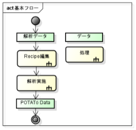
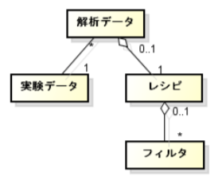

# Extended analysis

* This document has not been proofread. We would appreciate anyone willing to help with this! *

[Open PoTATo Document List](index.md)

<!-- TOC -->

- [Extended analysis](#extended-analysis)
- [Analysis functions](#analysis-functions)
    - [Analysis using Open PoTATo](#analysis-using-open-potato)
    - [Analysis processing](#analysis-processing)
- [Data structure](#data-structure)
    - [Analysis data](#analysis-data)
    - [Recipes](#recipes)
- [Filter extension](#filter-extension)
    - [Function interface](#function-interface)
    - [createBasicInfo subfunction](#createbasicinfo-subfunction)
    - [getArgument subfunction](#getargument-subfunction)
    - [write subfunction](#write-subfunction)
- [Auxiliary function](#auxiliary-function)
        - [uc_dataload function](#uc_dataload-function)
        - [nan_fcn function](#nan_fcn-function)
        - [uihelp function](#uihelp-function)

<!-- /TOC -->

# Analysis functions

## Analysis using Open PoTATo

This document explains how to extend single data analysis using Open PoTATo’s Research mode preprocessor.

In Open PoTATo, analysis procedures are called “recipes.” Recipes can be saved as files. Recipes are made up of multiple analysis functions (filters), and can change variable values and processing sequences.

- Recipes can be reused and redistributed

- Recipes can be edited

- Analysis functions (filters) can be added

Below is an explanation of how to add an analysis function.

For an explanation of a method of adding a simple analysis function, see the “Step-by-step guide to adding an analysis tool.pdf”. The explanation below, including related content, is closely tied to Open PoTATo’s internal structure.

This explanation assumes that program code is to be written, and is therefore intended for program developers.

## Analysis processing

In single data analysis using Open PoTATo’s Research mode preprocessor, recipes (analysis procedures) in analysis data are edited and analysis is performed.

The result of this analysis is data output by PoTATo.

Analysis data contains a recipe and the names of experimental data (raw data).

If this recipe is edited, PoTATo will acquire a list of analysis functions and their properties. The recipe is then modified when the user takes actions to add or delete analysis functions.

When analysis is performed, the analysis data is used to create an M-File for analysis. When an M-File is created, the following processes are written to a file: processes for loading data using experimental data names and processes for performing filtering using the functions registered in the recipe.

The created M-File can then be run to acquire post-analysis data from PoTATo.



# Data structure

## Analysis data

The data necessary for performing analysis is called analysis data. The figure below shows the structure of the analysis data.

Analysis data contains one item of experimental data (or multiple items in older versions) and one recipe. Each recipe is made up of multiple filters.

There are three types of filters: filters used on continuous data, blocking filters, and filters used on block data.

Specifically, recipes are saved within analysis data (AnalysisData) within the AnalysisData.data.filterdata structure.



## Recipes

Recipes indicate analysis procedures. Recipes have the following structure.

| Field name  | Contents                                     | Example                         |

| ------------ | --------------------------------------- | ------------------------- |

| dummy         | Dummy field to prevent the existence of empty structures  | No Effective Data'         |

| HBdata        | Filter list for continuous data         | { FilterData, FilterData}  |

| block_enable  | Block enabled flag                       | 1                         |

| BlockPeriod   | Block period                             | [5 15]                    |

| TimeBlocking  | Blocking filter                       | { FilterData}              |

| BlockData     | Filter list for block data       | { FilterData, FilterData}  |

Fields which are not used for analysis may be omitted, but the recipe must be structured such that it is not empty. If no analysis is performed, to prevent the recipe structure from being empty, set a value for the dummy field.

Analysis is performed by first applying filters to continuous data, then performing blocking, and, finally, applying filters to block data. Information about filter-related data and FilterData is indicated below.

Multiple blocking-related settings are configured. The block_enable field indicates whether blocking is enabled or disabled. When block_enable==0, blocking and later processing is not performed.

The BlockPeriod field is a common setting used for all blocking. When it is not set, blocking and later processing is not performed.

The TimeBlocking field is a filter used for blocking. When it is omitted, default blocking is performed. Default blocking is performed for all types of stimuli.

# Filter extension

## Function interface

Filters are created using PlugInWrap*.m files within the PluginDir folder in PoTATo. PoTATo can also search subfolders, so these files can be organized by putting them in separate folders. p-code files can also be searched, so perform p-coding if necessary.

This function has the following interface.

```matlab

PlugInWrap_*(‘subfncname’,[arg1,arg2,・・・])

```

The subfncname portion is replaced with the actual subfunction name, and arg1, arg2, etc., by actual subfunction arguments. The following three subfunctions should be prepared.

| Subfunction name       | Contents                                    |

| --------------- | -------------------------------------- |

| createBasicInfo  | Configures basic information                            |

| getArgument      | Creates filter data                |

| write            | Creates an M-File for performing analysis  |

The arguments and uses of each subfunction are fixed. This section provides an explanation of each subfunction. The code that serves as the framework of these functions can be created by copying another filter function or using the “P3_wizard_plugin” FilterPlug-in.

Function help comments (the comments at the start of the M-File) will be used as help information, so it is recommended that these comments be clear and easy to understand.

## createBasicInfo subfunction

The createBasicInfo subfunction returns basic information regarding the filter function. It is used for system control, such as when editing a recipe via PoTATo. Use fixed values for the basic information that it returns.

| Item          | Explanation                                             |

| ------------ | ----------------------------------------------- |

| Syntax  | info=createBasicInfo                            |

| Function          | Updates the AO-related data that corresponds to the designated name, ID  |

| Input          | **info** basic information (structure)                      |

The structure of the basic information uses the following format.

| Field name  | Contents                                                          | Example                    |

| ------------ | ------------------------------------------------------------ | -------------------- |

| name         | Filter name                                                    | 'MyFilter'            |

| region       | Array indicating the usable area<br>2:  Corresponds to continuous data<br>3:  Corresponds to block data<br>-1: Blocking (arrangement is not possible)  | [2,3]                |

| DispKind     | Display type                                                      | 0                    |

| Description  | Explanation of filter when creating M-Files                                  | ‘MyFilter: band-pass’  |

Here, the name field is used to indicate the filter name. Each name should be unique within PoTATo. If there are two identical names, an error will be displayed each time PoTATo is started.

The region field indicates which data the filter can be executed for. Normally, this should be set to 2 (continuous data) or 3 (block data). Both types of data can be selected by specifying [2,3].

The DispKind field indicates the type of filter. Previously, this was used to narrow down displayed filter lists, such as for BookMarks, but now this filter is not used by standard filters.

However, set it to F_1stLvlAna when creating a filter for 1st-Level-Analysis to be used in Developer-Mode.

## getArgument subfunction

This is used to configure arguments used when performing analysis.

| Item          | Explanation                                                          |

| ------------ | ------------------------------------------------------------ |

| Syntax  | fdata=getArgument(fdata, mfile)                              |

| Function          | This sets the filter data used when performing analysis.                      |

| Input          | **varargin** Other arguments. <br>In the current version of PoTATo,<br>varargin{1} contains a script file for creating<br>data immediately before filtering is performed.  |

| Input/output        | **fdata** Filter data                                      |

This is called by PoTATo's GUI. During new creation, only initial data is supplied, but when performing updates, the fdata field contains previous fdata contents. To cancel, set fdata=[]; before returning. The filter data format is as shown below.

| Field name  | Contents                          | Notes                      |

| ------------ | ---------------------------- | ------------------------ |

| name         | Filter name. Identical to basic information.  | Cannot be changed                  |

| wrap         | Function name                        | Cannot be changed                  |

| argData      | Data used in analysis          | Structure<br>Can be changed freely  |

Filter data here has an enable field in PoTATo. The enable field’s value can be ‘on’ or ‘off’, setting whether the filter is enabled or disabled.

This enable field is applied to the field data within the recipe (see Table 2.1 Recipe structure).

If you wish to acquire PoTATo data from immediately before the argument was set, use the following code.

```matlab

mfile=varargin{1};

[data, hdata]=scriptMeval(mfile, ‘data’,’hdata’);

```

Here, the PoTATo data acquired by this function changes when there are changes to surrounding recipes. When making changes, this can be used to acquire PoTATo data from immediately before an argument is set.

## write subfunction

When analysis is performed, the PoTATo recipe first creates an M-File, and then that M-File is executed to carry out analysis.

The write subfunction, therefore, creates the M-File used to perform analysis.

| Item          | Explanation                                                          |

| ------------ | ------------------------------------------------------------ |

| Syntax  | str=write(region,fdata)                                      |

| Function          | AO: Creates a character string for use in drawing processing                                |

| Input          | **region** Character string indicating the region. Continuous data: ‘Hbdata’, Block data: ‘BlockData’  |

|              | **fdata** Filter data                                      |

| Output          | **str** Character string used in AO drawing processing in the Axis-Area                     |

The image below shows the relationship between PoTATo and the filters when creating an M-File.


First PoTATo performs 1.getArgument as a filter, creating FilterData. This FilterData is stored within the recipe.

Next, the PoTATo uses make_mfile, an auxiliary function within PoTATo, to open the M-File it is creating. The recipe is then used to create the M-File. The createBasicInfo subfunction is used on the filter to create the help header, etc.

When PoTATo requires code for performing filtering, 3.write is performed for the filter.

When writing directly to the M-File within the filter’s write subfunction, make_mfile is used to perform writing.

Then PoTATo writes the filter’s write subfunction return value, str, and continues with the creation of the rest of the M-File.

Lastly, 4close is performed on make_mfile, and the created M-File is executed or opened as necessary.

Below is an example of a typical write subfunction.

When the filter creates an M-File, it inserts appropriate indents, follows uniform rules to insert code separators, and the like to create an easy to read M-File. The make_mfile function is provided as a tool for making organized files like these. The syntax of make_mfile is as shown below.

```matlab

make_mfile(‘subfunction name’,argument);

```

The main usage methods are as indicated below.

| Subfunction        | Argument             | Contents                                                          |

| -------------- | --------------- | ------------------------------------------------------------ |

| write          | Str             | Outputs character string Str to the M-File                                       |

| with_indent    | Str             | Outputs indented character string Str to the M-File                       |

| code_separator | level           | Outputs level-specific separators. The smaller the output integer, the higher the separator's importance.  |

| indent_fcn     | ‘up’ <br>‘down’ | Increases the amount of indentation<br>Decreases the amount of indentation  |

Here, use a preformatted character array for Str. While a cell can also be used, it is not recommended.

The write subfunction is normally started as indicated below.

```matlab

function str = write(region, fdata) %#ok

% input : fdata

str='';

bi=createBasicInfo;

```

Here, when str is used to return results, indentation cannot be adjusted, so set the default to be to return a blank.

The basic information is used to compare the version of the fdata created using getArgument against the version when the write subfunction is executed, and to insert the write subfunction version in the M-File.

Next, we recommend writing the header for the filter. Set the code level to three and indicate the filter name and write subfunction version.

```matlab

% *****************************

%  Header Area

% *****************************

make_mfile('code_separator', 3);

make_mfile('with_indent', ['% == ' fdata.name ' ==']);

make_mfile('with_indent', sprintf('%% Version %f',bi.Version));

make_mfile('code_separator', 3);

make_mfile('with_indent', '');

```

Next, insert the actual portion that will be executed. The code to be executed should be wrapped in a try-catch statement.

```matlab

% *****************************

%  Execute Area

% *****************************

make_mfile('with_indent', 'try');

make_mfile('indent_fcn', 'down'); % Reduce the indentation

% <<< The code to be executed is entered here >>

make_mfile('indent_fcn', 'up'); % Return the indentation to its previous level

make_mfile('with_indent', 'catch');

make_mfile('indent_fcn', 'down');

% Error processing

make_mfile('with_indent', 'errordlg(lasterr);');

make_mfile('indent_fcn', 'up');

make_mfile('with_indent', 'end');

make_mfile('with_indent', '');

```

Last, insert the portion that will be executed. Pay close attention to the variable scope when entering the code to be executed.

The variables that can be used in the write subfunction are the region and fdata arguments and the filter basic information. The filter data that contains the arguments (fdata) is not contained within the M-File.

The variables that can be used within the created M-File are PoTATo data.

| Subfunction         | Argument      | Contents                                                          | Scope          |

| --------------- | -------- | ------------------------------------------------------------ | ---------------- |

| region          | Argument      | Character string indicating the region.  <br>Continuous data: ‘Hbdata’, Block data:  ‘BlockData’  | Within write subfunction  |

| fdata           | Argument      | Filter data (Table 3.3 Filter data)                       | Within write subfunction  |

| bi              | Constant      | Filter basic information (Table 3.2 Filter basic information)<br>Acquired using createBasicInfo  | Within write subfunction  |

| dataname        | Input      | Name of experimental data file for calculations to be performed on (cell)                            | Within created M-File  |

| hdata<br>data   | Calculation scope  | PoTATo data<br>Immediately before executing filter                             | Within created M-File  |

| chdata<br>cdata | Calculation results  | PoTATo data<br>Continuous data immediately before blocking (only after blocking)  | Within created M-File  |

| bhdata<br>bdata | Calculation results  | PoTATo data<br>Block data after completion of analysis (does not normally exist)             | Within created M-File  |

Variables can be added within the write subfunction by defining them within the subfunction. Data changed here will not affect other data.

Variables within the created M-File can be changed or added by other filters. If a created filter requires the use of another filter, it is recommended that an appropriate explanation and error messages be inserted.

# Auxiliary function

Below is an auxiliary function that can be used when executing a filter.

| Function name       | Subfunction name  | Contents                                                          |

| ----------- | ---------- | ------------------------------------------------------------ |

| uc_dataload | -          | Load data                                                    |

| nan_fcn     | ‘mean’     | mean(x,dim), excluding NaNs                                  |

|             | ‘std0’     | std(x,0,dim), excluding NaNs                                 |

|             | ‘std1’     | Calculated std(x,1,flag), excluding NaNs                        |

| make_mfile  | -          | M-File creation tool. <br>Used by the write subfunction.          |

| msglistbox  | -          | Same as msgbox. <br>However, the message section is a list box<br>and can display numerous character strings.  |

| uihelp      | -          | Displays help information                                              |

### uc_dataload function

This function loads PoTATo continuous data from experimental data.

```matlab

[data,hdata]=uc_dataload(‘file name’);

```

Here, the file name is assigned by dataname{1} when creating an M-File.

### nan_fcn function

PoTATo data may contain NaNs. NaNs in PoTATo data often simply represent invalid data.

A function is therefore provided for disregarding these NaNs.

| Item          | Explanation                                                          |

| ------------ | ------------------------------------------------------------ |

| Syntax  | [data,n]=nan_fcn(fcn,data,dim)                               |

| Function          | Calculates the average value and standard variation, ignoring NaNs.                         |

| Input          | **fcn** Function type: <br>‘mean’ → Performs mean(data,dim) <br>‘std0’ → Performs std(data,0,dim) <br>‘std1’ → Performs std(data,1,dim)  |

|              | **data** Calculation scope data                                       |

|              | **dim** Dimension scope                                              |

| Output          | **data** Results                                                 |

|              | **n** Number of valid data used in calculation.                          |

```shell

## Background behind NaN settings: ##

PoTATo’s Motion Check filter sets a flag for measurement data when physical movement is determined to have occurred. For continuous data, a flag is set for the corresponding time and channel. For block data, a flag is set for the corresponding block and channel.

The way this flag is handled varies depending on the analysis method policy. One way of handling this data is to treat flagged data as invalid, so the corresponding data is changed to NaN.

```

### uihelp function

Filter plug-in help is displayed by the uihelp function. It is recommended that all filter plug-ins that are created support the following help function.

| Item          | Explanation                             |

| ------------ | ------------------------------- |

| Syntax  | h = uihelp(fname)               |

| Function          | Displays function help information                 |

| Input          | **fname** Function name                 |

| Output          | **h** uihelp figure handle  |

The uihelp function acquires a help document from the input function.

If there is a PDF or html help document, it enables the button used to open that help document. The PDF or html help document is searched for by searching for a file with a name formatted as indicated below within the same path as the function itself. The first file that is found will be opened.

- XXX/FunctionName.pdf

- XXX/FunctionName.html

- FunctionName.pdf

- FunctionName.html

Here, "XXX" represents the language set within PoTATo. Currently, this is “ja” for Japanese.

