# Research Mode operation manual

[Open PoTATo Document List](index.md)

<!-- TOC -->

- [Research Mode operation manual](#research-mode-operation-manual)
- [Overview](#overview)
    - [Research mode analysis process and states](#research-mode-analysis-process-and-states)
    - [Main window](#main-window)
- [Preparing to perform analysis](#preparing-to-perform-analysis)
    - [Single:  State when a single item of data is selected](#single--state-when-a-single-item-of-data-is-selected)
        - [Special processing button area](#special-processing-button-area)
            - [Mark editing](#mark-editing)
                - [Selection assistance GUI](#selection-assistance-gui)
                - [Enabling/disabling marks](#enablingdisabling-marks)
- [Click the “Delete” button (A) to enable or disable marks selected on the mark list.](#click-the-delete-button-a-to-enable-or-disable-marks-selected-on-the-mark-list)
                - [How to move marks forward or backward](#how-to-move-marks-forward-or-backward)
                - [Displaying the data state](#displaying-the-data-state)
        - [Analysis area](#analysis-area)
            - [Adding a filter](#adding-a-filter)
                - [My Filter List settings](#my-filter-list-settings)
            - [Selecting recipe information and filters to be edited](#selecting-recipe-information-and-filters-to-be-edited)
                - [Detailed filter information](#detailed-filter-information)
            - [Editing recipes](#editing-recipes)
            - [Saving and loading recipes](#saving-and-loading-recipes)
        - [Output area](#output-area)
    - [Batch:  State when multiple items of data with the same recipe are selected](#batch--state-when-multiple-items-of-data-with-the-same-recipe-are-selected)
        - [Displaying the grand average](#displaying-the-grand-average)
        - [Batch data drawing](#batch-data-drawing)
    - [Mixed:  State when multiple items of data with different recipes are selected](#mixed--state-when-multiple-items-of-data-with-different-recipes-are-selected)
        - [Extracting only data with the same recipe and consolidating recipes](#extracting-only-data-with-the-same-recipe-and-consolidating-recipes)
        - [Changing common filter settings](#changing-common-filter-settings)
- [Calculating summary statistics](#calculating-summary-statistics)
    - [Creating summary statistics data](#creating-summary-statistics-data)
        - [Summary statistic data configuration](#summary-statistic-data-configuration)
        - [Selecting analysis data](#selecting-analysis-data)
        - [Configuring the method used to calculate summary statistics](#configuring-the-method-used-to-calculate-summary-statistics)
        - [Calculating statistics](#calculating-statistics)
    - [Recalculating summary statistics](#recalculating-summary-statistics)
        - [Summary statistic data configuration](#summary-statistic-data-configuration-1)
        - [Selecting analysis data and editing recipes](#selecting-analysis-data-and-editing-recipes)
        - [Configuring the method used to calculate summary statistics while performing editing](#configuring-the-method-used-to-calculate-summary-statistics-while-performing-editing)
        - [Performing statistics editing operations](#performing-statistics-editing-operations)
- [Statistical verification](#statistical-verification)
    - [Selecting summary statistics data](#selecting-summary-statistics-data)
    - [Verification scope data information](#verification-scope-data-information)
    - [Summary statistics data output](#summary-statistics-data-output)
    - [Performing statistical verification](#performing-statistical-verification)
    - 

<!-- /TOC -->

# Overview

This document explains how to operate Open PoTATo in Research mode. In Research mode, users can combine analysis methods to perform relatively free analyses. Furthermore, unique analysis methods can be embedded in Open PoTATo (as plug-ins). This makes it possible to perform various new analyses.

This document explains how to operate the GUI. For information regarding how to start Open PoTATo, how to import experimental data into Open PoTATo, or how to select imported data, please see the “Basic operation” manual. For information regarding how to create plug-ins, see the separate plug-in creation manual.

[To table of contents](#Research Mode operation manual)

## Research mode analysis process and states

First, prepare for analysis of each unit of imported experimental data. The state that provides this function is called the **Preprocess** state. In the Preprocess state, information regarding experimental data (such as measurement points or stimulus marks) can be added or modified. Furthermore, analysis procedures that can be used on individual experimental data, such as “Baseline Correction” and “Blocking”, can be configured. In PoTATo, these analysis procedures are called **recipes**. Experimental data and recipes are saved together as **analysis data**. Analysis data can be used to create a MATLAB script function (M-File) for performing analysis of experimental data as indicated in recipes, and to draw the analysis results.

Next, summary statistics are calculated from multiple items of analysis data. The state in which this process is carried out is referred to as **Summary Statistics Computation**. The Summary Statistics Computation process uses analysis data within the computation scope to calculate statistical values that indicate representative characteristics of the data. The calculated statistics are associated with blocks, times, channels, data kinds (oxygenated hemoglobin/deoxygenated hemoglobin, etc.), test subject names, and the like.  The data that contains both the statistics and the associated information is saved as **Summary Statistics data**. Summary statistics data can be extracted as MATLAB variables, CSV files, etc.

Lastly, summary statistics data is used to perform statistical verification. The state in which this processing is performed is called **Statistical Testing**. In Statistical Testing, one or more groups are created based on information associated with statistics and statistical verification is performed.

**Fig. 1.1 The Research mode analysis process**

In Research mode, the **state** of the system, such as the appearances of windows and the functions of buttons, changes automatically depending on the analysis step or user input.

The results of processing in each of these states can be written to a file as data or displayed as a graph. Each of these states has objectives and, depending on specific conditions, may also have sub-states. The table below summarizes them.

**Table 1.1 Research mode states**

| State           | Sub-state  |  Contents                  |

| -------------------- | ------|------------------ |

| Preprocessor  | Single  |Editing of recipe for a single item of data  |

| - | Batch  |Batch editing of recipes for multiple items of data   * When the same recipe applies to all selected data |

|  - | Mixed  |Editing or consolidating of shared portions of recipes for multiple items of data  * When different recipes apply to selected data |

| Summary Statistics Computation  | New  |Creating summary statistics data |

| - | Edit  |Editing summary statistics data |

| Statistical Test  | - | Statistical test: T-testing/ANOVA/correlation analysis, etc. |

[To table of contents](#Research Mode operation manual)

## Main window

To enter Research mode, launch PoTATo and, on the main window Setting menu, select “Research Mode” as the “P3 MODE”.

Below is an overview of the main window shown in Research mode.

**Figure 1.2 Research mode main window and areas**

In Research mode, the main window can be dived into six areas. The content displayed in each area will vary depending on the system’s state, but the areas are primarily used to perform processing as shown below.

I) State selection toggle area

From here, you can select one of three states: Preprocessor, Summary Statistics Computation, or Statistical Test.

II) Data information/selection area

The name of the opened project and information regarding data within the computation scope are shown here. Analysis data other than statistical verification can also be selected here.

III) Special processing button area

This is used to perform position configuration, mark configuration, and other special processing.

IV) Status display area

V) Analysis area

This area has a GUI for performing analysis that corresponds to the system’s state.

VI) Output area

This area has a GUI for outputting state results.

[To table of contents](#Research Mode operation manual)

# Preparing to perform analysis

On the Research mode window, press the [Pre] toggle button to switch the system to the analysis preparation state (Preprocess). When the system is in the analysis preparation state, [Preprocess] will be shown on the [Pre] toggle button.

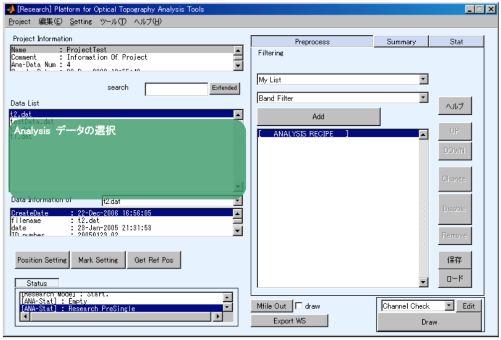

**Figure 2.1 Research mode analysis preparation state**

Position information is added to experimental data in the Preprocess state. Next, analysis procedures (recipes) that can be used on individual experimental data, such as “Baseline Correction” and “Blocking”, are configured for experimental data to which information has been added.

The data displayed in the Preprocess data information/selection area is analysis data which adds analysis procedures to experimental data. When experimental data is imported, it is automatically saved as analysis data and listed in the data area.

In the Preprocess state, the system will automatically switch to one of the following three substates depending on how data was selected.

**Table 2.1 Research mode states**

| State                                                | Sub-state  | Contents                                                          |

| -------------------------------------------------- | -------- | ------------------------------------------------------------ |

| Preprocessor                            | Single    | One item of data: Recipe editing                                       |

| -                                                  | Batch     | Multiple data: Batch Recipe editing   * When the same recipe applies to all selected data  |

| -                                                  | Mixed     | Multiple data: Editing or consolidating of shared portions of recipes  * When different recipes apply to selected data  |

The Single substate is the state when one item of analysis data has been selected. It is used to edit the recipe of the selected analysis data.

The Batch substate is the state when multiple items of analysis data have been selected, and the same recipe is used for all selected data. It is used to perform batch editing of the recipe for the selected data.

The Mixed substate is the state when multiple items of analysis data have been selected, and different recipes are used for the selected data. It is used to unify the arguments of shared analysis functions and match the contents of recipes to other recipes.

Below is an explanation of each substate.

[To table of contents](#Research Mode operation manual)

## Single:  State when a single item of data is selected

In the Preprocess state, selecting any single item of analysis data from the data list box <u>(A)</u> will cause the system to enter the Single substate.

**Fig. 2.2 Research mode analysis preparation** Single substate**

Below  is an explanation of the following three areas of the Single substate window.

I) Special processing button area

This is used to configure positions and stimulus marks for experimental data.

II) Analysis area

This is used to configure and edit analysis procedures (recipes).

III) Output area

[To table of contents](#Research Mode operation manual)

### Special processing button area

This area in the middle left of the main window, below the Analysis data selection list box, contains buttons for performing special processing.

To add measurement point information to experimental data, click the “PositionSetting” button (A) and set the position information. When doing this, you can set positions to be used for 2D display and load measurement results from a 3D digitizer. For details regarding position settings, refer to the “Position settings” manual.

If, for any reason, a stimulus mark is inappropriate, click the “MarkSetting” button (B) to edit the mark. See the next section for details regarding settings.

Other special processes are assigned to button (C). The processes to be assigned to this button can be selected by right-clicking it.

Plug-ins can be assigned. The processing performed by this button therefore changes depending on the state of the plug-in. This manual does not explain individual processes.

[To table of contents](#Research Mode operation manual)

#### Mark editing

This section provides a detailed explanation of editing stimulus marks using the Mark Setting button. Stimulus types can be changed and stimulus marks can be deleted or moved. However, stimulus kinds cannot be changed.

Clicking the “Mark Setting” button will cause an editing window such as the one shown below to appear.

The name of the data being edited is shown in the text box (A), and the state of the data being operated on is shown in the graph at right. First, select the stimulus type on the popup menu (B). If there is a mark for the stimulus start time and a mark for the stimulus stop time, select “Block”. If there is only one time mark per stimulus, select “Event”.

Next, select the stimulus mark you wish to change from the mark list (C). You can delete or move selected stimulus marks.  To start the editing process from the beginning, click the “Reset” button (D). 

When you have finished making changes, click the “OK” button (E) to finalize the changes.  To cancel the changes you have made, click the “Cancel” button (F). 

##### Selection assistance GUI 

The selection assistance GUI is used to select all marks without clicking individual marks on the mark list (Fig. 2.5 (C) in Mark Setting). 

The SerialNo is a sequential number assigned based on the mark time, beginning with 1 for the earliest mark time.  SerialNos are numbers surrounded with “[]” on the mark list.  To select data using its SerialNo, check the “SerialNo” checkbox (A) and enter the SerialNo of the mark you wish to edit in the edit text box (B).  MATLAB matrix representation can be used to specify data by entering “1:2:10” or the like. 

The Kind value indicates the kind of stimulus. It is indicated on the mark list as a number enclosed by “<>”. To select data using Kind values, check the “Kind” checkbox (C) and enter the Kind you wish to select in the edit text box (D).

After entering the information, click the “Select” button (E) to and the data will be selected on the mark list. If both the “SerialNo” and “Kind” checkboxes are checked, marks which satisfy both conditions will be selected.

##### Enabling/disabling marks

# Click the “Delete” button (A) to enable or disable marks selected on the mark list.

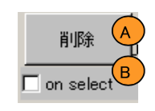

The selected marks will change accordingly. Marks with a “O” are enabled. Marks with a “X” are disabled. When the “on select” checkbox (B) is checked, selecting a mark on the mark list will enable or disable it.

##### How to move marks forward or backward

First, select a mark on the mark list. Next, set the amount to move the mark using the edit text box (B). Enter amounts in units of sampling periods. For example, for ETG7000, 1=100 msec. To move the mark time forward, click the minus button (A). To move the mark time back, click the plus button (C).

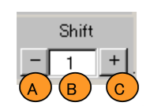

#####Displaying the data state

Enabled marks (A) are indicated with a green line. Selected marks (B) are indicated with magenta-colored pentagons. Channel hemoglobin data selected using the channel popup menu (D) is indicated with a solid line (C).

[To table of contents](#Research Mode operation manual)

### Analysis area

The analysis area to the right of the main window for the preprocessing Single and Batch substates contains the window for setting and modifying analysis procedures (recipes) on single items of experimental data. The analyses that can be configured for recipes here include frequency filters for eliminating noise and processes used for removing data when physical movement is determined to have occurred. Recipes also contain processes for converting experimental data into block data, which is extracted for individual stimulus blocks.

The individual processes performed by analysis recipes are called filters. Filters can be extended using plug-ins.

For explanations of typical filters, see “Appendix: Filter explanations”. Some filters have online help. Online help can be used by setting the Help toggle button (A) to the “ON” position.

Recipe editing includes the following processes.

I) 	Adding a filter

II) 	Selecting recipe information and filters to be edited

III) 	Editing recipes

IV) 	Saving and loading edited recipes

Below is an explanation of each of these.

#### Adding a filter

To add a filter, select the filter on the filter popup menu (B) and click the “Add” button (C) to execute it. When a filter is added, it will be added to the end of the recipe described below. Note that filters that are used on continuous data are added to the end of the analysis of continuous data. By default, the popup menu (B) only displays the filters that are registered in the “My Filter List”, which by default contains only commonly used filters. To display all filters, select “All Filter” on the popup menu (A).

##### My Filter List settings

The list of filters shown when “My Filter List” is selected can be modified by changing its settings. To change its settings, select “My Filter List” on the main window’s Setting menu. A window like that shown before will appear.

The name of the “My Filter List” will be shown in the edit text box (A). The name can be modified.

The list box at left (B) contains all of the filters. The list box at right (C) contains the filters currently registered in the “My Filter List”.

To add a filter to the My Filter List, select the filter to add in the list box at left (B) and click the “[>>]” button (D). To remove a filter from the My Filter List, select the filter to remove in the list at right and click the “[<<]” button (E). When you have finished making changes, click the “OK” button (F). To cancel, click the “Cancel” button (G). The editing window will close.

[To table of contents](#Research Mode operation manual)

#### Selecting recipe information and filters to be edited

The recipe information shown in the analysis procedure will be displayed in a list box, as shown below.

The results of filters will vary depending on the order in which the filters are executed, so the order of the filters within the recipe is important. In particular, filters are separated into filters applied to continuous data (A) and filters applied to block data (C) before and after filters used to perform blocking.

##### Detailed filter information

Each filter is displayed on two lines. The first line indicates whether the filter is enabled or disabled (A), with this information shown as an “O” or an “X”. The filter name (B) is also displayed. The second line contains the filter’s argument information (C).

However, when blocking filters are disabled, they are handled differently. When blocking is disabled, “(Blocking disabled)<<< <<< <<<” (D) is displayed, and all filters beyond that point (E) are disabled.

#### Editing recipes

First, select the filter you wish to edit using the recipe information list box (X). Buttons (A) through (E) will be enabled or disabled depending on which contents can be executed for the filter.

To move the filter up in the execution sequence, click the “UP” button (A). To move it down, click the “DOWN” button (B). To change an argument, click the “Change” button (C). When the “Change” button is clicked, the argument setting window will open. If the filter is disabled, it will be enabled.

To disable an enabled filter, click the “Disable” button (D). To enable a filter that has been disabled, click the button whose label changed to “Enable” (D). Last, to remove a filter from a recipe, click the “Remove” button (E).

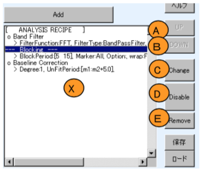

#### Saving and loading recipes

Recipes can be saved to and loaded from files. To save a recipe, click the “Save” button. To load a file, click the “Load” button.

In Japanese language environments, these buttons may be labelled “保存” and “ロード” respectively. (This is dependent on the MATLAB environment.)

[To table of contents](#Research Mode operation manual)

### Output area

This section explains the preprocess Single substate data output area.

Depending on the MATLAB version, data for MATLAB can be output using the “MFile Out” button (A) or the “Export WS” button (C). The “Draw” button (F) can be used to display results.

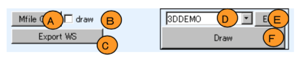

Click the “MFile Out” button (A) to create a MATLAB script function (M-File) for performing analysis of created analysis data. After clicking the button, you will be asked what to name the output M-File. Select the location you wish to save the file to and click the “OK” button . Checking the “Draw” checkbox (B) will add drawing processing to the M-File.

Click the “Export WS” button (C) to output the results of applying analysis procedures to a MATLAB workspace. The analysis results will be output to the workspace. The main analysis result data includes PoTATo data. Refer to the "PoTATo data format" section of the separate “Basic operation” manual for details regarding PoTATo data.

Below is an explanation of how to draw analysis results. With PoTATo, drawing is performed using analysis results and display layouts. Select the analysis results from the data list and select the layout from the popup menu (D). Then click the “Draw” button (F) to draw the results.

Clicking the “Edit” button (E) will open a window for editing the layout selected in the layout popup menu (D). For information regarding how to edit layouts, see the “Display function” manual.

[To table of contents](#Research Mode operation manual)

## Batch:  State when multiple items of data with the same recipe are selected

In the Preprocess state, when multiple items of analysis data have been selected from the data list box (A) and the same recipe is used for all selected data, the system changes to the Batch substate.

In the Batch substate, special function button position settings and mark settings are not displayed. To change position settings, etc., switch to Single substate.

The GUI for editing recipes is the same as for the Single substate. Note that changes to recipes will be applied to all selected analysis data.

The “Plot Average” button (B) button will be displayed. This button is used to plot the average waveform of the selected analysis data involved in drawing (grand average).  Furthermore, when the “Draw” button (C) is clicked, results will be shown for all selected analysis data.

### Displaying the grand average

Click the “Plot Average” button (B) to calculate and display the grand average.  When the average waveform is calculated, data which meets any of the following conditions will be disregarded.

- Data which is not block data.

- Data for which the channel number or kind number does not match.

- Data with significantly different stimulus periods (the threshold is set in the configuration))

- Data with different sampling periods

- Data marked as being invalid due to bodily movement, etc.

Limit values for differences in stimulus periods are set using “Stim-Diff-Limit” on the main window’s Setting menu.

The figure below shows an example of an error dialog that would be displayed if you tried to use continuous data. Grand averaging can only be performed on block data, so edit the recipe to check that blocking has been configured and enabled.

[To table of contents](#Research Mode operation manual)

### Batch data drawing

Clicking the “Draw” button in the preprocess Batch substate will draw one figure for each selected item of analysis data. Therefore, if 100 items of data are selected, 100 figures will be output.

After drawing, the GUI shown below will be displayed for performing actions on multiple figures.

A list of the drawn figures will be shown in the GUI’s list box (A). Select figures in the list box and click the “Tile” button (F) to arrange the selected figures in a tile arrangement.

To update the list box (A), click the “Reset” button (B). To delete selected figures, click the “Delete” button (C).

The figures will be arranged in the same order as in the list box, so the “Up” and “Down” buttons can be used to change the order of the figures. You can change how the figures are arranged by selecting “Tile” or “Overwrap” on the popup menu (D). When “Tile” is selected, the area in which to arrange figures can be specified in Normal units in the edit text box (E).

[To table of contents](#Research Mode operation manual)

## Mixed:  State when multiple items of data with different recipes are selected

In the Preprocess state, when multiple items of analysis data have been selected from the data list box (A) and the selected data uses different recipes, the system changes to the Mixed substate. In the Mixed substate, you can extract data which uses the same recipes, consolidate multiple recipes into a single recipe, and configure filters that are used by all of the recipes.

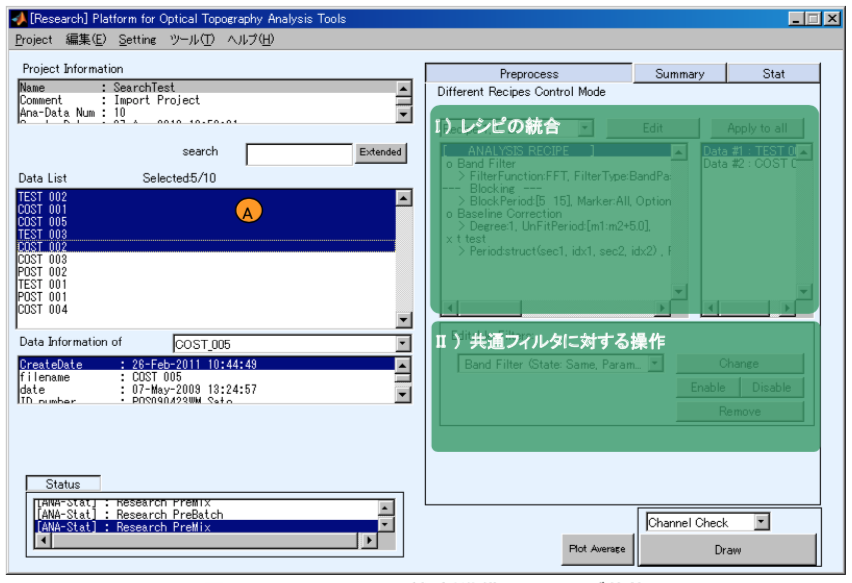

[To table of contents](#Research Mode operation manual)

### Extracting only data with the same recipe and consolidating recipes

In the Mixed substate, multiple items of analysis data with different recipes can be selected. The recipes of analysis data selected in the recipe popup menu (A) are displayed using the format “Recipe α, (β,/γ)” (α, β, and γ are integers). α is the recipe ID number, and is assigned automatically. β is the number of items of selected analysis data that use recipe α. γ is the total number of items of selected analysis data. Here, the contents of Recipe α are displayed in list box (B), and list box (E) displays a list of all analysis data that uses Recipe α.

Click the “Edit” button (C) to edit the analysis data displayed in list box (E).  When this button is clicked, only the analysis data that uses Recipe α displayed in list box (E) will be selected, and the system will switch to the preprocess Batch substate.

Click the “Apply to all” button (D) to set the recipe for all selected analysis data to the recipe selected with the recipe popup menu (A). This will set the same recipe for all, and the system will switch to the preprocess Batch substate.

### Changing common filter settings

If there are filters that are used in all recipes that apply to the selected analysis data, they will be listed in the common filter popup menu (A).

To change filter settings, click the “Change” button (B). To enable or disable filters, click the “Enable” button (C) or the “Disable” button (D). To remove a filter from a recipe, click the “Remove” button (E).

If all recipes become identical due to the removal of filters, the system will switch to the preprocess Batch substate.

[To table of contents](#Research Mode operation manual)

# Calculating summary statistics

On the Research mode window, press the [Summary] toggle button to switch the system to the summary statistics computation state. When the system is in the summary statistics computation state, [Summary Statistics Computation] will be shown on the [Summary] toggle box.

In summary statistics computation state, the analysis data created in the preprocess stage is used to create summary statistics data.

Press the [New] toggle button (A) to begin creating new summary statistics data. Press the [Edit] toggle button (B) to edit summary statistics data that has already been created. The creation and editing processes are explained in the following sections.

Created summary statistics data can be used by Open PoTATo to perform statistical verification (Statistical Testing). It can also be output in the form of a CSV file.

**Note** The extended search window can always be used in this state.  The extended search window can be used to narrow down data by its creation date, etc., so it is effective for working with a large amount of analysis data.

[To table of contents](#Research Mode operation manual)

## Creating summary statistics data

Summary statistics data is created from analysis data. To create summary statistics data, first click the “New” toggle button (A) while the system is in summary statistics computation state.

Summary statistics data is created by performing the operations on each area as shown in the figure. In these areas:

I)  Names and comments are configured for the summary statistics data that will be created.

II)  The analysis data used as the input for the summary statistic computation is selected.

III) The statistics computation method is configured.

IV) Statistics computation is performed.

Each of these procedures is explained below.

[To table of contents](#Research Mode operation manual)

### Summary statistic data configuration

Data names for the summary statistics data to be created are entered in (A) and comments are entered in (B).

In future analysis, when using summary statistics data, the name entered here is used to select the data. It is therefore important to choose an easy to remember name for the data.

There are two restrictions on data names.

- Names can only consist of single-byte letters, numbers, and “_”. The first character must be a letter.

- Names which are already cannot be used.

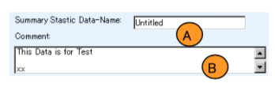

### Selecting analysis data

Select the analysis data to use to compute summary statistics. The analysis data is the data containing both experimental data and recipes, created during the preprocess stage. Data is selected using the list box (A). Data can be narrowed down using the extended search function.

The following three analysis data selection approaches can be used.

- All selected data is block data

- All selected data is continuous data

- Selected data includes both block data and continuous data

Statistics are computed using different methods for each of these patterns.

**Note** The statistics computation method settings interface in the following section will differ depending on the data selection pattern.

### Configuring the method used to calculate summary statistics

Configure the method used to compute statistics. First, use the popup menu (A) to select the function for calculating summary statistics. When you select a function, a GUI will be displayed in the parameter settings area as shown at right. The arrangement of buttons, etc., will vary depending on the function. Use this GUI to set the parameters used when computing statistics. Click the “Save” button (B) to save the parameter settings to a file. Click the “Load” button (C) to load the parameter settings from a file. Click the “Help” toggle button (D) to display the online help for a selected function.

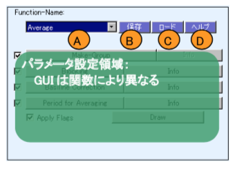

### Calculating statistics

After performing all settings, click the “Save” button shown at the bottom right (IV) of the window displayed when [creating summary statistics data] (creating summary statistics data) to perform statistics computation.

If not all analysis data is selected when [selecting analysis data] (selecting analysis data), a dialog window like the one below will appear asking you to confirm if you wish to perform statistics computation for the selected files only or for all displayed data. Select the appropriate radio button (A) for the files you wish to perform analysis on and click the “Save” button (B).

While computation is in progress, a list box (A) will be displayed checking if you wish to perform statistics computation for each item of analysis data, and a progress bar (B) will show the computation progress. If the list box (A) displays “[W] xxx”, “[E] xxx”, or the like instead of “** OK **”, this indicates that a problem has occurred while performing computation using the target analysis data and either there is a problem in the computation output or computation could not be performed.

When statistics computation has been completed for all analysis data, “Done” will be displayed in the list box (C). Click the “OK” button (D).

If the Summary Statistics data name specified in the [Summary statistics data configuration] (Summary statistics data configuration) is already in use, an error dialog window like that shown below will be displayed. If this happens, change the Summary Statistics data name and perform computation again.

[To table of contents](#Research Mode operation manual)

## Recalculating summary statistics

The data and summary statistics data stored in the summary statistics created in the [creating summary statistics data] (creating summary statistics data) section can be edited. For example, this can be effective when adding new analysis data or reusing data using previous experimental settings.

To edit summary statistics data, first click the “Edit” toggle button (A) while the system is in summary statistics computation state.

The GUI in the area shown in the figure can be used to edit Summary Statistics data. In these areas:

I) 	Summary Statistics to be edited can be selected and comments can be changed.

II) 	Analysis data can be changed.

III) 	The statistics computation method can be changed.

IV) 	Editing operations can be performed.

Each of these procedures is explained below.

### Summary statistic data configuration

Immediately after the system enters summary statistics computation state, the new creation toggle will be in the “On” position. To maintain the same new creation/editing state, click the “Lock” toggle button (A).

**Note** This function is useful when returning to the analysis preparation state, editing the recipes that correspond to analysis data, etc., and then performing summary statistics editing work again.

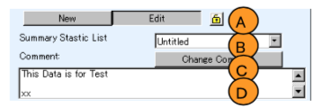

Select the Summary Statistics data you wish to edit using the popup menu (B). Comments regarding the data will be displayed in the edit text box (D). To edit or update comments, make the desired changes in the edit text box (D) and click the “Change Comment” button (C).

### Selecting analysis data and editing recipes

Select the analysis data to use to compute summary statistics. Data is selected using the list box (A). If the recipe in the analysis data used to compute summary statistics differs from the current recipe in the data, the data will be flagged with “***”. When this data with a different recipe is right-clicked while selected, a context menu will be displayed.

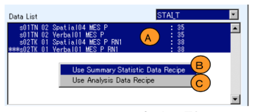

Selecting the “Use Summary Statistics Data Recipe” menu item (B) will cause the recipe used when computing Summary Statistics data to immediately reflect the current recipe of the analysis data.

Selecting the “Use Analysis Data Recipe” menu item (C) will cause the Summary Statistics data computation recipe to be overwritten.

The summary statistics data itself will not be recomputed. If you have made changes, click the “Apply Change” button before performing statistical verification to recompute the summary statistics.

** (Note) ** This data handling method is complex, and may be changed in the future.

### Configuring the method used to calculate summary statistics while performing editing

The statistics computation method settings will be the same as during the [creation process] (configuring the method used to calculate summary statistics)

### Performing statistics editing operations

Click the “Apply changes” button (A) to apply changes, recompute the summary statistics data, and overwrite the summary statistics.  Click the “Remove” button (B) to delete the summary statistics data. Click the “Copy” button (C) to copy the current data. Click the “Text Out” button (D) to output the current summary statistics data as a CSV file.

 After clicking the “Copy” button, you can configure the copied summary statistics data, as shown below. Enter the data name in (A) and comments in (B). To perform copying without changing the currently selected data, check the checkbox (C). Conversely, to acquire information from the current GUI and recompute statistics, uncheck the checkbox.

Once you have completed the configuration process, click the “Copy” button (D) to perform copying. The “Cancel” button (E) can be used at any time.

[To table of contents](#Research Mode operation manual)

# Statistical verification

On the Research mode window, press the [Stat] toggle button to switch the system to the statistical verification state. When the system is in the statistical verification state, [Statistical Test] will be shown on the [Stat] toggle box.

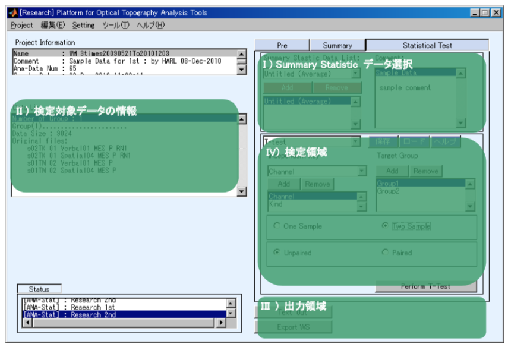

In the statistical verification state, statistical verification can be performed on the summary statistics data created using [Summary Statistics Computation] (Summary Statistics Computation).

The statistical verification main window is divided into four areas.

I) An area for selecting summary statistics data

II) An area for viewing information regarding the data in the verification scope

III) An area for outputting selected summary statistics data

IV) An area for performing verification.

Each of these areas is explained below.

## Selecting summary statistics data

First, select the summary statistics data to perform statistical verification on using the popup menu (A). The name of the saved summary statistic data and the names of the function used to compute summary statistics will be displayed in the popup menu (A).

When summary statistic data is selected in the popup menu (A), comments for that data will be displayed in the list box (B).

To perform statistical analysis on this summary statistic, click the “Add” button (C). The data will be added to the list box (E) indicating the summary statistic data that will be used for statistical verification.

To remove data from the list, select the summary statistic to remove on the list box (E) and click the “Remove” button (D).

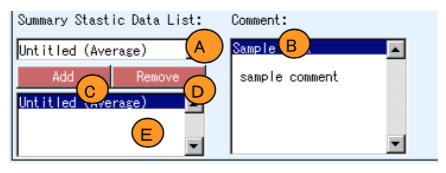

## Verification scope data information

When [selecting summary statistics data] (selecting summary statistics data), information regarding the selected data on which statistical verification is to be performed will be displayed. The information regarding data in the verification scope treats each selected item of summary statistic data as a single group.

The number of items of data within the group and the name of the analysis data used when creating summary statistics data will be displayed.

## Summary statistics data output

This indicates how the selected summary statistics data will be deployed and output.

Click the “Text Out” button (A) to output the data within the verification scope as a CSV file.

Below is an example of the CSV file. The fourth row contains the header of each column. Data is output to the fifth row and onwards.

The “Export WS” button (B) outputs data within the verification scope to the MATLAB workspace. The output variable name will be ExpandedSummaryzedData and will be in structure form.

The header will be stored in ExpandedSummaryzedData.header as a cell string.

Each column of ExpandedSummaryzedData.data will contain data that corresponds to ExpandedSummaryzedData.header, in 2D array form.

## Performing statistical verification

Statistical verification can be performed on selected summary statistic data.

First, select the verification function using the popup menu (A).

When you select a function, a GUI will be displayed in the parameter settings area. Use this GUI to set the parameters used when computing statistics. The GUI will vary depending on the function, and is not explained here.

Click the “Save” button (B) to save the parameter settings to a file. Click the “Load” button (C) to load the parameter settings from a file.

Click the “Help” toggle button (D) to display the online help for a selected function.

[To table of contents](#Research Mode operation manual)

###

