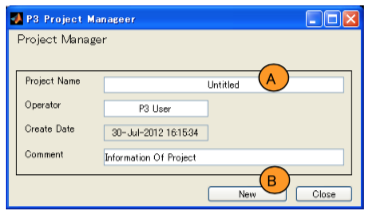
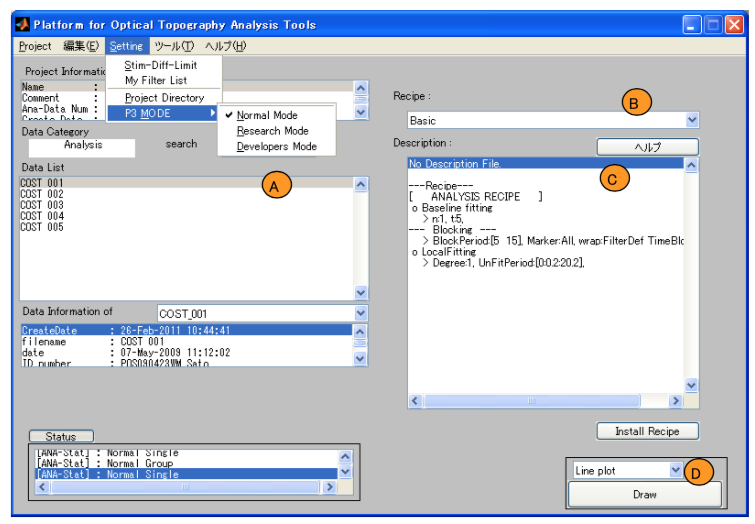
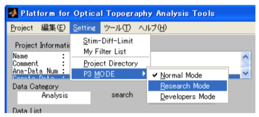
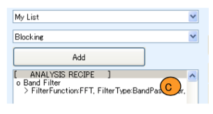
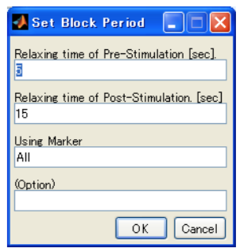
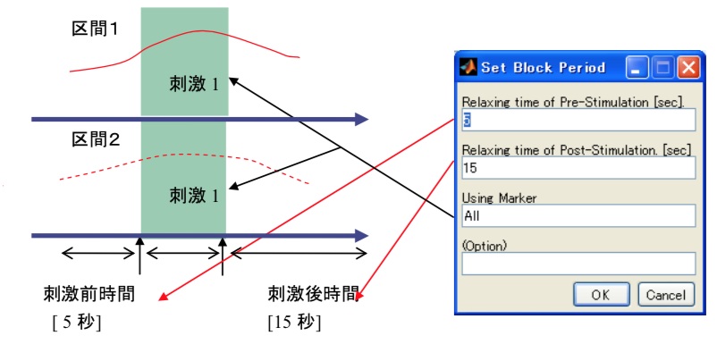
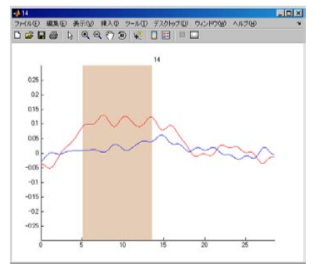

<a id="WfCycle0"></a># Open PoTATo First Step Guide

[Open PoTATo Document List](index.md)

<!-- TOC -->

- [Performing analysis](#performing-analysis)
    - [Startup](#startup)
    - [Creating a project](#creating-a-project)
    - [Importing experimental data](#importing-experimental-data)
    - [Analysis and data display in Normal mode](#analysis-and-data-display-in-normal-mode)
- [Customizing analysis methods](#customizing-analysis-methods)
    - [Changing the analysis mode](#changing-the-analysis-mode)
    - [The Preprocess window](#the-preprocess-window)
    - [Adding analysis](#adding-analysis)
    - [Frequency filters](#frequency-filters)
    - [Separating continuous data into blocks](#separating-continuous-data-into-blocks)
    - [Editing recipes](#editing-recipes)

<!-- /TOC -->

This document is a step-by-step guide to using the Open Platform of Transparent Analysis Tools for functional near infrared spectroscopy (Open PoTATo).

It uses typical Open PoTATo usage examples to explain the basics regarding how to use Open PoTATo.

Open PoTATo has two modes: **Normal mode**, which makes it easy to perform analysis, and **Research mode**, which makes it possible to customize analysis methods. The analysis mode can be easily switched from the menu. (There is also a mode for developers, but it is not covered in this guide.)

I) 	In the [Performing analysis] (Performing analysis) section, we will try launching Open PoTATo and displaying a graph using the basic Normal mode analysis procedure.

II)   The [Customizing analysis methods] (Customizing analysis methods) section provides an example of customizing an analysis method using Research mode. In Open PoTATo, sequences of analysis procedures are called **recipes**. The example shows how to create and edit a recipe used to analyze experimental data.

# Performing analysis

Open PoTATo can load data output from various fNIRS devices.  It can also analyze that data through simple user operation.

This section explains the simplest way of operating Open PoTATo using Normal mode.  It covers how to launch Open PoTATo, create a project, load experimental data, select the analysis to perform, and display the results.

## Startup

First, start Matlab.


The MATLAB startup screen will be displayed. Wait for it to start completely.

When MATLAB has started, switch to the directory in which Open PoTATo was installed. In the Command Window, type “P3” and press the “Enter” key.


Open PoTATo will start up.

## Creating a project

The data used by Open PoTATo is managed in units called **projects**. Projects are collections of experimental data to be analyzed. For example, separate projects can be created for each experiment theme to make it easy to manage data.

This section explains how to create a project. To create a project, while no project has been opened in Open PoTATo, click the [Make Project] button (A).


The project creation window will be displayed. Configure the project information here.  Let’s enter “test” in the Project Name edit text box (A) and click the “New” button (B).  A project will be created, and it will now be possible to load experimental data.



## Importing experimental data

The project we have created does not yet contain any data. Let’s load experimental data into the project. Click the “Import Data” button (A) to import experimental data into the project.


 Clicking the “Import Data” button will cause the Data Import window to be displayed. Import experimental data using the following procedure.

1. Select the experimental data to import.

Clicking the “Add file(s)” button (A) will cause the file selection window (b0) to be displayed. Click the “Browse” button to select the folder containing the experimental data file from (b1) and select the file to load from the list box (b2).

2. When a file is selected, it will be added to the list (B).  In this state, only file information has been loaded. The data itself has not yet been loaded. Confirm the information in the list box. If there are any unnecessary files, use the “Remove file” button to remove them from the list.

3.  Click the “Execute” button (C) to begin importing data.


## Analysis and data display in Normal mode

When experimental data is imported, the main window will appear as below.

```markdown

## Note  ##

If the system is not in Normal mode, select Normal Mode in the P3 Mode section of the Setting menu.

```

1. Select one item of analysis data loaded from the experimental data using the data list box (A).

2. Select the analysis procedure from the Recipe popup menu (B). Select Yamada2018SciRep here. A brief description of Yamada2018SciRep will be shown in the Description list box (C).

3. Click the “Draw” button (D) to draw the results. You can select various display methods from the Line Plot popup menu.



To run “Yamada2018SciRep", you will need the butterworth function provided by the MATLAB signal processing toolbox.

Below is an example of how the data will be displayed. A GUI (A) for selecting the data kind (Oxy/Deoxy, etc.) and stimulus kind (Mark), detailed channel information (B), and a topography image (C) will be displayed.


The brief description of Yamada2018SciRep analysis will be as shown below.

``` markdown

## Yamada2018SciRep: Analysis contents ##

191129

# Summary

There are two tasks (left-handed food grasping: 1, right-handed food grasping: 2), trial runs performed alternately under each respective condition 75 times

Time between tasks: 20 seconds or more

Eliminate baseline variation using 3D polynomial fitting

Remove noise using 0.7Hz Low Pass Filtering

Perform blocking using 35-second blocks, from 5 seconds before stimulus starts to 30 seconds after stimulus starts

# Information

Tag: Yamada, 2018 SciRep

Title: Functional near-infrared spectroscopy for monitoring macaque cerebral motor activity during voluntary movements without head fixation

Authors: Yamada T, Kawaguchi H, Kato J, Matsuda K & Higo N

Journal: Scinentific Reports 2018 Aug 09;8:1194.

# Description of Recipe

* Both Oxy-Hb and Deoxy-Hb signals were used in this study.

1. Baseline correction (Continuous)

	- Degree: 3

  - UnFitPeriod: N/A

2. Bandpass filtering

	- Filter Function: ButterWorth

  - Dimension for butter: 4

  - Filter Type: LowPassFilter

	- Low-Pass Filter [Hz]: 0.7

3. Blocking

  - Pre-task period: 5 [s]

  - Post-task period: 15 [s]

  - Using Marker: All

```

# Customizing analysis methods

Editing and saving analysis procedures (recipes) in Open PoTATo makes it possible to perform repeatable analysis with a high degree of freedom. This section uses the “Preprocess” analysis preparation function offered by Open PoTATo’s Research mode. In this example, we will focus on only one item of experimental data from which we will eliminate noise and extract data.

For this example, let us assume that Open PoTATo has already been launched and experimental data has already been loaded. Refer to the [Performing analysis] (Performing analysis) section above for information regarding these basic operations.

Below is an explanation of a typical analysis preparation process. The analysis in this step-by-step guide can be applied to a wide variety of experimental data.

## Changing the analysis mode

Switch Open PoTATo to Research mode.

To change the mode, select Research Mode in the P3 Mode section of the main window’s Setting menu.



## The Preprocess window

Next, switch Open PoTATo to the analysis preparation state.

Click the “Pre” toggle button (A) on the Research mode window.  The system will switch to the analysis preparation (Preprocess) state, and “Preprocess” will be shown on the Pre toggle button.


In the Preprocess state, analysis procedures (recipes) can be configured for analysis data selected in the list box at left.

## Adding analysis

On the right side of the main window in the Preprocess state is a window where you can configure and edit the analysis procedure (recipe) that will be used on the selected experimental data.

In this step-by-step guide, we will create a recipe that does the following two things.

- Applies a frequency filter to eliminate noise

- Converts “continuous data”, which is chronologically continuous and includes multiple stimuli into “block data”, separated by stimulus category.

## Frequency filters

Let us configure the frequency filter used to eliminate noise. To add the filter, select “Band Filter” on the filter popup menu (A) and click the “Add” button (B).


The Band Filter parameter configuration window will be displayed. Select Bandpass Filter (A), a frequency filter that uses an FFT, as the filter type.  Change the Low-Pass (B) from the default value of 0.8 to 0.5 [Hz]. At this point, you will be able to confirm the waveform before and after filtering on-screen. Next, click the “OK” button (C).


A Band Filter will be added to the list box that shows the recipe (C). Configured parameters will be listed after the “>”.



## Separating continuous data into blocks

Next, let’s convert “continuous data”, which includes multiple stimuli, into “block data”, separated by stimulus category. Select “Blocking” as the filter to add on the filter popup menu and click the “Add” button. The configuration window will be displayed. Click “OK”.



This analysis will perform processes such as those shown below.

For example, let us assume that there is continuous data with two stimuli.


This continuous data, with its two stimuli, will be divided into two blocks of data, each with its own stimulus, based on the settings.

 

Processes beyond this point will be performed in units of **blocks**.

## Editing recipes

Let us assume that when we clicked the “Draw” button, the results were like those shown below, and there were two or three noise peaks in a 10 second span. Let us change the frequency filter to also cut off any data with a frequency higher than 0.2Hz.

```markdown

### Note  ###

For convenience's sake, let us assume this is noise. To check if it really is noise, verification must be performed.

```



First, from the recipe information list box (A), select the frequency filter, the Band Filter. Next, click the “Change” button (B).


As a result, the parameter settings window appeared again. Change the parameter settings window Low-Pass setting from 0.5 to 0.2. Only frequencies below 0.2 will be considered valid.

This produces a waveform with the noise removed.


```markdown

### Tips  ###

The order of the filters can be changed using the “Up” and “Down” buttons.

Recipes can be saved using the “Load/Save” button.

If you wish to look at the contents of the analysis in detail, you can convert the procedure into a script M-File.

This function can be used to check the source codes of filters using open analysis methods.

```

<a id="WfTarget"></a>[Open PoTATo Document List ](index.md)

