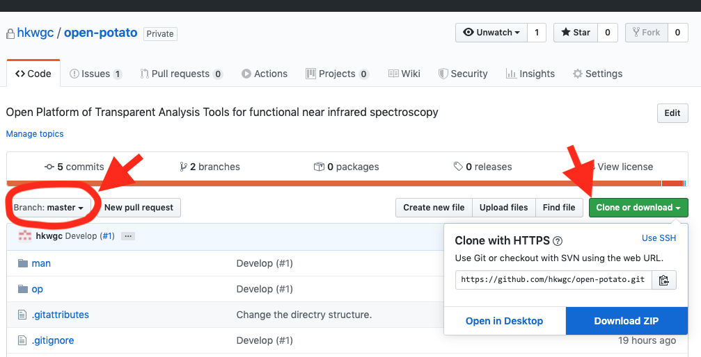

# Open PoTATo installation manual

1. Install MATLAB.

2. Download the file from the [Top page] (https://github.com/hkwgc/open-potato).

The Top page is laid out as shown below. First, check that the area circled in red at top left says **[Branch: master]**. Click **[Clone or Download]** at top right and click on **[Download ZIP]** in the displayed pop-up window. The file will start downloading.



The downloaded file will be named as follows.

```

open-potato-master.zip

```

3. Unzip the downloaded open-potato-master.zip in whichever folder you desire.  Note that it cannot be installed in any of MATLAB’s special directories (such as toolbox).

After unzipping, the folder structure will be as shown below.

```

-op

-man

-LISENCE

-README.md

-README_EN.md

```

4. Change the current directory.

   Start up MATLAB and set the current directory as the following subfolder in the unzipped folder.

```

op

```

This can be configured using "Current folder” in the MATLAB toolbar on the main MATLAB screen.

5. Launch Open PoTATo. Enter the following in the MATLAB command line.

``` matlab

>> P3

```

Then press the “Enter” key to launch Open PoTATo.

If it does not launch successfully, there may be a problem in the folder into which the file was unzipped.

Next, please see [Launching Open PoTATo for the first time] (initial-launch.md).

