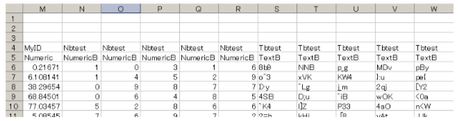
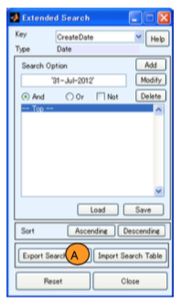
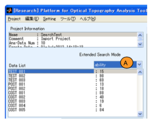
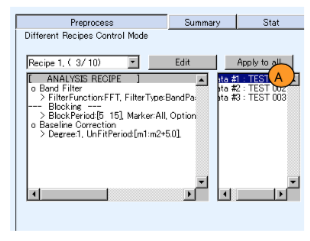
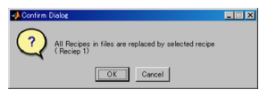

# 拡張検索

*このドキュメントは校正が済んでいません。協力者を歓迎します。*

[Open PoTAToドキュメントリストへ](index.md)


<!-- TOC -->

- [拡張検索](#%E6%8B%A1%E5%BC%B5%E6%A4%9C%E7%B4%A2)
- [概要](#%E6%A6%82%E8%A6%81)
- [基本操作](#%E5%9F%BA%E6%9C%AC%E6%93%8D%E4%BD%9C)
    - [起動と拡張検索ウィンドウ](#%E8%B5%B7%E5%8B%95%E3%81%A8%E6%8B%A1%E5%BC%B5%E6%A4%9C%E7%B4%A2%E3%82%A6%E3%82%A3%E3%83%B3%E3%83%89%E3%82%A6)
    - [検索条件の書式](#%E6%A4%9C%E7%B4%A2%E6%9D%A1%E4%BB%B6%E3%81%AE%E6%9B%B8%E5%BC%8F)
    - [検索条件リストの編集](#%E6%A4%9C%E7%B4%A2%E6%9D%A1%E4%BB%B6%E3%83%AA%E3%82%B9%E3%83%88%E3%81%AE%E7%B7%A8%E9%9B%86)
    - [検索キーの追加と編集](#%E6%A4%9C%E7%B4%A2%E3%82%AD%E3%83%BC%E3%81%AE%E8%BF%BD%E5%8A%A0%E3%81%A8%E7%B7%A8%E9%9B%86)
        - [特殊なデータタイプ](#%E7%89%B9%E6%AE%8A%E3%81%AA%E3%83%87%E3%83%BC%E3%82%BF%E3%82%BF%E3%82%A4%E3%83%97)
- [ステップガイド](#%E3%82%B9%E3%83%86%E3%83%83%E3%83%97%E3%82%AC%E3%82%A4%E3%83%89)
        - [検索キーの追加](#%E6%A4%9C%E7%B4%A2%E3%82%AD%E3%83%BC%E3%81%AE%E8%BF%BD%E5%8A%A0)
            - [拡張検索ウィンドウの起動](#%E6%8B%A1%E5%BC%B5%E6%A4%9C%E7%B4%A2%E3%82%A6%E3%82%A3%E3%83%B3%E3%83%89%E3%82%A6%E3%81%AE%E8%B5%B7%E5%8B%95)
            - [検索キーの追加・編集](#%E6%A4%9C%E7%B4%A2%E3%82%AD%E3%83%BC%E3%81%AE%E8%BF%BD%E5%8A%A0%E3%83%BB%E7%B7%A8%E9%9B%86)
            - [結果の確認](#%E7%B5%90%E6%9E%9C%E3%81%AE%E7%A2%BA%E8%AA%8D)
        - [検索キーの利用したグループの作成](#%E6%A4%9C%E7%B4%A2%E3%82%AD%E3%83%BC%E3%81%AE%E5%88%A9%E7%94%A8%E3%81%97%E3%81%9F%E3%82%B0%E3%83%AB%E3%83%BC%E3%83%97%E3%81%AE%E4%BD%9C%E6%88%90)
            - [レシピの設定](#%E3%83%AC%E3%82%B7%E3%83%94%E3%81%AE%E8%A8%AD%E5%AE%9A)
            - [グループ1のデータの選択と平均波形の表示](#%E3%82%B0%E3%83%AB%E3%83%BC%E3%83%971%E3%81%AE%E3%83%87%E3%83%BC%E3%82%BF%E3%81%AE%E9%81%B8%E6%8A%9E%E3%81%A8%E5%B9%B3%E5%9D%87%E6%B3%A2%E5%BD%A2%E3%81%AE%E8%A1%A8%E7%A4%BA)
            - [グループ2のデータの選択と平均波形の表示](#%E3%82%B0%E3%83%AB%E3%83%BC%E3%83%972%E3%81%AE%E3%83%87%E3%83%BC%E3%82%BF%E3%81%AE%E9%81%B8%E6%8A%9E%E3%81%A8%E5%B9%B3%E5%9D%87%E6%B3%A2%E5%BD%A2%E3%81%AE%E8%A1%A8%E7%A4%BA)
        - [発展](#%E7%99%BA%E5%B1%95)

<!-- /TOC -->


# 概要

拡張検索ではプロジェクトに含まれる解析データから被験者名、年齢などの項目(検索キー)を利用してデータを絞り込むことができます。また、検索するための値を解析データに追加することもできます。


# 基本操作

## 起動と拡張検索ウィンドウ

拡張検索を行うにはメインウィンドウのToolメニューのExtended Searchを選択します。拡張検索ウィンドウが起動し、メインウィンドウが更新されます。

なお、searchエディットボックスの右側にExtendedボタンがある場合はExtendedボタンでも起動します。

下図は左側に拡張検索ウィンドウ、右側にメインウィンドウの一部を示しています。


拡張検索ウィンドウのオンラインマニュアルを表示するにはHelpボタン(A)を、拡張検索ウィンドウを閉じる場合は、Closeボタン(G)を押してください。

拡張検索ウィンドウのKeyメニュー(B)では検索キーを選択できます。さらに、検索条件をSearch Option(D)に入力します。絞り込み条件は検索キーごとに書式が決まっています。ここで、[Add]ボタンをおすと拡張検索ウィンドウ条件リストに登録され、メインウィンドウのデータリストが更新されます。

Keyメニュー(B)で検索キーを選択すると、データタイプ(Type)(C)が表示されます。また、検索条件の書式例がSearch Option(D)に表示されます。

拡張検索ウィンドウのKeyメニュー(B)はメインウィンドウのメニュー(B)と連動して動作します。また、メインウィンドウのデータリストに検索項目の情報が表示されます。

拡張検索ウィンドウのAscending(昇順)もしくはDescending(降順)ボタン(E)を押すと解析データを並び替えることができます。

実験に関連するデータを基に検索キーを追加・設定したい場合は、検索キーの入出力ボタン(F)を利用して、キーを編集します。この方法に関しては1.5で述べます。


## 検索条件の書式

検索キーごとにSearch Optionの書式が決まっています。例えば、検索キーをageとすると、データタイプにはNumericと表示されます。Search Optionには数値を入力することができます。以下の表は検索キーのデータタイプと書式を示します。

なお、内部データはソフトウェア開発者向けの情報で、MATLABの型を示しています。


**検索の書式** 

| データタイプ          | 書式                 | 内部データ|
| ------------- | -------------------- |--------- |
| Text | 文字列(正規表現) | 文字列|
| Date  | 日付検索は‘dd-mm-yyyy’形式で指定。<br> 範囲を指定する場合はセルで<br>開始、終了日時を指定。 |MATLAB<br>時刻シリアル|
| Gender  | 文字列、’Male’もしくは’Female’ | 数値: 0:男性 1:女性|
| Numeric  | 10>や>10 のような数値と不等号1文字<br>もしくは配列で最大・最小を[0 10]などと指定する。 | 数値|
| Cell  | - | セル|
| unknown  | - | - |


Dateデータタイプでは、’26-Feb-2011’のように年月日の前後にシングルコーテーションを付けた文字列を入力します。また、datestr(now)などのようにMATLAB関数を用いることも可能です。例えば昨日のデータを検索したい場合はdatestr(now-1)と指定出来ます。また、2011年1月1日から2011年2月26日までのデータを探したい場合、Dateをセル{‘01-Jan-2011’,’26-Feb-2011’}のように設定します。

Genderデータタイプでも、文字列の前後にシングルコーテーションが必要です。

Numericデータタイプでは、数値と1文字の比較演算子で検索します。10より大きい数値の検索は>10もしくは10<と記入します。ここで>=演算等は設定出来ないことに注意してください。数値を最大値、最小値で検索する場合は、例えば、10以上20以下の場合には[10, 20]と設定します。この時、等号が含まれることに注意してください。

検索キーを選んだときにデータタイプがCell,unknownとなったときは、その検索キーで検索ができないことを示しています。


## 検索条件リストの編集

拡張検索では検索条件リストを編集することにより、ファイル検索をします。


検索条件リストに新たに検索キーを追加するには、Keyメニュー(X)で検索したいキーを選びます。その後、検索キーのデータタイプ(Y)を参考に、検索条件テキスト(A)に検索条件をSearch Optionに記入します。また、And検索とするかOr検索などを選択します。その後Addボタン(B)を押すと検索条件が追加され、検索条件リスト(E)が更新されます。

追加された検索条件は検索条件リスト(E)の選択位置に挿入されます。”)”を選択している場合はその位置に新たな”()”とともに、その内部に挿入されます。


設定した検索設定を変更・削除したい場合は検索条件リスト(E)で変更対象となる検索条件を選択し、Modifyボタン(C)もしくはDelete(D)ボタンを押します。

検索設定はファイルに保存し、読み込むことが出来ます。検索設定の読み込みはLoadボタン(F)を、保存はSaveボタン(G)を押します。


## 検索キーの追加と編集

デフォルトで用意されている検索キーに加え、独自の検索キーを追加・編集することもできます。

検索キーを追加・編集には検索キーの入出力ボタンを使います。


検索キーの編集は4ステップで行います。

i)	関連する実験データを読み込む。
ii)	Export Search Tableボタン(A)により検索キーデータをCSVファイルに出力する。
iii)	検索キーの入ったCSVファイルを編集する。
iv)	Import Search Tableボタン(B)によりCSVファイルから検索キーデータを作成する。


ii) で出力したCSVファイルをMicrosoft Excel で開くと下記のようになります。


4行目に検索キーの名称が、5行目にデータタイプが記載されています。新たに検索キーを追加する場合は同様のフォーマットで1列追加します。

6行目以降は解析データの検索キーの値が記載されています。検索キーの値を変更したい場合は、セルの値を変更してください。ただし、filenameは変更できません。


```shell
### 注意 ###
CSV 編集に表計算ソフトを用いる場合、時刻などデータの有効桁数が丸められことがあります。
```


### 特殊なデータタイプ

上記の表には記載していない特殊なデータタイプとしてNumericB と TextB があります。

これらのデータタイプを使うと、各ファイルではなくファイル内の各刺激に対して検索用の値を設定できます。この値はResearchモードのStatistical Testで利用できます。

設定例を下記に示します。



4行目には、各ファイルに含まれている刺激の数と同数の連続する列に、同じ名前を記入します。5行目には、値が数値の場合は’NumericB’と、文字列の場合は’TextB’と記入します。

この例では、N列からR列にNbtestという名前でNumericBの値を、S列からW列にTbtestという名前でTextBの値を設定しています。

列の順序は刺激の時間順に対応しています。この例では6行N列のセルに6行目の解析データの最初の刺激ブロックに対応するNbtestの値を、6行O列のセルに次の刺激ブロックのNbtestの値を...という様にデータが記入されています。

刺激の数が一致しない場合は列を最大値に合わせます。また、測定出来なかった箇所にはNumericBに関してはNaNが、TextBに関しては空白が利用できます。

検索キー入力後に、実験データを読み込んだ場合、未入力の数値はNaNに,テキストは空白に設定されます。


# ステップガイド

OpenPoTAToでは多くの実験データから統計的検定を行うことができます。グループ間比較を行うためには、多数のデータからグループをつくる必要がります。

ここでは、拡張検索を用いてデータを選択する方法を例で示します。

この例で想定している解析は以下のとおりです。

- 複数の被験者に対してfNIRS実験を行います。
- fNIRSデータと併せて、各被験者のパフォーマンスを1~100の数値で表したスコアを持っています。
- スコアが10~20の被験者の平均波形と、スコアが80以上の被験者の平均波形を目視・比較します。

手順としては、拡張検索機能を用いて、検索キーとして各被験者のスコアを追加します。その後、スコアを検索キーとしてグループを作成し、選択したデータの平均波形を表示します。


### 検索キーの追加

実験データを検索するための検索キーを登録します。検索キーは各被験者のパフォーマンスを1~100で表したスコアとします。


#### 拡張検索ウィンドウの起動

新しい検索キーの登録は拡張検索機能から行います。メインウィンドウメニューのToolメニューのExtended Searchを選択し、拡張検索ウィンドウを表示します。


#### 検索キーの追加・編集

検索キーには実験データファイルに入っている情報、作成日付や性別などが存在します。この検索キー、値を検索キーの入出力ボタンを使って追加・編集します。

拡張検索ウィンドウのExport Search Tableボタン(A)により検索キーデータをCSVファイルに出力します。




このとき、出力ファイル名が聞かれますのでデスクトップにkey.csvというファイル名で保存します。

出力したkey.csvを編集しやすいアプリケーションで開きます。(ここではMicrosoftExcelを利用しています。)


検索キーを追加するため、出力したCSVファイルの最終列に一列加えます。ここではL列に対して被験者のスコア(1~100の数値)を検索キーとして登録します。

L4にキー名称として“ability”を、データタイプとしてL5に”Numeric”を記載します。次に、L6以下の各行に、被験者名(subjectname)に対応した被験者の能力を記入します。

編集結果をCSVファイルで保存し、拡張検索ウィンドウのImport Search Tableボタン(A)を押し、編集したCSVファイルを読み込みます。


#### 結果の確認
正しく検索キーがインポートされると、検索キーに ability が追加されます。
検索キーポップアップメニュー(A) からabilityを選択 し、結果を確認します。




### 検索キーの利用したグループの作成

登録した検索キーを用い、スコアが 10~20 の被験者グループ(グループ1)の平均波形と、スコアが 80 以上の被験者グループ(グループ2)の平均波形を比較できるようにします。

#### レシピの設定

まず、全てのデータを選択します。

レシピが異なる場合は”Different Recipes Control Mode”に入りますので、Apply to all ボタン(A)を押し、 全てのデータのレシピを同じものにします。



続く質問ダイアログの OK ボタンを押します。




このレシピには平均波形を計算するための”Blocking”が入っています。


#### グループ1のデータの選択と平均波形の表示

スコアが 10~20 の被験者(グループ1)の平均波形を出力します。


拡張検索ウィンドウの検索キーメニュー(A)から”ability”を選択し、Search Option(B)に”[10 20]”と記載します。その後、Add ボタン(C)を押すとスコアが 10~20の被験者のデータのみがデータリスト(E)に表示されます。このとき、データの確認のため、 Descending ボタン(D)でデータを降順に並べることもできます。

次に、平均波形を表示するため、データリスト(E)の全てのデータ を選択し、Plot Average ボタン(F)を押します。

以上の手順を経ると、スコアが 10~20 の間の被験者データの平均波形が表示されます。


#### グループ2のデータの選択と平均波形の表示

スコアが 80 以上の被験者(グループ2)の平均波形を出力します。


検索条件リスト(A)で、グループ1のデータを選択するときに設定した検索条件”**  ability *** : [10 20]”が記載されて いる箇所を選択します。選択すると、Search Option(B)が”[10 20]”になりますので、”> 79”に変更します。次に、Modify ボタン(C)を押します。そうするとスコアが80以上の被験者のデータがデータリスト(D)に表示されます。

これらのデータを選択し、Plot Average ボタン(E)を押すとスコア80 以上の被験者の平均波形が表示されます。


以上の手順で下記のように、2つのグループの平均データを並べて表示することができます。


### 発展

今回のステップガイドでは1つの検索キーでデータ選択を行いましたが、複数の検索キーを追加することで、同時に複数の条件下で検索することもできます。

統計的検定を行いグループのデータを数値化することも可能です。また、被験者に与えた刺激ごとにスコアなどの値がある場合には、この値を統計的検定で利用することもできます。

このような操作方法は、マニュアルの”Research-Mode”をご参照ください。

