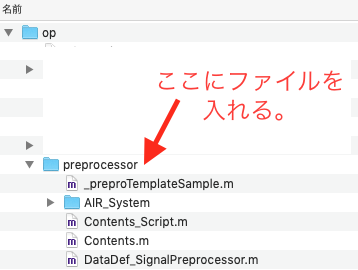
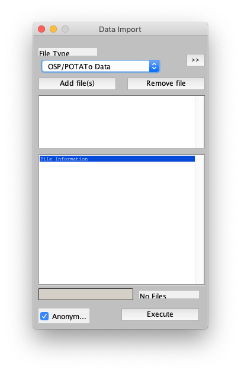

# 読み込みプラグインのインストール

[Open PoTAToドキュメントリストへ](index.md)

<!-- TOC -->

- [読み込みプラグインのインストール](#%E8%AA%AD%E3%81%BF%E8%BE%BC%E3%81%BF%E3%83%97%E3%83%A9%E3%82%B0%E3%82%A4%E3%83%B3%E3%81%AE%E3%82%A4%E3%83%B3%E3%82%B9%E3%83%88%E3%83%BC%E3%83%AB)
    - [入手方法](#%E5%85%A5%E6%89%8B%E6%96%B9%E6%B3%95)
    - [読み込みプラグインのインストール](#%E8%AA%AD%E3%81%BF%E8%BE%BC%E3%81%BF%E3%83%97%E3%83%A9%E3%82%B0%E3%82%A4%E3%83%B3%E3%81%AE%E3%82%A4%E3%83%B3%E3%82%B9%E3%83%88%E3%83%BC%E3%83%AB)
    - [インストールの確認](#%E3%82%A4%E3%83%B3%E3%82%B9%E3%83%88%E3%83%BC%E3%83%AB%E3%81%AE%E7%A2%BA%E8%AA%8D)
    - [問い合わせ](#%E5%95%8F%E3%81%84%E5%90%88%E3%82%8F%E3%81%9B)

<!-- /TOC -->

## 入手方法

Open PoTAToの読み込みプラグインはfNIRS装置のメーカー・ベンダー各社よりご提供いただいております。

読み込みプラグインの一覧は[こちら](https://github.com/hkwgc/open-potato-add-on-lists/blob/master/list-add-on.md#読み込みプラグイン)です。

## 読み込みプラグインのインストール

ここでは各社の読み込みプラグインをインストールするときに共通する内容を説明します。

独自のインストール方法が定められている場合は、その方法に従ってください。

読み込みプラグインはMatlabのファイル(MファイルもしくはPファイル)で、ファイル名は「prepro_XXXX.m」もしくは「prepro_YYYY.p」です。XXXXやYYYYはファイルごとに異なります。

これを Open PoTAToを起動するときの**opフォルダ**の**preprocessorフォルダ**に入れてください。

インストール作業はこれで完了です。

## インストールの確認

Projectの設定が既に完了しており、Open PoTAToのメインウィンドウが開いているとします。

メインウィンドウのProjectメニューからData Importを選択してください。

データインポートダイアログが開くので、ポップアップメニューを選択します。

読み込みプラグインが正しくインストールされていると、リストにその装置の読み込みプラグインの名称が新たに追加されていることが確認できます。

## 問い合わせ

読み込みプラグインに関するご質問はプラグインの作成元にお問い合わせください。

[Open PoTAToドキュメントリストへ](index.md)

