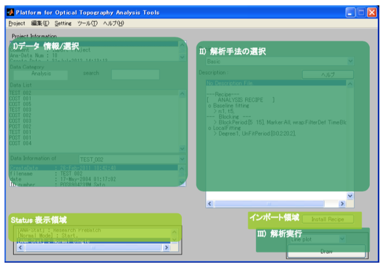
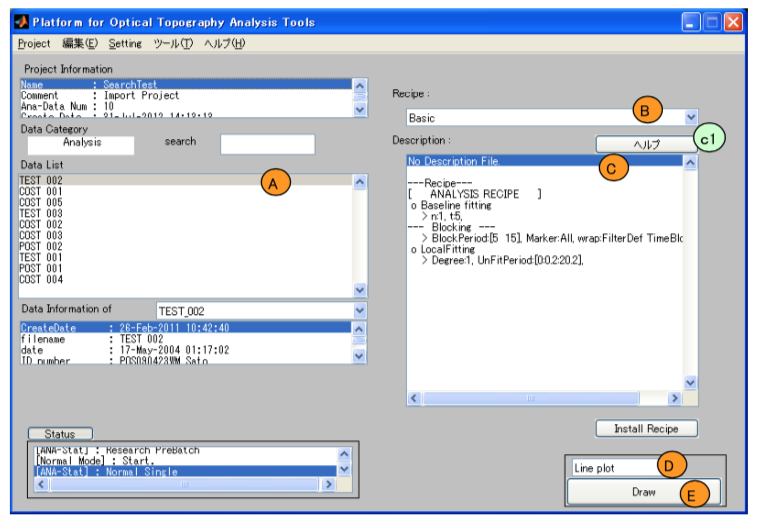

# Normal Mode 操作マニュアル

[Open PoTAToドキュメントリストへ](index.md)

<!-- TOC -->

- [Normal Mode 操作マニュアル](#normal-mode-%E6%93%8D%E4%BD%9C%E3%83%9E%E3%83%8B%E3%83%A5%E3%82%A2%E3%83%AB)
- [概要](#%E6%A6%82%E8%A6%81)
    - [説明内容](#%E8%AA%AC%E6%98%8E%E5%86%85%E5%AE%B9)
    - [解析モデルと状態](#%E8%A7%A3%E6%9E%90%E3%83%A2%E3%83%87%E3%83%AB%E3%81%A8%E7%8A%B6%E6%85%8B)
    - [メインウィンドウ概要](#%E3%83%A1%E3%82%A4%E3%83%B3%E3%82%A6%E3%82%A3%E3%83%B3%E3%83%89%E3%82%A6%E6%A6%82%E8%A6%81)
    - 
- [単一の実験データを解析](#%E5%8D%98%E4%B8%80%E3%81%AE%E5%AE%9F%E9%A8%93%E3%83%87%E3%83%BC%E3%82%BF%E3%82%92%E8%A7%A3%E6%9E%90)
    - [実行手順](#%E5%AE%9F%E8%A1%8C%E6%89%8B%E9%A0%86)
    - [解析手法(レシピ)の追加](#%E8%A7%A3%E6%9E%90%E6%89%8B%E6%B3%95%E3%83%AC%E3%82%B7%E3%83%94%E3%81%AE%E8%BF%BD%E5%8A%A0)
        - [解析手法（レシピ）の追加](#%E8%A7%A3%E6%9E%90%E6%89%8B%E6%B3%95%E3%83%AC%E3%82%B7%E3%83%94%E3%81%AE%E8%BF%BD%E5%8A%A0)
        - [Zipped Recipe の作成](#zipped-recipe-%E3%81%AE%E4%BD%9C%E6%88%90)
- [複数の実験データを解析](#%E8%A4%87%E6%95%B0%E3%81%AE%E5%AE%9F%E9%A8%93%E3%83%87%E3%83%BC%E3%82%BF%E3%82%92%E8%A7%A3%E6%9E%90)
    - [実行手順](#%E5%AE%9F%E8%A1%8C%E6%89%8B%E9%A0%86)
    - [解析手法(レシピ)の追加](#%E8%A7%A3%E6%9E%90%E6%89%8B%E6%B3%95%E3%83%AC%E3%82%B7%E3%83%94%E3%81%AE%E8%BF%BD%E5%8A%A0)
        - [解析手法（レシピ）の追加](#%E8%A7%A3%E6%9E%90%E6%89%8B%E6%B3%95%E3%83%AC%E3%82%B7%E3%83%94%E3%81%AE%E8%BF%BD%E5%8A%A0)
        - [Zipped Recipe  の作成](#zipped-recipe--%E3%81%AE%E4%BD%9C%E6%88%90)

<!-- /TOC -->

# 概要

## 説明内容

Open PoTAToのNormal モードの操作方法について説明します。Open PoTATo 起動方法、実験データを Open PoTATo にインポートする方法、インポートしたデータを選択する方法については、マニュアル『基本操作』をご参照ください。

Normal モードは一般的に使われるfNIRS解析を実施するためのモードです。Normal モードでは、実験データの選択、解析手法の選択、解析の実施の3ステップで本格的な解析ができます。

また、解析手法（レシピ）は追加可能です。そのため、最新の解析手法を導入したり、チーム内で解析手法を共有したりすることが出来ます。

[目次へ](#Normal Mode 操作マニュアル)

## 解析モデルと状態

Normal モードにおける解析モデルと解析処理について説明します。Normal モードは解析対象となる実験データが単一の場合と複数の場合で状態を分けて処理します。これを表にまとめます。

**表 1.1 Normal モードにおける状態**

| 状態          | 内容                 |
| ------------- | -------------------- |
| Normal Single | 単一実験データの解析 |
| Normal Group  | 複数実験データの解析 |

以下、各状態の操作方法について説明します。
最初に Normal Single 状態の解析モデルを説明します。

**図 1.1 Normal モード 単一実験データ解析モデル** 

入力は、解析手法および解析対象となる１つの実験データになります。実験データをレシピ（解析手順）にそって解析し、その結果を解析手法に収められている LAYOUT を使って描画します。

次に、Normal Group 状態の解析モデルを説明します。

**図 1.2 Normal モード 複数実験データ解析モデル** 

入力は、解析手法および解析対象となる複数の実験データになります。解析では、それぞれの実験データに対してレシピを適用します。次に、ここで得られた各解析データから平均値などの要約統計量を算出します。最後にこれらの統計量に対して統計検定を行います。

## メインウィンドウ概要

Normal モードに入るためには Open PoTATo を起動し、メインウィンドウのメニュー"Setting"の"P3 MODE"から、"Normal Mode"を選択します。

Normal モードにおけるメインウィンドウの概要を説明します。

**図 1.3 Normal モード メインウィンドウと領域**

Normal モードには実験データが単一の場合と複数の場合の2種類の状態があります。ただし、どちらの状態でも解析の実行は以下の3ステップになります。

​	I\) 実験データの選択

​	II\) 解析手法の選択

​	III\) 解析の実行

また、何れの状態でも解析手法のインポートが可能です。

以下、各状態について、それぞれの操作および解析手法の追加方法を説明します。

なお、Status 表示領域には状態が変更されたときなどにメッセージが表示されますが、ここでは説 明しません。

[目次へ](#Normal Mode 操作マニュアル)

##  

# 単一の実験データを解析

## 実行手順

Normal モード Single 状態は１つの Normal モードにおいて１つの解析データを選択中の状態で す。この時のメインウィンドウは下記のようになります。

**図 2.1 Normal モード Single 状態**

最初に、実験データの選択を行います。選択はデータリストボックス(Ａ)から解析を行いたいデ ータを1つ選択します。

次に解析手法を Recipe ポップアップメニュー(B)から選択します。選択中の解析手法の概略説 明は Description リストボックス(C)に表示されます。詳細なヘルプ情報がある場合はヘルプボタン (b1)が有効になります。

最後に、結果を描画します。描画方法（レイアウト）をポップアップメニュー(D)から選択し Draw ボ タン(E)を押すことにより結果が描画されます。

## 解析手法(レシピ)の追加

次に解析手法を追加する方法を説明します。

### 解析手法（レシピ）の追加

解析手法を追加するには Open PoTATo: Normal モード Single 用の解析手法を格納した zip ファイル が必要です。このファイルを Zipped Recipe とします。

追加するには、最初にメインウィンドウの Install Recipe ボタンを押します。そうすると Zipped Recipe の選択を求められますので Zipped Recipe を指定します。

インストールに成功するとメインウィンドウが更新され、Recipe ポップアップメニューに解析手法 が追加されます。

### Zipped Recipe の作成

Zipped Recipe は解析手法（レシピ）が格納されたディレクトリを zip 形式に圧縮したファイルです。 具体的なディレクトリの内容は下表の通りです。

**表 2.1 解析手法ディレクトリ**

| ファイル名     | 必須 | 内容                                                         |
| -------------- | ---- | ------------------------------------------------------------ |
| Recipe.mat     | 必須 | フィルタレシピ                                               |
| Descript.txt   | -    | Description リストボックスに表示する文字列（解析内容の説明）を格納したテキストファイル。 存在しない場合はレシピから自動で生成する |
| Descript.pdf   | -    | 詳細ヘルプ（PDF）存在しない場合はヘルプ(HTML)を参照する      |
| Descript.html  | -    | 詳細ヘルプ(HTML)存在しない場合は詳細ヘルプボタンを無効にする |
| LAYOUT\_\*.mat | -    | 解析で利用するレイアウト \* 存在しない場合はデフォルト値を使用 |

Recipe.mat は Research モード Preprocess 状態のレシピの保存ボタンで作成出来るファイルです。

Recipe ポップアップメニューに表示されるレシピ名は以下の方法で決定されます。Recipe.mat 内に変数 Name があり"P3-Recipe"以外の値の場合、Name の値を利用されます。それ以外の場 合はディレクトリ名がレシピ名として利用されます。

[目次へ](#Normal Mode 操作マニュアル)

# 複数の実験データを解析

## 実行手順

複数の実験データに対する解析実行手順を説明します。

Normal モード Group 状態のメインウィンドウは下記のようになります。

**図 3.1 Normal モード Group 状態**

最初に、実験データの選択を行います。選択はデータリストボックス(Ａ)から解析するデータを複数個選択します。

次に解析手法を Recipe ポップアップメニュー(B)から選択します。選択中の解析手法の概略説明は Description リストボックス(C)に表示されます。

最後に、Execution ボタン(D)を押し、検定を実施します。

## 解析手法(レシピ)の追加

次に解析手法を追加する方法を説明します。

### 解析手法（レシピ）の追加

解析手法を追加するには Open PoTATo: Normal モード Group 用の解析手法を格納した zip ファイル が必要です。このファイルを Zipped Recipe とします。

追加を実行するには、メインウィンドウの Install Recipe ボタンを押します。そうすると、Zipped Recipe の選択を求められますので用意した Zipped Recipe を指定します。

インストールに成功するとメインウィンドウが更新され、Recipe ポップアップメニューに解析手法 が追加されます。

### Zipped Recipe  の作成

Zipped Recipe は解析手法（レシピ）が格納されたディレクトリを zip 形式に圧縮したファイルです。 

ディレクトリは下表の内容物を含みます。

**表 3.1 解析手法ディレクトリ**

| ファイル名      | 必須 | 内容                                                         |
| --------------- | ---- | ------------------------------------------------------------ |
| GroupRecipe.mat | 必須 | 解析手法の入ったデータ                                       |
| Summary_Arg.mat | 必須 | Summary Statistics Computation 用引数データ                  |
| Stat_Arg.mat    | 必須 | Statistical Test 用引数データ                                |
| Descript.txt    | -    | Description リストボックスに表示する文字列（解析内容の説明）を格納したテキストファイル。 存在しない場合はレシピから自動で生成する |
| Descript.pdf    | -    | 詳細ヘルプ（PDF）存在しない場合はヘルプ(HTML)を参照する      |
| Descript.html   | -    | 詳細ヘルプ(HTML)存在しない場合は詳細ヘルプボタンを無効にする |

GroupRecipe.mat には以下のデータが含まれます。

**表 3.2 GroupRecipe.mat 格納変数**

| 変数名          | 必須 | 内容                                  |
| --------------- | ---- | ------------------------------------- |
| Name            | -    | 解析手法名称                          |
| Filter_Manager  | 必須 | 1実験データ解析用のレシピ             |
| SummaryFunction | 必須 | Summary Statistics Computation 関数名 |
| StatFunction    | 必須 | Statistical Test 関数名               |

GroupRecipe.mat に Name 変数を追加した場合は Recipe ポップアップメニューに表示されるレシピ名として利用されます。Name が省略された場合はディレクトリ名がレシピ名として利用されま す。

Filter\_Manager の Recipe は、Research モード Pre 状態のフィルタレシピの保存ボタンにより格納されるファイル内で、格納されているデータと同じです。

SummaryFunction に記載する Summary Statistics Computation 関数名は、要約統計量算出実 施関数の名前を指定します。関数は Open PoTATo が定義する規定に適合しなくてはなりません。 StatFunction に記載する Statistical Test 関数名は、統計検定実施関数の名前を指定します。 関数は Open PoTATo が定義する規定に適合しなくてはなりません。

[目次へ](#Normal Mode 操作マニュアル)
