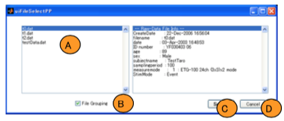
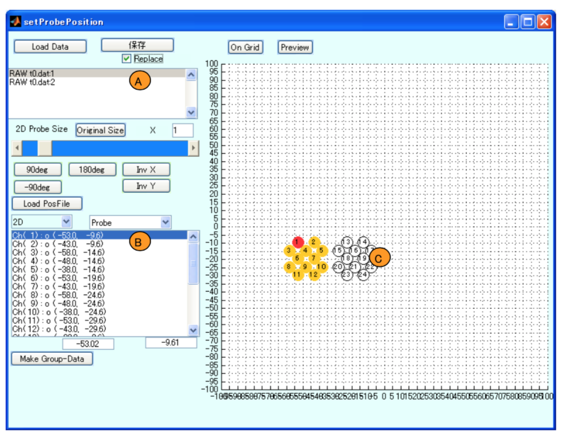
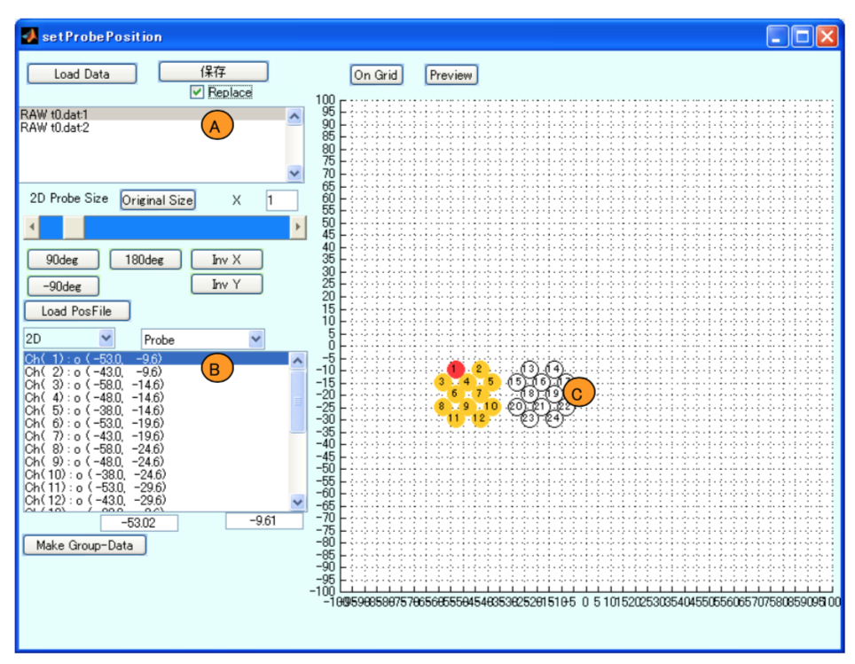
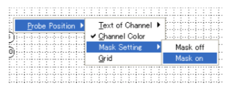
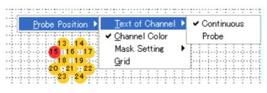
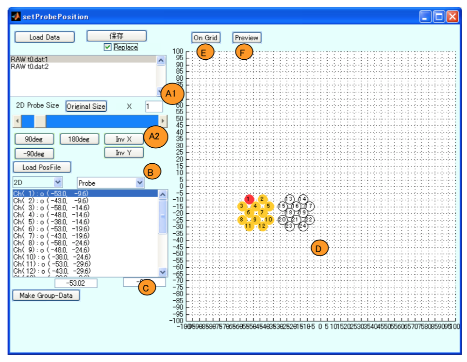
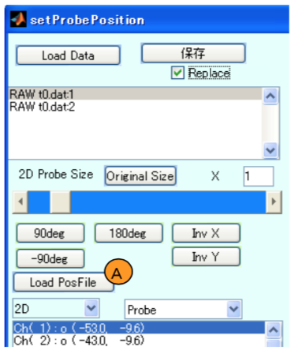
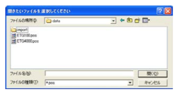
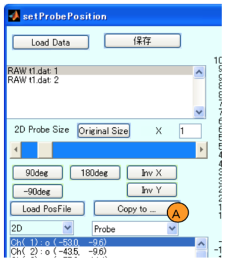

# 計測位置情報の設定

[Open PoTAToドキュメントリストへ](index.md)

<!-- TOC -->

- [計測位置情報の設定](#%E8%A8%88%E6%B8%AC%E4%BD%8D%E7%BD%AE%E6%83%85%E5%A0%B1%E3%81%AE%E8%A8%AD%E5%AE%9A)
- [概要](#%E6%A6%82%E8%A6%81)
    - [位置設定ウィンドウ](#%E4%BD%8D%E7%BD%AE%E8%A8%AD%E5%AE%9A%E3%82%A6%E3%82%A3%E3%83%B3%E3%83%89%E3%82%A6)
- [位置情報の設定](#%E4%BD%8D%E7%BD%AE%E6%83%85%E5%A0%B1%E3%81%AE%E8%A8%AD%E5%AE%9A)
    - [位置設定ウィンドウの起動](#%E4%BD%8D%E7%BD%AE%E8%A8%AD%E5%AE%9A%E3%82%A6%E3%82%A3%E3%83%B3%E3%83%88%E3%82%99%E3%82%A6%E3%81%AE%E8%B5%B7%E5%8B%95)
    - [編集実験データの選択](#%E7%B7%A8%E9%9B%86%E5%AE%9F%E9%A8%93%E3%83%87%E3%83%BC%E3%82%BF%E3%81%AE%E9%81%B8%E6%8A%9E)
    - [保存/終了処理](#%E4%BF%9D%E5%AD%98%E7%B5%82%E4%BA%86%E5%87%A6%E7%90%86)
    - [不要なチャンネルのデータの削除](#%E4%B8%8D%E8%A6%81%E3%81%AA%E3%83%81%E3%83%A3%E3%83%B3%E3%83%8D%E3%83%AB%E3%81%AE%E3%83%86%E3%82%99%E3%83%BC%E3%82%BF%E3%81%AE%E5%89%8A%E9%99%A4)
    - [仮想2D位置情報の設定](#%E4%BB%AE%E6%83%B32d%E4%BD%8D%E7%BD%AE%E6%83%85%E5%A0%B1%E3%81%AE%E8%A8%AD%E5%AE%9A)
    - [位置データファイルの読み込み](#%E4%BD%8D%E7%BD%AE%E3%83%86%E3%82%99%E3%83%BC%E3%82%BF%E3%83%95%E3%82%A1%E3%82%A4%E3%83%AB%E3%81%AE%E8%AA%AD%E3%81%BF%E8%BE%BC%E3%81%BF)
    - [位置データのコピー](#%E4%BD%8D%E7%BD%AE%E3%83%87%E3%83%BC%E3%82%BF%E3%81%AE%E3%82%B3%E3%83%94%E3%83%BC)

<!-- /TOC -->

# 概要

計測位置情報とはfNIRS実験のときのプローブやチャンネルの位置の情報のことです。
Open PoTAToは様々な形で位置情報を保持することができます。

最も単純なものは**メジャーモード**です。メジャーモードとは、プローブやチャンネルの2次元的配置の決まったパターンをID番号で管理する仕組みのことです。

また、Open PoTAToには位置情報を修正する機能や3次元位置計測ユニットで取得した位置情報を読み込みチャンネル位置に変換する機能などがあります。3次元位置計測ユニットを使うと実座標系の頭表上の計測位置を扱うこともできます。

空間解析を適用した場合、MNI(Montreal Neurological Institute)座標系で、計測位置に対応する標準脳上の位置を計算することもできますが、ここでは説明しません。


## 位置設定ウィンドウ

位置情報は位置設定ウィンドウで設定できます。
位置設定ウィンドウの機能は以下の通りです。

- 実験データを読み込む
- 同一測定により出来た複数の実験データを1つの実験データとして読み込む
- チャンネルの位置を設定する
- 不要なチャンネルを削除する
- チャンネル位置情報を別実験データに適用する(コピーする)
- 位置計測ユニットの出力ファイルを読み込み、チャンネルに変換する
- 編集結果を反映し、実験データを上書き保存する。
- 編集結果を別の実験データとして保存する


位置設定ウィンドウの設定した情報は実験データに保存されます。この情報は表示、解析、データ出力のときに使われます。

不要チャンネルの削除では使用しないチャンネルの情報を完全に削除します。不要なチャンネルを削除することにより、不要な計算や表示を避けることができます。


# 位置情報の設定

## 位置設定ウィンドウの起動

位置情報の設定は、位置設定ウィンドウから行います。まずは、位置設定ウィンドウの起動方法を説明します。

Researchモード画面で[Pre]トグルボタンを押下状態にすることにより、解析準備状態
(Preprocess)に移動します。この状態でPosition Settingボタン(A)を押すと位置設定ウィンドウの起動が始まります。


なお、位置設定ウィンドウはメインウィンドウのToolメニューからPosition Settingを選択しても起動します。


## 編集実験データの選択

まず、位置情報を編集する実験データを選択するためのダイアログが表示されます。



位置データを追加したいファイルをリストボックス(A)から選択します。

このとき、同一測定によりできた複数の実験データがある場合、1つの実験データにまとめることができます。命名規則から同一の測定であると予測されるファイルは

ETG4000_3x3_MES_Probe[1,2,3,4].csv

というように、1つの実験データとして表示されます。この機能をオフにしたい場合はFile Groupingのチェックボックス(B)を外してください。

ファイルを選択し、Selectボタン(C)を押すと下図のような位置情報設定ウィンドウが開きます。Cancelボタン(D)を押した場合は、処理が中断されます。位置情報設定ウィンドウには、データリスト(A)、チャンネルリスト(B)、位置情報表示エリア(C)があります。




**エラーケース: ** グループ化できないファイル

選択したデータが同一測定から作成された実験データとして扱えない場合、下図のようなエラーが発生します。


```shell
## ヒント:実験データについて ##

位置設定で選択可能なデータの一覧は、メインウィンドウで表示されるデータ一覧と異なる場合があります。これは、位置設定で扱うデータは実験データであり、POTAToのメインウィンドウで表示されているデータは解析データ(Analysisデータ)であることが原因です。

通常、ユーザは実験データと解析データの相違を意識する必要はありませんが、これらの関係を説明します。

実験データとは、fNIRS装置から出力されたファイルを読み込んだデータ一式です。これに位置設定などの付加的な情報も含みます。解析データは、上記実験データを特定するためのデータと、それを解析するためのレシピを保持しています。計測したデータの実体は持っていません。実験データを読み込んだときに、Open POTAToは実験データを作成すると同時に、実験データに対応する解析データを作成します。

位置設定では、実験データ内の位置情報を編集・保存します。

解析データをコピーした場合、この解析データのみをコピーし、実験データは変更しません。そのため、実験データが少なく見えます。実験データそのものをコピーしたい場合はプロジェクト内の”RAW”データの読み込みにより行います。

解析データの削除を行った場合、実験データは削除されません。そのため、実験データのみ残ります。この場合、Toolメニュー、Project RepairのRaw Data Checkを用いると不要な実験データを削除することが可能です。
```


## 保存/終了処理

位置情報の編集後にファイルを保存する場合は Save ボタン(A)を押してください。このとき、上書き保存する場合は Replace をチェックしてください。


位置設定を終了する場合はウィンドウを閉じるボタン(C)を押してください。 このとき、データを保存するか否かの質問ダイアログがでます。保存するときは Yes を、保存しない場合は No を選択して ください。


<!--これ以降、未修正 & 動作未確認-->


## 不要なチャンネルのデータの削除

位置情報設定ウィンドウ起動時のダイアログで選択された実験データはリスト(A)に表示されます。

解析に利用しないチャンネルのデータがある場合にはリストボックス(B)から対象のチャンネルを選択します。選択の度にチャンネルの有効/無効が切り替わります。無効なチャンネルはxで、有効なチャンネルはoで示されています。

<!--この機能は不要では?-->

チャンネルを無効にすると、保存時に対象チャンネルに関する全データが削除されます。このことにより、以降の処理が高速・シンプルになります。なお、保存後、チャンネルのデータは復元できません。





仮想的な2D 位置が Axes(C)に表示されています。Axes 上のチャンネル番号を選択するとリスト ボックス(B)の選択位置も変更されます。



ここで、全チャンネルを削除する場合は Axes(C)を右クリッ クし、ProbePosition/MaskSetting/Maskonメニュー を選択 してください。

逆に全チャンネルを有効にする場合は、Mask off を選択し てください。


## 仮想2D位置情報の設定

波形の表示やトポグラフィ作成時の補間に利用する 2 次元の位置を設定します。

位置の設定は最初”Probe”単位で行います。ここで言う Probe はホルダやキャップなどと呼ば れている光源・検出器の集まりです。座標は仮想的なもので任意に決定可能です。ただし利用す る解析関数や表示物(AO)によっては適切な指定が必要になります。


環境を設定します。設定は Axes を右クリックして 表示されるメニューにより行います。

各チャンネルの表示文字列に Probe 番号を付加 したい場合は Probe Position/Text of Channel Probe を選択してください。

選択中の Channel の色を消したい場合は、 Channel Color を選択しチェックを外してください。

GUI 経由で位置を設定する場合、チャンネルはグリッド線に合わせて配置されます。このグリッ ドの間隔を変更したい場合は Grid を選択してください。




環境設定後、位置を設定します。



最初に、Probeのサイズと大まかな配置方法を設定します。Probeのサイズはスライドバー(A1)で変更出来ます。

Probeの回転には90°、-90°、180°回転が、反転にはX軸反転、Y軸反転のボタン(A2)があります。

次に、Probeの位置を編集します。ポップアップメニュー(B)からProbeを選択します。その後選択中Probeの最小チャンネルのX座標、Y座標をエディットテキスト(C)に入力します。なお、位置はAxes(D)内のProbeをドラッグすることによっても移動可能です。

最後に、Probeではなく、チャンネル単位で移動したい場合は、ポップアップメニュー(B)からChannelを選択しAxes(D)内のチャンネルをドラッグしてください。

編集結果を表示したい場合はPreviewボタン(F)を押してください。onGridボタン(E)は全チャンネルをグリッドに合わせます。


## 位置データファイルの読み込み

ETGシリーズのオプションである3次元位置計測ユニットで取得した位置データファイルを読み込む方法について説明します。

なお、本機能に対応している位置データファイルのバージョンは1.2および2.0です。

最初に Load PosFile ボタン(A)を押します





そのとき、位置データファイルの場所が聞かれますので、 位置データファイルを指定してください。




ここで各ホルダ内のオプトードの配置情報に ついての確認ダイアログが表示されます。問題 がなければ Yes ボタンを押してください。


表示に問題があれば No ボタンを押し、光源・ 検出器の配置方法を n×m 形式で指定してくださ い。


その結果、位置データファイル読み込みウィンドウが開きます。


位置データファイル読み込みウィンドウでは、読み込んだファイル内容の確認、変更を行います。
ウィンドウ右側のAxesには被験者のNasionと両耳をつないだポリゴンが灰色の面で示され、その上に位置データファイルから読み込んだ光源、検出器位置が青色の点で示されます。また、それらの中点と定義したチャンネル位置を橙色の点で示されます。
位置情報を表示するProbeをポップアップメニュー(A)から選択します。位置データファイルを変更/再読み込みしたい場合はReloadPosボタン(B)を押します。
光源位置・検出器位置に問題がある場合、リストボックス(C)から問題のある位置を選択し、エディットテキスト(D)で変更します。編集した光源位置・検出器位置から再度チャンネル位置を計算したい場合はConvertボタン(E)を押してください。
変換したチャンネル位置に問題がある場合、リストボックス(F)から問題のある位置を選択し、エディットテキスト(G)で変更可能です。なお、Axesにチャンネル番号を表示したい場合はChannel Textトグルボタン(H)をON状態にしてください。
編集が完了し、内容がよければOKボタン(I)を押すことにより結果を保存します。


## 位置データのコピー





設定した位置情報を他の実験データにも用いたい場合、位置データのコピーを行います。
位置データを保存することにより、位置データを保持したデータを開いた状態にすると、Copy to...ボタン(A)が表 示されます。
Copy to...(A)ボタンを押してください。

そうすると、位置データファイル読み込みウィンドウが開きます。


コピー元(A)には選択中データが設定されます。コピー先を追加するにはAddボタン(B)を押してください。実験データ選択ダイアログが表示されます。追加が完了するとリストボックス(D)に追加されたファイルが表示されます。追加した実験データを削除するためにはRemoveボタン(C)を押してください。

位置データのコピー後のデータを別ファイルに保存するときはReplaceチェックボックス(F)をOffにしてください。また、別ファイルに保存する場合の名前を自分で設定する場合はAuto-Naming(E)をOffにしてください。
内容がよければCopyボタン(G)を押してコピーを実行します。またキャンセルする場合はキャンセルボタン(H)を押してください。


