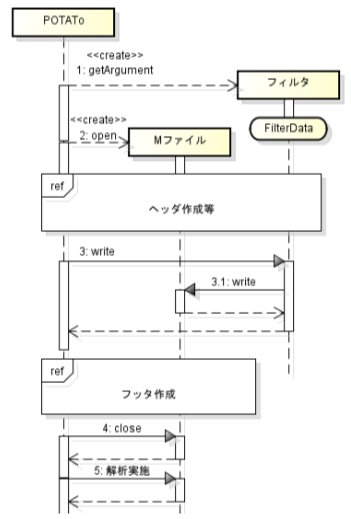

# 解析の拡張

*このドキュメントは校正が済んでいません。貢献頂ける方を歓迎します!*

[Open PoTAToドキュメントリストへ](index.md)

<!-- TOC -->

- [解析の拡張](#解析の拡張)
- [解析機能](#解析機能)
    - [Open PoTAToにおける解析](#open-potatoにおける解析)
    - [解析処理](#解析処理)
- [データ構造](#データ構造)
    - [解析データ](#解析データ)
    - [レシピ](#レシピ)
- [フィルタの拡張](#フィルタの拡張)
    - [関数インタフェイス](#関数インタフェイス)
    - [createBasicInfoサブ関数](#createbasicinfoサブ関数)
    - [getArgumentサブ関数](#getargumentサブ関数)
    - [writeサブ関数](#writeサブ関数)
- [補助関数](#補助関数)
        - [uc_dataload関数](#uc_dataload関数)
        - [nan_fcn関数](#nan_fcn関数)
        - [uihelp関数](#uihelp関数)

<!-- /TOC -->


# 解析機能

## Open PoTAToにおける解析
ここではOpen PoTAToのResearchモードの解析準備(Preprocessor)における単体データ解析の拡張方法を説明します。

Open PoTAToでは解析の手順をレシピと呼んでいます。レシピはファイルに保存することもできます。またレシピは複数の解析関数（フィルタ）から構成されており、変数や実行順序を変更可能です。

- レシピは再利用・配布可能
- レシピは編集可能
- 解析関数（フィルタ）を追加可能

ここでは解析関数の追加に関して説明します。

簡単な解析関数の追加方法は別途【解析ツール作成のためのステップガイド.pdf】をご参照ください。ここでは、関連する内容も含めOpen PoTAToの内部構造に近い説明を行います。

なお、ここではプログラムコードの作成を前提としていますので、プログラム開発者向けの説明になります。


## 解析処理

Researchモードの解析準備(Preprocessor)における単体データ解析では解析データ(Analysisデータ)内になるレシピ(解析手順)を編集し、解析を実施します。

その結果、POTAToデータを出力します。

解析データは、実験データ(Rawデータ)の名前とレシピを持っています。

このレシピを編集するため、POTAToは解析関数のリストとその特徴を取得します。その後、ユーザの操作により解析関数を加えたり削除したりすることによりレシピを編集します。

解析の実施では解析データから解析用のM-ファイルを作成します。M-ファイルの作成では、実験データ名からデータの読込処理を、レシピに登録されている関数からフィルタ処理をファイルに書き出します。

作成したM-Fileを実行することにより、解析後のPOTAToデータが取得できます。


# データ構造


## 解析データ
解析を実施するために必要なデータは解析データです。解析データの構造を図に示します。
解析データは１つの実験データ（旧バージョンは複数可）と１つのレシピを持っています。レシピは複数のフィルタから出来ています。
ここでフィルタには、連続データに対して行うフィルタ、ブロッキング用フィルタ、区間データに対して行うフィルタの3種類があります。

具体的にはレシピは解析データ(AnalysisData)以下にAnalysisData.data.filterdataに構造体として保存されます。


## レシピ


レシピは解析手順を示します。レシピは以下のような構造体になっています。

| フィールド名 | 内容                                    | 例                        |
| ------------ | --------------------------------------- | ------------------------- |
| dummy        | 空構造体を避けるための ダミーフィールド | No Effective Data'        |
| HBdata       | 連続データに対するフィルタリスト        | { FilterData, FilterData} |
| block_enable | ブロック有効フラグ                      | 1                         |
| BlockPeriod  | ブロック期間                            | [5 15]                    |
| TimeBlocking | ブロック化フィルタ                      | { FilterData}             |
| BlockData    | 区間化データに対するフィルタリスト      | { FilterData, FilterData} |

 

全てのフィールドは対象とする解析を実施しない場合省略できますが、レシピは空でない構造体にする必要があります。そこで、解析がなく、レシピ構造体が空になる場合はdummyフィールドで何かの値を設定します。
解析は、最初に連続データに対してフィルタを適用し、次にブロッキングを行い、最後に区間データに対してフィルタを適用します。ここでフィルタに関するデータ、フィルタデータ（FilterData）に関しては後述します。
ここで、ブロッキングに関しては複数の設定があります。block_enableはブロック化の有効/無効を示します。block_enable==0の場合はブロック化以降の処理を行いません。
BlockPeriodはブロッキングの共通設定項目で、この項目がない場合もブロック化以降の処理を行いません。
TimeBlockignはブロッキング用のフィルタですが、省略時はデフォルトのブロッキング処理が行われます。なおデフォルトの処理では全刺激の種類に対してブロッキングを行います。


# フィルタの拡張


## 関数インタフェイス


フィルタはPOTATo内のPluginDirフォルダ以下にPlugInWrap*.mというファイル名で作成します。POTAToはサブフォルダ以下も検索しますので、フォルダを分けることで整理することができます。また、pコード化したファイルも検索しますので、必要があればpコード化してください。

この関数は以下のようなインタフェィスを持ちます。

```matlab
PlugInWrap_*(‘subfncname’,[arg1,arg2,・・・])
```

ここでsubfncnameにサブ関数名が入り、arg1,arg2・・・はサブ関数の引数です。用意すべきサブ関数は以下3つになります。

| サブ関数名      | 内容                                   |
| --------------- | -------------------------------------- |
| createBasicInfo | 基本情報設定                           |
| getArgument     | フィルタデータを作成する               |
| write           | 解析を実施するための M-File を作成する |

それぞれのサブ関数の引数や用途は決まっており、ここでは各サブ関数について説明します。なお、これらの関数の骨格となるコードは、他のフィルタ関数をコピーするか、”P3_wizard_plugin“のFilterPlug-inで作成できます。

また、関数ヘルプ用のコメント（M-ファイルの最初のコメント）はヘルプとして利用されますので、わかりやすく入力することを推奨します。


## createBasicInfoサブ関数

createBasicInfoサブ関数はフィルタ関数の基本的な情報を返します。POTAToでレシピを編集する際など、システムの制御に利用します。なお、結果である基本情報は固定値にしてください。
| 項目         | 説明                                            |
| ------------ | ----------------------------------------------- |
| シンタックス | info=createBasicInfo                            |
| 機能         | 指定したname,IDに対応するAO関連データを更新する |
| 入力         | **info** 基本情報（構造体）                     |

ここで、基本情報構造体は以下のフォーマットです。


| フィールド名 | 内容                                                         | 例                   |
| ------------ | ------------------------------------------------------------ | -------------------- |
| name         | フィルタ名                                                   | 'MyFilter'           |
| region       | 利用可能領域を示す配列<br>2: 連続データに対応<br>3: 区間データに対応<br>-1:ブロッキング(この場合配列不可) | [2,3]                |
| DispKind     | 表示種別                                                     | 0                    |
| Description  | M-File作成時のフィルタの説明                                 | ‘MyFilter:band-pass’ |

ここでnameは表示するフィルタ名です。nameはPOTATo内でユニークであるべきです。もし同一の名前が記載されると起動時、毎回警告が出力されます。

regionはそのフィルタが実行可能なデータを示します。通常、 3連続データ）もしくは3（区間データ）を記載します。両方のデータに対応する場合は[2,3]と複数記載できます。

DispKindはそのフィルタの種別を示します。BookMarkなど、表示するフィルタリストの絞込みに使われていましたが、現在は普通のフィルタでは使われていません。

ただし、Developer-Modeで利用する1st-Level-Analysis用のフィルタを作成する場合はF_1stLvlAnaを指定してください。


## getArgumentサブ関数

解析を行うための引数設定を行います。

| 項目         | 説明                                                         |
| ------------ | ------------------------------------------------------------ |
| シンタックス | fdata=getArgument(fdata, mfile)                              |
| 機能         | 解析を行うためのフィルタデータを設定する                     |
| 入力         | **varargin** その他の引数。<br>現行バージョンのPOTAToには<br>varargin{1}にフィルタ実施直前のデータを<br>作成するためのスクリプトファイルが入っている。 |
| 入出力       | **fdata** フィルタデータ                                     |


POTATo内のGUIより呼び出されます。新規作成時は初期データのみ与えられますが、更新時、
fdataには以前のfdataが設定されます。キャンセルする場合はreturn前にfdata=[]；と設定します。フィルタデータのフォーマットは以下の通りです。

| フィールド名 | 内容                         | 備考                     |
| ------------ | ---------------------------- | ------------------------ |
| name         | フィルタ名、基本情報と同じ。 | 変更不可                 |
| wrap         | 関数名                       | 変更不可                 |
| argData      | 解析で利用するデータ         | 構造体<br>自由に作成可能 |


ここでフィルタデータはPOTATo内ではenableフィールドを持ちます。enableは’on’もしくは’off’の値をとり、フィルタの有効/無効を示しています。
レシピ内(参照：表2.1 レシピ構造体)のフィルタデータはこのenableフィールドが付加されています。

また、引数設定前のPOTAToデータを取得したい場合、以下のように利用してください。

```matlab
mfile=varargin{1};
[data, hdata]=scriptMeval(mfile, ‘data’,’hdata’);
```


ここで、この関数で得られるPOTAToデータは周辺のレシピが変更されることにより変更されます。変更時には引数設定直前のPOTAToデータが取得できます。


## writeサブ関数

解析実施時、POTAToはレシピより一旦M-Fileを作成し、その後作成したM-Fileを実行することで解析を実施します。
そのため、writeサブ関数では解析を実施するためのM-File作成を行います。

| 項目         | 説明                                                         |
| ------------ | ------------------------------------------------------------ |
| シンタックス | str=write(region,fdata)                                      |
| 機能         | AO：描画処理のための文字列作成                               |
| 入力         | **region** 領域を示す文字列。連続データ：’HBdata’、区画データ:‘BlockData’ |
|              | **fdata** フィルタデータ                                     |
| 出力         | **str** Axis-Area内のAO描画処理で実行する                    |

文字列ここで、M-Fileの作成時のPOTAToとフィルタの関係を示します。



あらかじめPOTAToは1.getArgumentをフィルタに実施し、FilterDataを作成します。この時FilterDataはレシピ内に保存さます。

次にPOTAToはPOTATo内の補助関数make_mfile関数を用いて作成するMファイルを開きます。その後、レシピに従いフMファイルを作成します。このときフィルタに対してcreateBasicInfoを用いて、ヘルプ用のヘッダ等も作成します。

POTAToがフィルタ実施用コードの記載が必要になると、フィルタに対して3.writeを実施します。

フィルタのwriteサブ関数内でMファイルに直接書き込みをする場合、make_mfileを用いて書き込みを実施します。

その後、POTAToはフィルタwriteサブ関数の戻り値、strを書き込んだり、残りのMファイルの作成を行ったりします。

最後にmake_mfileに4closeを実施し、必要に応じて作成されたMファイルを実施したり、開いたりします。


典型的なwriteサブ関数の例を示します。

フィルタがMファイルを作成する際、適切なインデント（行頭の空白）をいれたり、統一されたルール沿ってコードの区切り文いれたりすることで読みやすいMファイルが作成できます。このようにファイルを整形するためのツールとしてmake_mfile関数が提供しています。make_mfileのシンタックスは以下のようになります。

```matlab
make_mfile(‘サブ関数名’,引数);
```

主な利用方法は以下になります。

| サブ関数       | 引数            | 内容                                                         |
| -------------- | --------------- | ------------------------------------------------------------ |
| write          | Str             | 文字列StrをM-Fileに出力                                      |
| with_indent    | Str             | インデント付きで文字列StrをM-Fileに出力                      |
| code_separator | level           | levelに応じた区切り文を出力の整数で小さいほど重要な区切りとする |
| indent_fcn     | ‘up’ <br>‘down’ | インデントを上げる（空白文字を増やす）<br>インデントを下げる |

ここでStrは整形済みのchar配列としてください。cellで記載することも可能ですが、非推奨です。

writeサブ関数は通常以下の様に開始します。

```matlab
function str = write(region, fdata) %#ok 
% input : fdata
str='';
bi=createBasicInfo;
```


ここで、strで結果を返すとインデント調整ができないので、初期値として空白で返すよう予め設定しておきます。
基本情報はgetArgumentにより作成されたfdataのバージョンとwriteサブ関数実行時のバージョンを比較すること、またM-Fileにwriteサブ関数のバージョンを残すことに利用します。

次にフィルタ用のヘッダを記載することを推奨しています。コードの区切りをレベル3にし、フィルタ名、writeサブ関数のバージョン表示を行います。

```matlab
% *****************************
%  Header Area
% *****************************
make_mfile('code_separator', 3);
make_mfile('with_indent', ['% == ' fdata.name ' ==']);
make_mfile('with_indent', sprintf('%% Version %f',bi.Version));
make_mfile('code_separator', 3);
make_mfile('with_indent', '');
```


次に実際の実行部分を記載します。実行部分はtry-catch文で括るべきです。

```matlab
% *****************************
%  Execute Area
% *****************************
make_mfile('with_indent', 'try');
make_mfile('indent_fcn', 'down'); % インデントを下げる

% <<< ここに実行部分を記載 >>

make_mfile('indent_fcn', 'up'); % インデントを戻す
make_mfile('with_indent', 'catch');
make_mfile('indent_fcn', 'down');
% エラー処理
make_mfile('with_indent', 'errordlg(lasterr);');
make_mfile('indent_fcn', 'up');
make_mfile('with_indent', 'end');
make_mfile('with_indent', '');
```


最後に実行部分を記載します。実行部分を記載する際、変数の有効範囲（スコープ）に注意してください。

writeサブ関数内で使える変数は引数のregion,fdataおよびフィルタ基本情報です。ここで引数が格納されているフィルタデータ（fdata)は作成するMファイル中には存在しません。

作成するMファイル内で使える変数はPOTAToデータです。

| サブ関数        | 引数     | 内容                                                         | スコープ         |
| --------------- | -------- | ------------------------------------------------------------ | ---------------- |
| region          | 引数     | 領域を示す文字列。 <br>連続データ:’HBdata’、区画データ: ‘BlockData’ | write サブ関数内 |
| fdata           | 引数     | フィルタデータ (表 3.3 フィルタデータ )                      | write サブ関数内 |
| bi              | 定数     | フィルタ基本情報(表 3.2 フィルタ基本情報)<br>createBasicInfo で取得 | write サブ関数内 |
| dataname        | 入力     | 計算対象実験データファイル名(セル)                           | 作成M ファイル内 |
| hdata<br>data   | 計算対象 | POTATo データ<br>フィルタ実行直前                            | 作成M ファイル内 |
| chdata<br>cdata | 計算結果 | POTATo データ<br>ブロック化直前の連続データ(ブロック化後のみ) | 作成M ファイル内 |
| bhdata<br>bdata | 計算結果 | POTATo データ<br>解析完了後の区間データ(通常なし)            | 作成M ファイル内 |

writeサブ関数内の変数はサブ関数内で定義することにより、追加されます。ここで変更したデータは他に影響を及ぼしません。

作成Mファイル内の変数は他のフィルタにより変更されたり追加されたりします。もし、作成するフィルタが他のフィルタを必要とする場合、適切な説明やエラー文を入れることを推奨します。


# 補助関数

フィルタを実施する上で利用可能な補助関数を示します。

| 関数名      | サブ関数名 | 内容                                                         |
| ----------- | ---------- | ------------------------------------------------------------ |
| uc_dataload | -          | データ読込                                                   |
| nan_fcn     | ‘mean’     | NaNデータを除いたmean(x,dim)                                 |
|             | ‘std0’     | NaNデータを除いたstd(x,0,dim)                                |
|             | ‘std1’     | NaNデータを除いたstd(x,1,flag)を計算。                       |
| make_mfile  | -          | Mファイル作成用ツール。<br>writeサブ関数で利用する。         |
| msglistbox  | -          | msgboxと同じ。<br>ただしメッセージ部分がリストボックスになり<br>多くの文字列を表示できる。 |
| uihelp      | -          | ヘルプを表示する                                             |


### uc_dataload関数

実験データからPOTATo連続データを読み込む。

```matlab
[data,hdata]=uc_dataload(‘ファイル名’);
```

ここで、Mファイル作成時、ファイル名はdataname{1}で与えられる。


### nan_fcn関数
POTAToデータにはNaNが混在している場合があります。POTAToデータにおけるNaNは多くの場合、単に無効なデータという意味です。
そのためこれらのデータを無視する関数を提供します

| 項目         | 説明                                                         |
| ------------ | ------------------------------------------------------------ |
| シンタックス | [data,n]=nan_fcn(fcn,data,dim)                               |
| 機能         | NaNを無視した平均値・標準偏差の計算。                        |
| 入力         | **fcn** 関数タイプ：<br>‘mean’→mean(data,dim)を実施<br>‘std0’→std(data,0,dim)を実施<br>‘std1’→std(data,1,dim)を実施 |
|              | **data** 計算対象データ                                      |
|              | **dim** 対象次元                                             |
| 出力         | **data** 結果                                                |
|              | **n** 計算に利用した有効なデータ数。                         |


```shell
## NaN 設定の経緯:##
POTATo の Motion Check(体動)フィルタは体動と判断した時点の測定データに対 してフラグを立てます。連続データの場合はその時刻、チャンネルに対してフラグを立て、区間データの場合はブロック、チャンネルに対してフラグを立てます。
このフラグの扱いは解析方法の指針により異なります。対応方法のひとつとして、フラグが立っているデータを無効にするため、対応箇所のデータを NaN に設定する方法があります。
```


### uihelp関数
フィルタプラグインのヘルプはuihelp関数により表示されます。作成するフィルタプラグインは以下のヘルプ機能に対応することを推奨します。
| 項目         | 説明                            |
| ------------ | ------------------------------- |
| シンタックス | h = uihelp(fname)               |
| 機能         | 関数のヘルプ表示                |
| 入力         | **fname** 関数名                |
| 出力         | **h** uihelp の figure ハンドル |
uihelpは入力関数からヘルプドキュメントを取得し表示します。

また、PDFやhtmlによるヘルプドキュメントがある場合はヘルプドキュメントを開くためのボタンを有効化します。PDFやhtmlのヘルプドキュメントの検索は関数と同じパスの以下のファイルを検索し、最初に見つかったものを開きます。

- XXX/関数名.pdf
- XXX/関数名.html
- 関数名.pdf
- 関数名.html

ここで、XXXはPOTATo内の言語設定名で、現在は日本語"ja"です。