# Research Mode 操作マニュアル

[Open PoTAToドキュメントリストへ](index.md)

<!-- TOC -->

- [Research Mode 操作マニュアル](#research-mode-%E6%93%8D%E4%BD%9C%E3%83%9E%E3%83%8B%E3%83%A5%E3%82%A2%E3%83%AB)
- [概要](#%E6%A6%82%E8%A6%81)
    - [Researchモードの解析の流れと状態](#research%E3%83%A2%E3%83%BC%E3%83%89%E3%81%AE%E8%A7%A3%E6%9E%90%E3%81%AE%E6%B5%81%E3%82%8C%E3%81%A8%E7%8A%B6%E6%85%8B)
    - [メインウィンドウ](#%E3%83%A1%E3%82%A4%E3%83%B3%E3%82%A6%E3%82%A3%E3%83%B3%E3%83%89%E3%82%A6)
- [解析準備](#%E8%A7%A3%E6%9E%90%E6%BA%96%E5%82%99)
    - [Single: 一つのデータを選択した状態](#single-%E4%B8%80%E3%81%A4%E3%81%AE%E3%83%86%E3%82%99%E3%83%BC%E3%82%BF%E3%82%92%E9%81%B8%E6%8A%9E%E3%81%97%E3%81%9F%E7%8A%B6%E6%85%8B)
        - [特殊処理ボタン領域](#%E7%89%B9%E6%AE%8A%E5%87%A6%E7%90%86%E3%83%9B%E3%82%99%E3%82%BF%E3%83%B3%E9%A0%98%E5%9F%9F)
            - [マーカ編集](#%E3%83%9E%E3%83%BC%E3%82%AB%E7%B7%A8%E9%9B%86)
                - [選択補助GUI](#%E9%81%B8%E6%8A%9E%E8%A3%9C%E5%8A%A9gui)
                - [マーカの有効化/無効化](#%E3%83%9E%E3%83%BC%E3%82%AB%E3%81%AE%E6%9C%89%E5%8A%B9%E5%8C%96%E7%84%A1%E5%8A%B9%E5%8C%96)
                - [マーカを前後に移動する方法](#%E3%83%9E%E3%83%BC%E3%82%AB%E3%82%92%E5%89%8D%E5%BE%8C%E3%81%AB%E7%A7%BB%E5%8B%95%E3%81%99%E3%82%8B%E6%96%B9%E6%B3%95)
                - [データ状態の表示](#%E3%83%86%E3%82%99%E3%83%BC%E3%82%BF%E7%8A%B6%E6%85%8B%E3%81%AE%E8%A1%A8%E7%A4%BA)
        - [解析領域](#%E8%A7%A3%E6%9E%90%E9%A0%98%E5%9F%9F)
            - [フィルタの追加](#%E3%83%95%E3%82%A3%E3%83%AB%E3%82%BF%E3%81%AE%E8%BF%BD%E5%8A%A0)
                - [My Filter Listの設定](#my-filter-list%E3%81%AE%E8%A8%AD%E5%AE%9A)
            - [レシピ情報・編集対象フィルタの選択](#%E3%83%AC%E3%82%B7%E3%83%92%E3%82%9A%E6%83%85%E5%A0%B1%E3%83%BB%E7%B7%A8%E9%9B%86%E5%AF%BE%E8%B1%A1%E3%83%95%E3%82%A3%E3%83%AB%E3%82%BF%E3%81%AE%E9%81%B8%E6%8A%9E)
                - [フィルタ情報の詳細](#%E3%83%95%E3%82%A3%E3%83%AB%E3%82%BF%E6%83%85%E5%A0%B1%E3%81%AE%E8%A9%B3%E7%B4%B0)
            - [レシピ編集](#%E3%83%AC%E3%82%B7%E3%83%94%E7%B7%A8%E9%9B%86)
            - [レシピの保存・読み込み](#%E3%83%AC%E3%82%B7%E3%83%92%E3%82%9A%E3%81%AE%E4%BF%9D%E5%AD%98%E3%83%BB%E8%AA%AD%E3%81%BF%E8%BE%BC%E3%81%BF)
        - [出力領域](#%E5%87%BA%E5%8A%9B%E9%A0%98%E5%9F%9F)
    - [Batch: 同一レシピを持つ複数のデータを選択した状態](#batch-%E5%90%8C%E4%B8%80%E3%83%AC%E3%82%B7%E3%83%92%E3%82%9A%E3%82%92%E6%8C%81%E3%81%A4%E8%A4%87%E6%95%B0%E3%81%AE%E3%83%86%E3%82%99%E3%83%BC%E3%82%BF%E3%82%92%E9%81%B8%E6%8A%9E%E3%81%97%E3%81%9F%E7%8A%B6%E6%85%8B)
        - [グランドアベレージの表示](#%E3%82%B0%E3%83%A9%E3%83%B3%E3%83%89%E3%82%A2%E3%83%99%E3%83%AC%E3%83%BC%E3%82%B8%E3%81%AE%E8%A1%A8%E7%A4%BA)
        - [Batchにおけるデータの描画](#batch%E3%81%AB%E3%81%8A%E3%81%91%E3%82%8B%E3%83%87%E3%83%BC%E3%82%BF%E3%81%AE%E6%8F%8F%E7%94%BB)
    - [Mixed: 異なるレシピを持つ複数のデータを選択した状態](#mixed-%E7%95%B0%E3%81%AA%E3%82%8B%E3%83%AC%E3%82%B7%E3%83%92%E3%82%9A%E3%82%92%E6%8C%81%E3%81%A4%E8%A4%87%E6%95%B0%E3%81%AE%E3%83%86%E3%82%99%E3%83%BC%E3%82%BF%E3%82%92%E9%81%B8%E6%8A%9E%E3%81%97%E3%81%9F%E7%8A%B6%E6%85%8B)
        - [同一レシピを持つデータのみを抽出、レシピの統合](#%E5%90%8C%E4%B8%80%E3%83%AC%E3%82%B7%E3%83%94%E3%82%92%E6%8C%81%E3%81%A4%E3%83%87%E3%83%BC%E3%82%BF%E3%81%AE%E3%81%BF%E3%82%92%E6%8A%BD%E5%87%BA%E3%83%AC%E3%82%B7%E3%83%94%E3%81%AE%E7%B5%B1%E5%90%88)
        - [共通するフィルタの設定変更](#%E5%85%B1%E9%80%9A%E3%81%99%E3%82%8B%E3%83%95%E3%82%A3%E3%83%AB%E3%82%BF%E3%81%AE%E8%A8%AD%E5%AE%9A%E5%A4%89%E6%9B%B4)
- [要約統計量の算出](#%E8%A6%81%E7%B4%84%E7%B5%B1%E8%A8%88%E9%87%8F%E3%81%AE%E7%AE%97%E5%87%BA)
    - [要約統計量データの作成](#%E8%A6%81%E7%B4%84%E7%B5%B1%E8%A8%88%E9%87%8F%E3%83%87%E3%83%BC%E3%82%BF%E3%81%AE%E4%BD%9C%E6%88%90)
        - [Summary Statistic データの設定](#summary-statistic-%E3%83%86%E3%82%99%E3%83%BC%E3%82%BF%E3%81%AE%E8%A8%AD%E5%AE%9A)
        - [Analysis データの選択](#analysis-%E3%83%87%E3%83%BC%E3%82%BF%E3%81%AE%E9%81%B8%E6%8A%9E)
        - [統計量の算出方法の設定](#%E7%B5%B1%E8%A8%88%E9%87%8F%E3%81%AE%E7%AE%97%E5%87%BA%E6%96%B9%E6%B3%95%E3%81%AE%E8%A8%AD%E5%AE%9A)
        - [統計量の算出](#%E7%B5%B1%E8%A8%88%E9%87%8F%E3%81%AE%E7%AE%97%E5%87%BA)
    - [要約統計量の再計算](#%E8%A6%81%E7%B4%84%E7%B5%B1%E8%A8%88%E9%87%8F%E3%81%AE%E5%86%8D%E8%A8%88%E7%AE%97)
        - [Summary Statisticデータの設定](#summary-statistic%E3%83%87%E3%83%BC%E3%82%BF%E3%81%AE%E8%A8%AD%E5%AE%9A)
        - [Analysis データの選択とレシピの編集](#analysis-%E3%83%87%E3%83%BC%E3%82%BF%E3%81%AE%E9%81%B8%E6%8A%9E%E3%81%A8%E3%83%AC%E3%82%B7%E3%83%94%E3%81%AE%E7%B7%A8%E9%9B%86)
        - [編集時の統計量の算出方法の設定](#%E7%B7%A8%E9%9B%86%E6%99%82%E3%81%AE%E7%B5%B1%E8%A8%88%E9%87%8F%E3%81%AE%E7%AE%97%E5%87%BA%E6%96%B9%E6%B3%95%E3%81%AE%E8%A8%AD%E5%AE%9A)
        - [統計量の編集操作実行](#%E7%B5%B1%E8%A8%88%E9%87%8F%E3%81%AE%E7%B7%A8%E9%9B%86%E6%93%8D%E4%BD%9C%E5%AE%9F%E8%A1%8C)
- [統計的検定](#%E7%B5%B1%E8%A8%88%E7%9A%84%E6%A4%9C%E5%AE%9A)
    - [Summary Statistic データの選択](#summary-statistic-%E3%83%86%E3%82%99%E3%83%BC%E3%82%BF%E3%81%AE%E9%81%B8%E6%8A%9E)
    - [検定対象データ情報](#%E6%A4%9C%E5%AE%9A%E5%AF%BE%E8%B1%A1%E3%83%86%E3%82%99%E3%83%BC%E3%82%BF%E6%83%85%E5%A0%B1)
    - [Summary Statisticデータの出力](#summary-statistic%E3%83%87%E3%83%BC%E3%82%BF%E3%81%AE%E5%87%BA%E5%8A%9B)
    - [統計的検定の実施](#%E7%B5%B1%E8%A8%88%E7%9A%84%E6%A4%9C%E5%AE%9A%E3%81%AE%E5%AE%9F%E6%96%BD)
        - 

<!-- /TOC -->

# 概要

本ドキュメントは Open PoTAToにおける Research モードの 操作方法について説明します。Research モードでは解析手法を組み合わせることにより比較的自由な解析をすることができます。また、独自の解析手法を Open PoTAToに組み込む（プラグイン）ことにより、最新の多様な解析が可能になります。

本ドキュメントではGUIの操作方法について説明します。Open PoTATo 起動方法、実験データをインポートする方法、 インポートしたデータを選択する方法については、別途マニュアル“基本操作”をご参照ください。プラグイン作成手法は別途マニュアルをご参照ください。

[目次へ](#Research Mode 操作マニュアル)

## Researchモードの解析の流れと状態
最初に、インポートした実験データ単位で解析準備を行います。この機能をもつ状態を **Preprocess** といいます。Preprocess では、実験データに関する情報(測定位置や刺激マークなど)を追加・修正できます。また、実験データに対して、”Baseline Correction”や”区間化 (Blocking)”などの実験データ単独で可能な解析の手順を設定します。POTATo ではこの解析手順のことを **レシピ(Recipe)**と呼び、実験データとレシピを併せて、**解析データ(Analysisデータ)**として保存します。Analysis データを用いると、実験データをレシピに従って解析するためのMATLABスクリプト関数(M-File)を作成したり、解析結果を描画したりすることができます。

次に、複数の Analysis データから要約統計量の算出を行います。この処理を **Summary Statistics Computation** 状態といいます。Summary Statistics Computation では、計算対象となる Analysis データから時間平均値などの特徴を代表的に表す統計値を算出します。算出した統計量は、各区間（ブロック）、時刻、チャンネル、データ種類(Kind)（オキシヘモグロビン・デオキシヘモグロビンなど）、被験者名などと関連付けられます。 この統計量と関連付けられた情報をまとめたデータを、**要約統計量（Summary  Statistics  データ）** として保存します。Summary Statistics  データは、MATLAB 変数として取り出したり、CSV ファイルとして取り出した りすることができます。

最後に、Summary Statistics データを用いて統計的検定を行います。この処理を **Statistical Test** 状態といいます。Statistical Test では、統計量に関連付けられた情報を元に1つもしくは複数のグループを作成し、統計的検定をします。

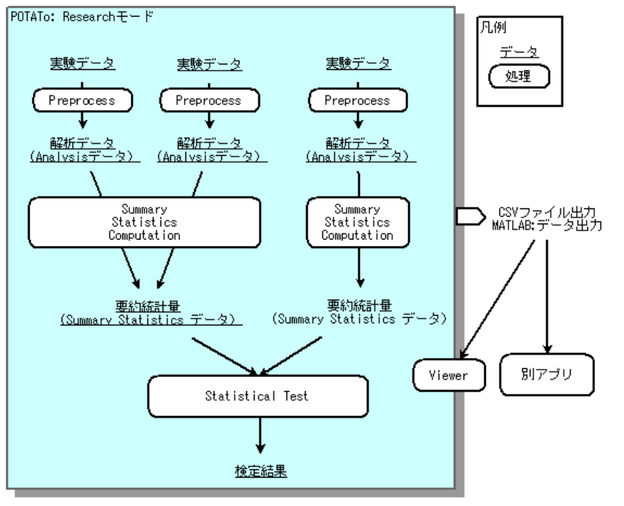

**図 1.1 Research モード 解析の流れ** 

Researchモードでは解析のステップやユーザーの入力に合わせて、ウィンドウの外観やボタンの機能といった**状態**が自動的に切り替わります。

それぞれの状態では、その時点の結果として、データのファイル出力やグラフの描画が可能です。これらの状態には目的や状況によりサブ状態が存在します。これを表にまとめます。

**表 1.1 Researchモードにおける状態**

| 状態          | サブ状態 |  内容                 |
| -------------------- | ------|------------------ |
| 解析準備 Preprocessor | Single |1つのデータのレシピを編集 |
| - | Batch |複数のデータのRecipeを一括 編集  *選択中の全データの Recipe が等しい場合|
|  - | Mixed |複数のデータのRecipeの共通部分編集 or 統合 *選択中のデータの Recipe が異なる場合|
| 要約統計量の算出 Summary Statistics Computation | New |要約統計量データの作成|
| - | Edit |要約統計量データの編集|
| 統計的検定 Statistical Test | - | 統計的検定：T 検定/ANOVA/相関解析など|

[目次へ](#Research Mode 操作マニュアル)

## メインウィンドウ

Research モードに入るためには POTATo を起動し、メインウィンドウのメニュー”Setting”の”P3 MODE”から、”Research Mode”を選択してください。

そこで表示される Research モードにおけるメインウィンドウの概要を説明します。

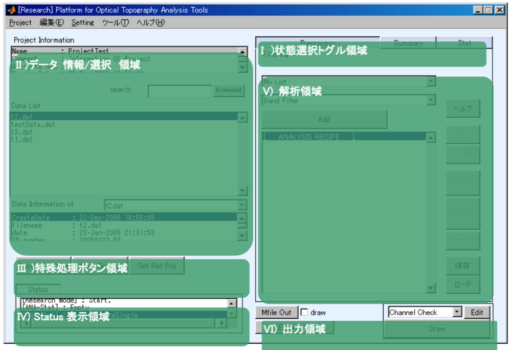

**図 1.2 Research モードのメインウインドウと領域**

Research モードではメインウィンドウを6つの領域に分けることができます。各領域に表示される内容は状態により変わりますが、主に以下に示す処理を実施するための領域になります。

I) 状態選択トグル領域
解析準備(Preprocessor)、要約統計量算出(Summary Statistics Computation)、統計的検定の3つの状態のうち1つを選択します。

II) データ　情報/選択領域
開いているプロジェクト名や計算対象データの情報を表示します。また統計的検定を除き、 解析データの選択を行います。

III) 特殊処理ボタン領域
位置設定や、マーク設定、その他の特殊処理を行います。

IV) Status 表示領域

V) 解析領域
状態にあった解析を行うためのGUIが表示されます。

VI) 出力領域
状態の結果を出力するためのGUIが表示されます。

[目次へ](#Research Mode 操作マニュアル)

# 解析準備 

解析準備状態(Preprocess)に遷移するには、Research モード画面で [Pre]トグルボタンを押下状態にします。解析準備状態では[Pre]トグルボタンは、[Preprocess]と表示されています。

**図 2.1 Research モード解析準備状態**

Preprocess では実験データに位置情報を追加します。さらに、情報が追加された実験データに対して、”Baseline Correction”や”区間化 (Blocking)”などの実験データ単独で可能な解析手順 (レシピ)を設定します。

Preprocess のデータ情報/選択領域に示されるデータは、実験データに解析手順を付加した Analysis データです。実験データをインポートした場合、自動的に Analysisデータとして保存され、データ領域にリストアップされます。

Preprocess ではデータの選択のしかたにより、以下に示す3つのサブ状態が自動的に切り替わります。

**表 2.1 Researchモードにおける状態**

| 状態                                               | サブ状態 | 内容                                                         |
| -------------------------------------------------- | -------- | ------------------------------------------------------------ |
| 解析準備 Preprocessor                           | Single   | 1つのデータ：Recipe編集                                      |
| -                                                  | Batch    | 複数のデータ：一括 Recipe 編集  *選択中の全データの Recipe が等しい場合 |
| -                                                  | Mixed    | 複数のデータ：Recipe 共通部分編集 or 統合 *選択中のデータの Recipe が異なる場合 |

Singleサブ状態は1つの解析データを選択した状態です。選択中の解析データのレシピを編集します。

Batchサブ状態は複数の解析データを選択し、選択したデータのレシピが全て同じ状態です。選択中のデータのレシピを一括して編集します。

Mixedサブ状態は複数の解析データを選択し、選択したデータのレシピが異なる状態です。共通の解析関数の引数を揃えたり、レシピを他のレシピに揃えたりします。

以下、各サブ状態に関して説明を行います。

[目次へ](#Research Mode 操作マニュアル)

## Single: 一つのデータを選択した状態

Preprocess において、データリストボックス<u>(A)</u>から任意の1つの解析データを選択すると、 Single サブ状態に入ります。

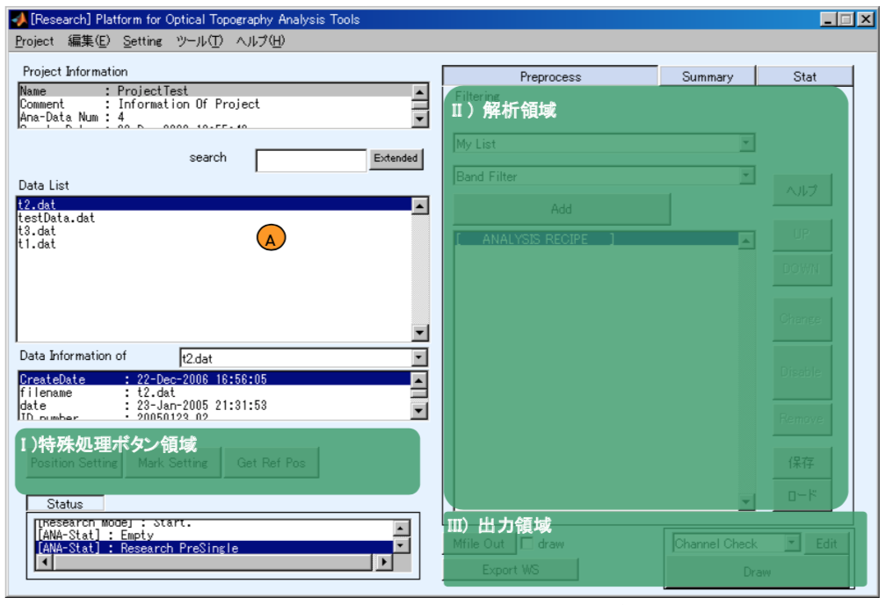

**図 2.2 Research モード解析準備:Single サブ状態**

Single サブ状態画面の、以下の3つの領域について説明します。

I) 特殊処理ボタン領域
実験データに対して、位置設定、刺激マーク設定を行います。

II) 解析領域
解析手順(レシピ)の設定・編集を行います。

III) 出力領域

[目次へ](#Research Mode 操作マニュアル)

### 特殊処理ボタン領域

メインウィンドウ左中段、Analysisデータ選択リストボックスの下に特殊処理用のボタンが並んでいます。

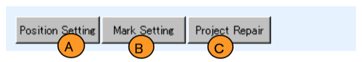

測定位置情報を実験データに付加したい場合にPositionSettingボタン(A)を押し、位置情報を設定します。このとき、2次元で表示に利用する位置の設定、3Dデジタイザによる計測結果の読み込みができます。位置設定の詳細は別途マニュアル“位置設定”をご参照ください。

何らかの理由で刺激マーカが適切でない場合、MarkSettingボタン(B)を押しマーカを編集します。設定の詳細は次項を参照下さい。

その他の特殊処理はボタン(C)に割り当てられます。このボタンに割り当てる処理内容は右クリックすることにより選択できます。

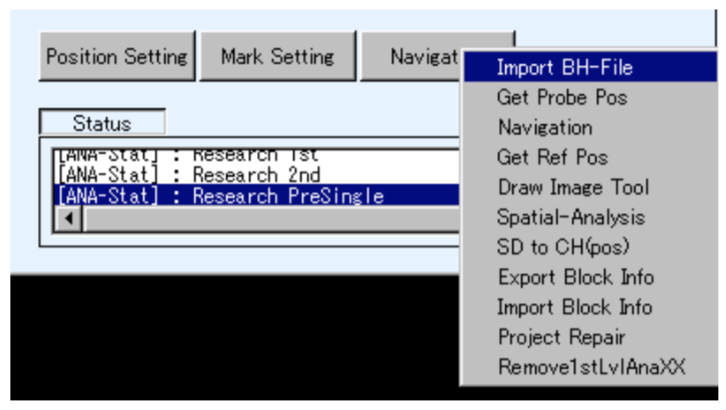

割り当て可能な処理はプラグイン可能です。このため、このボタンの処理はプラグイン状況により変更されます。本マニュアルでは個々の処理に関しては説明しません。

[目次へ](#Research Mode 操作マニュアル)

#### マーカ編集

Mark Settingボタンを用いた刺激マークの編集の詳細を説明します。この編集では、刺激タイプの変更、刺激マークの削除、刺激マークの移動ができます。ただし、刺激種類の変更はできません。
Mark Settingボタンを押すと下記のような編集画面が表示されます。

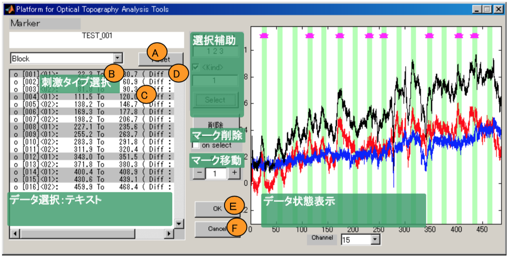

テキストボックス(A)に編集中のデータ名が表示され、現在操作中のデータ状態が右側にグラフで表示されます。最初に刺激タイプをポップアップメニュー(B)で選択します。刺激の開始時刻・終了時刻それぞれにマークが入っている場合は”Block”を、刺激のあった1時刻にのみマークが入っている場合は”Event”を選択します。

次に、マーカリスト(C)から変更したい刺激マークを選択します。選択中の刺激マークに対して、マークの削除もしくはマークの移動を実行します。編集を始めからやり直したい場合には、Resetボタン(D)を押します。

編集が完了した場合は、OKボタン(E)を押し変更を確定します。編集をキャンセルしたい場合にはCancelボタン(F)を押します。

##### 選択補助GUI

選択補助GUIは、マーカリスト(図2.5Mark Setingの(C))のクリックではなく一括してマークを選択したいときに利用できます。

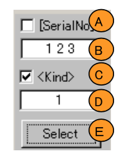

SerialNoはマーカを時間の若い順に1,2,・・・と順番につけた数値です。SerialNoはマーカリスト内では”[]”で括られた数値で示されています。SerialNoで選択するデータを指定する場合、SerialNoチェックボックス(A)をチェックし、エディットテキスト(B)に選択したい番号を記入します。このとき、MATLABの行列表現で”1:2:10”等と指定することも可能です。

Kindは刺激の種類を表す値で、マーカリストでは”<>”で括られた数値で示されています。Kindでデータを選択する場合、Kindチェックボックス(C)をチェックし、エディットテキスト(D)に選択したいKindを記入します。

記入完了後、Selectボタン(E)を押すことにより、マーカリスト上でデータが選択されます。この、SerialNoとKindが同時にチェックされている場合、両方の条件を満たすマークが選択されます。

##### マーカの有効化/無効化

マーカリストで選択しているマークを有効化もしくは無効化したいときに削除ボタン(A)を押します。

その結果、選択中のマークが反転します。ここで、“o”で示されたマークが有効、”x”で示されたマークが無効と設定されています。on selectチェックボックス(B)がチェックされている場合、マークリストを選択する度にマークの有効/無効が反転します。

##### マーカを前後に移動する方法

最初にマーカリストでマークを選択します。次にエディットテキスト(B)で移動量を設定します。このときの入力単位はサンプリングピリオドになります。例えば、ETG7000では1=100 msecになります。マーカの時刻を早めたい場合は、マイナスボタン(A)を、遅らせたい場合はプラスボタン(C)を押 します。

##### データ状態の表示

有効になっているマーク(A)は緑のラインで示されます。また、現在選択中のマーク(B)はマゼンダ色の5角形で示されます。また、チャンネルポップアップメニュー(D)に応じたチャンネルのヘモグロビンデータが実線(C)で表示されます。

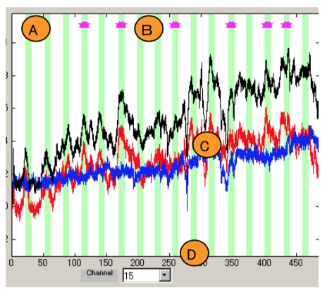

[目次へ](#Research Mode 操作マニュアル)

### 解析領域

PreprocessにおけるSingleサブ状態およびBatchサブ状態のメインウィンドウ右側にある解析領域は、1つの実験データに対する解析手順（Recipe）の設定・編集画面になります。ここで、レシピに設定する解析には、ノイズ除去のための周波数フィルタや体動のあるデータを取り除く処理などが含まれます。また、実験データを刺激区間ごとに取り出した“区間データ”に変換する処理もレシピに記載します。
解析レシピの個々の処理はフィルタと呼ばれています。フィルタはプラグインにより拡張可能です。
代表的なフィルタの説明は「付録：フィルタ説明」を参照ください。また、一部のフィルタにはオンラインヘルプが付いています。オンラインヘルプはヘルプトグルボタン(A)をONにしておくことにより利用できます。
レシピの編集には次の処理があります。

I)	フィルタの追加
II)	レシピ情報・編集対象フィルタの選択
III)	レシピ編集
IV)	編集済みレシピの保存・読み込み

以下それぞれについて説明します。

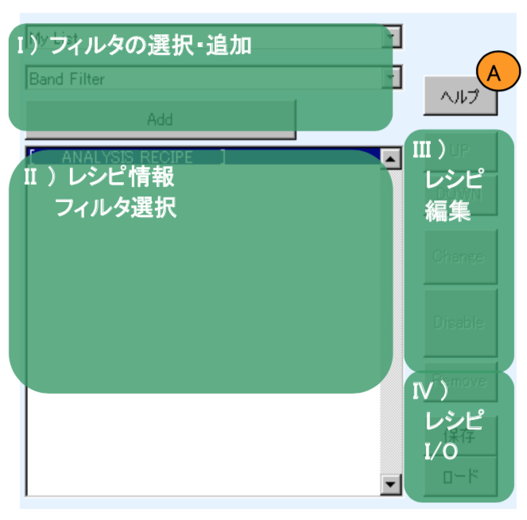

#### フィルタの追加

フィルタの追加はフィルタポップアップメニュー(B)から追加するフィルタを選択し、Addボタン(C)を押すことにより実行できます。フィルタが追加されると、後述のレシピの末尾にフィルタが追加されます。ただし、連続データに対するフィルタの場合は連続データに対する解析の末尾に追加されます。初期状態ではポップアップメニュー(B)にはよく使うフィルタとして、”My Filter List”に登録されているフィルタのみが表示されています。全てのフィルタを表示したい場合はポップアップメニュー(A)から”All Filter”を選択ください。

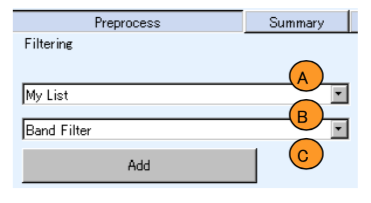

##### My Filter Listの設定

”My Filter List”選択時に表示されるフィルタ一覧は設定により変更できます。設定するにはメインウィンドウの”Setting”メニューから”My Filter List”を選択します。その結果、下図のようなウィンドウが表示されます。
エディットテキスト(A)に”My Filter List”の名称が表示されます。この名称は変更可能です。

全てのフィルタが左のリストボックス(B)に、現在の”My Filter List”が右のリストボックス(C)に示されます。
My Filter Listにフィルタを追加したいときは、左のリストボックス(B)から追加したいフィルタを選択し、[>>]ボタン(D)を押します。逆にMy Filter Listからフィルタを外したいときは、右のリストボックスから外したいフィルタを選択し[<<]ボタン(E)を押します。編集が終了したらOKボタン(F)を、キャンセルしたい場合はCancelボタン(G)を押し、編集画面を閉じてください。

[目次へ](#Research Mode 操作マニュアル)

#### レシピ情報・編集対象フィルタの選択

解析手順を示しているレシピ情報は下図のようにリストボックス内に示されます。

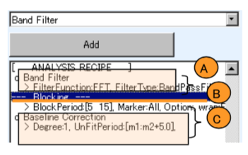

フィルタは実行順序により結果が異なりますので、レシピ内の順序は重要です。特に、区間化処理(Blocking)を行うフィルタ(B)の前後で、連続データに対するフィルタ(A)と区間データに対するフィルタ(C)に分けられます。

##### フィルタ情報の詳細

各フィルタは2行で示されます。1行目には、フィルタの有効/無効情報(A)がそれぞれ、o,xで表示されます。またフィルタ名称(B)が表示されます。2行目にはフィルタの引数情報(C)が表示されます。

ただし、区間化フィルタが無効の際は他と扱いが異なります。区間化が無効な場合は”(Blocking disabled )<<< <<< <<<” (D)と示され、それ以降のフィルタ(E)も無効になります。

#### レシピ編集

まず、レシピ情報リストボックス(X)から、編集したいフィルタを選択します。その結果、フィルタに対して実行できる内容に沿って、(A)~(E)のボタンの有効/無効が変わります。
フィルタの実行順序を上げたいときはUP(A)ボタンを、逆に順序を下げたいときにはDOWN(B)ボタンを押します。また、引数を変更したい場合はChange(C)ボタンを押します。Changeボタン実行後、引数設定ウィンドウが立ち上がり、フィルタが無効であった場合は有効に変更されます。
有効状態のフィルタを無効化したいときにはDisableボタン(D)を押します。また、無効状態になったフィルタを有効に戻したいときは、表示名がEnableに変わったボタン(D)を押します。最後に、フィルタをレシピから取り除きたい場合はRemoveボタン(E)を押します。

#### レシピの保存・読み込み

レシピはファイルに保存・読み込むことが可能です。レシピを保存する場合は、Save ボタンを、 読み込む場合は Load ボタンを押してください。

なお、日本語環境下においては、それぞれのボタンは”保存”, “ロード”と記載されている場合があります。(MATLAB 環境により依存して変わります。)

[目次へ](#Research Mode 操作マニュアル)

### 出力領域

PreprocessにおけるSingleサブ状態にあるデータ出力領域について説明します。
MATLAB版においては、MATLAB用のデータ出力方法として、MFile Outボタン(A)とExport WSボタン(C)があります。また、結果を描画する方法としてDrawボタン(F)があります。

作成したAnalysisデータの解析を実施するMATLABスクリプト関数(M-File)を作成したい場合、Mfile Outボタン(A)を押します。ボタン押下後、出力するMファイル名を聞かれますので、出力場所を指定しOKボタンを押してください。このとき、drawチェックボックス(B)をチェックしておくと、描画処理もM-Fileに記述されます。
また、MATLAB Workspaceに解析手順適用結果を出力したい場合はExport WSボタン(C)を押します。その結果、Workspaceに解析結果が出力されます。解析結果の主要なデータとして、PoTAToデータが存在します。POTAToデータに関しては別途マニュアル“基本操作”にある”PoTAToのデータ形式”をご参照ください。
次に、解析結果を描画する方法を説明します。PoTAToでは、解析結果と表示レイアウトを用いて描画を行います。解析結果はデータリストから選択し、レイアウトはポップアップメニュー(D)から選択します。その後、Drawボタン(F)を押し描画します。
ここで、Editボタン(E)はレイアウトポップアップメニュー(D)で選択しているレイアウトを編集するためのウィンドウを立ち上げます。レイアウトの編集方法はマニュアル”表示機能”をご参照ください。

[目次へ](#Research Mode 操作マニュアル)

## Batch: 同一レシピを持つ複数のデータを選択した状態

Preprocess において、データリストボックス(A)から同じレシピをもつ複数の解析データを選択すると、Batch サブ状態に遷移します。

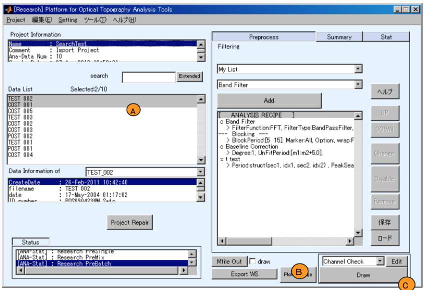

Batch サブ状態では、特殊ボタンの位置設定およびマーク設定が表示されなくなります。位置設定等を行いたい場合は、Single サブ状態で行ってください。

レシピの編集のGUIは Single サブ状態と同じです。ただし、レシピの変更は選択中の解析データ全てに適用されます。

描画に関連して選択中の解析データの平均波形(グランドアベレージ)を表示する Plot Average ボタン(B)が表示されます。 また、Draw ボタン(C)を押したとき、選択中の全ての解析データに対して結果が表示されます。 

### グランドアベレージの表示

Plot Average ボタン(B)を押すと、グランドアベレージを計算し、結果を表示します。 平均波形を計算するときに、下記のいずれかの条件に適合するデータは無視されます。

- 区間データではない。
- channel数 もしくは kind数 が異なる。
- 刺激期間が大きく異なる(制限値は設定による)
- サンプリングピリオドが異なる
- 体動などにより無効と指定されている

なお、刺激期間の差の制限値は、メインウィンドウの、”Setting”メニューの”Stim-Diff-Limit”により設定できます。

エラーの一例として連続データを利用した場合には下図のようなダイアログが表示されます。グランドアベレージは区間データのみを処理できますので、レシピ編集にて Blocking が設定されており、有効であることを確認してください。

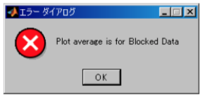

[目次へ](#Research Mode 操作マニュアル)

### Batchにおけるデータの描画

Preprocess、Batchサブ状態でDrawボタンを押すと、選択中の解析データに1個に対して1つの図が描かれます。そのため100個のデータを選んでいる場合は100個の図が出力されます。

描画後、複数の図を操作するツールとして、下図のようなGUIが表示されます。
GUIのリストボックス(A)には描画した図のリストが表示されます。リストボックス内の図を選択し、Tileボタン(F)を押すと選択中の図が整列されます。
リストボックス(A)を更新するときはResetボタン(B)を、選択中の図をdeleteする場合はdeleteボタン(C)を押します。
整列順序はリストボックスの並び順ですが、Up/Downボタンにより順序を変更できます。また、整列の方法としてポップアップメニュー(D)でTileかOverwrapかを選択できます。また、Tileの場合は、エディットテキスト(E)に整列するエリアをNormal単位で指定することができます。

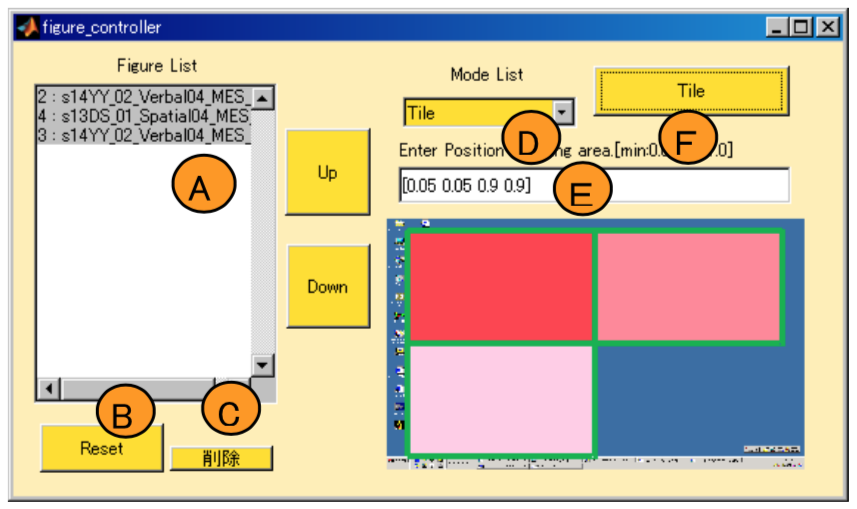

[目次へ](#Research Mode 操作マニュアル)

## Mixed: 異なるレシピを持つ複数のデータを選択した状態

Preprocess において、データリストボックス(A)から異なるレシピをもつ複数の解析データを選択すると、Mixed サブ状態に入ります。Mixedサブ状態では、このようなデータから同じレシピを持つものを抽出すること、複数あるレシピを1つのレシピに統合することや、全てのレシピで共通して利用されているフィルタの設定を変更することができます。

[目次へ](#Research Mode 操作マニュアル)

### 同一レシピを持つデータのみを抽出、レシピの統合

Mixed サブ状態ではレシピの異なる複数の解析データが選択されています。レシピポップアップメニュー(A)には選択中の解析データのレシピが、

”Recipe α, (β,/γ)”(α, β, γは整数)

というフォーマットで表示されます。αはレシピのID番号で、自動的に付与されます。βはレシピαを持つ選択中の解析データの数、 γは選択中の解析データの総数です。ここで、Recipe αの内容はリストボックス(B)に表示され、レシピに Recipe αをもつ解析データの一覧はリストボックス(E)に表示されます。

ここで、リストボックス(E)に示される解析データを編集するためには、Edit ボタン(C)を押します。 その結果、リストボックス(E)に示される Recipe αをもつ解析データのみが選択され、Preprocess Batch サブ状態に遷移します。

また、選択中の全ての解析データのレシピをレシピポップアップメニュー(A)で選択されたレシピ にしたい場合は、Apply to all ボタン(D)を押します。そうすると全てのレシピが同じになり、 Preprocess Batch サブ状態に遷移します。

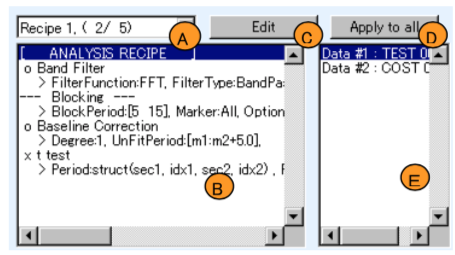

### 共通するフィルタの設定変更

選択されているすべての解析データのレシピで共通して利用されているフィルタがある場合、共通フィルタポップアップメニュー(A)にリストアップされます。

フィルタの設定を変更したい場合は、Changeボタン(B)を、フィルタを有効化/無効化したい場合はそれぞれEnableボタン(C)/Disableボタン(D)を押します。また、フィルタをレシピから取り除きたい場合はRemoveボタン(E)を押します。

編集によって、全てのレシピが同等になった場合はPreprocess Batchサブ状態に遷移します。

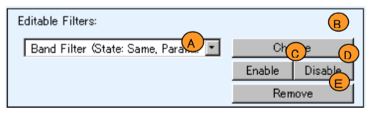

[目次へ](#Research Mode 操作マニュアル)

# 要約統計量の算出

要約統計量算出状態に遷移するには Research モード画面で[Summary]トグルボタンを押下
状態にします。要約統計量算出状態になっているとき、[Summary]トグルボタンは、
[Summary Statistics Computation]と表示されます。

要約統計量の算出状態では、Preprocessで作成した解析データ(Analysisデータ)から要約統計量データ(Summary Statisticデータ)を作成します。

要約統計量データを新たに作成する場合は、[New]トグルボタン(A)を押下状態にします。また、作成済みの要約統計量データを編集する場合は、[Edit]トグルボタン(B)を押下状態にします。作成・編集の詳細は後続する各節で説明します。

なお、作成したSummary Statisticデータを使うと、Open PoTAToで統計的検定(Statistical Test)を実施できます。また、CSVファイルとして出力したりできます。

**ヒント** この状態では必ず拡張検索ウィンドウが使えます。 拡張検索ウィンドウを用いると作成日などからデータを絞り込むことできるので、Analysis データが大量にある場合などに有効です。

[目次へ](#Research Mode 操作マニュアル)

## 要約統計量データの作成

解析データ(Analysis データ)から要約統計量データ(Summary Statistic データ)を作成します。作成するには、最初に要約統計量算出状態で「New トグルボタン」(A) を押下状態にします。

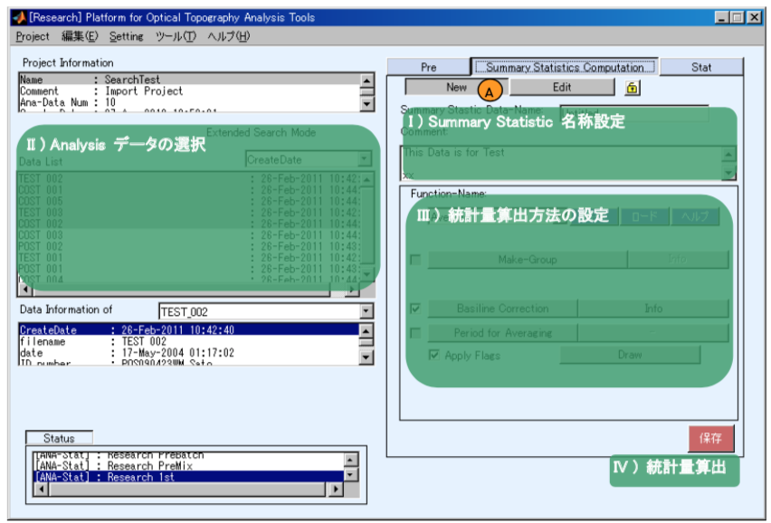

Summary Statistic データは、図で示す各領域を操作することにより作成します。各領域では、

I)  作成する Summary Statistic データの名前・コメントを設定します。
II)  要約統計量算出の入力となる Analysis データを選択します。
III) 統計量の算出方法を設定します。
IV) 統計量算出を実行します。 

以下、それぞれの手順について説明します。

[目次へ](#Research Mode 操作マニュアル)

### Summary Statistic データの設定

作成する Summary Statistic データの、データ名を(A)に入力し、コメントを(B)に入力します。
これ以降の解析で、Summary Statistic データを利用する場合、ここで入力した名前を用いてデータを指定します。そのため、 記憶し易いデータ名にしてください。

データ名には2つの制約があります。
- 英数字および”_”のみで記載し、先頭文字は英字にします
- 既に登録してある名称は利用できません。

### Analysis データの選択

要約統計量を算出するためのAnalysis データを選択します。Analysisデータは、Preprocessで作成した実験データとレシピが含またデータです。データの選択はリストボックス(A)で行います。この時、拡張検索による絞り込みが可能です。

Analysisデータの選択の仕方として、次の3パターンがあります。
- 選択した全データが“区間データ”
- 選択した全データが”連続データ”
- 選択したデータに”区間データ”と”連続データ”が含まれる

それぞれのパターンごとに異なる方法で統計量が算出されます。

**ヒント**　データ選択のパターンにより、次項の統計量の算出方法設定のインターフェースが変わることがあります。

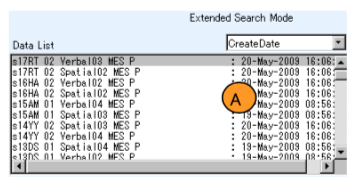

### 統計量の算出方法の設定
統計量算出の方法を設定します。最初に、ポップアップメニュー(A)から要約統計量を算出する関数を選択します。関数を選択すると右図のパラメータ設定領域にGUIが表示されます。ボタンの配置などは関数によって異なります。これらのGUIを操作し、統計量算出のためのパラメータを設定します。パラメータの設定は、保存ボタン(B)でファイルに保存でき、ロードボタン(C)にてファイルから読み込むことができます。選択した関数のオンラインヘルプを確認する場合はヘルプトグルボタン(D)を押下状態にしてください。

### 統計量の算出

すべての設定を終了後、[要約統計量データの作成](要約統計量データの作成)で示した画面右下(IV)の”Save”(保存)ボタンを押し、統計量の算出を実行します。
このとき、[Analysisデータの選択](Analysis データの選択)において全てのAnalysisデータ（ファイル）を選択していない場合、下記のように、選択中のファイルに対して実施するか、表示中の全てのデータに対して実施するかの確認ダイアログが表示されます。解析対象としたいファイルに応じてラジオボタン(A)を選択し、Save ボタン(B)を押します。

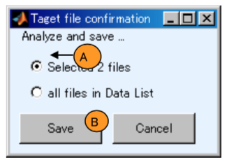

実行中、各Analysisデータについて統計量の算出の成否がリストボックス(A)に表示され、進捗率がプログレスバー(B)に示されます。このとき、リストボックス(A)に”** OK **”ではなく、”[W] xxx”や”[E] xxx”と表示された場合、対象となるAnalysisデータの統計量算出中に何らかの問題があり、算出結果に問題がある、もしくは算出できなかったことを意味します。
すべてのAnalysisデータについて統計量の算出が完了すると、リストボックス(C)に”Done”と表示されますのでOKボタン(D)を押してください。

また、[Summary Statistic データの設定](Summary Statistic データの設定)で設定した Summary Statistic データ名が既に使用されている場合、下図のようなエラーダイアログが表示されます。この場合、Summary Statistic データ名を変更して再実行してください。

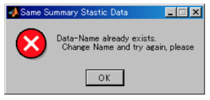

[目次へ](#Research Mode 操作マニュアル)

## 要約統計量の再計算

[要約統計量データの作成](要約統計量データの作成)で作成した要約統計量が格納されたデータ、Summary Statistic データは編集することもできます。例えば、新たにAnalysisデータを追加した場合や以前の実験での設定を再利用するとき有効です。

編集するには、最初に要約統計量算出状態で「Edit トグルボタン」(A) を押下状態にします。

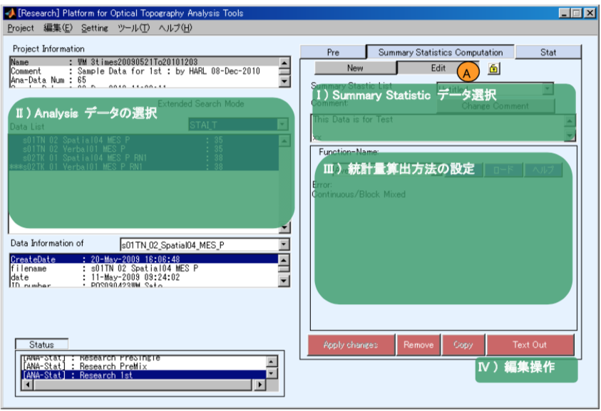

Summary Statisticデータの編集では、図で示した領域にあるGUIを操作することによりデータを編集します。各領域では、

I)	編集するSummary Statisticデータを選び、コメントを変更します。

II)	Analysisデータを変更します。

III)	統計量の算出方法を変更します。

IV)	編集操作を実行します。

以下、それぞれの手順について説明します。

### Summary Statisticデータの設定
要約統計量の算出状態に入った直後は新規作成(Newトグル)がOnになります。新規作成/編集の状態を保持したい場合は、ロックトグルボタン(A)を押下状態にします。

**ヒント** 一度解析準備(Pre)状態に戻り、対応 Analysis データのレシピ編集等を行い、再び 要約統計量の編集作業を行う場合にこの機能は便利です。

編集したい Summary Statistic データをポップアップメニュー(B)から選択します。このとき、データに関するコメントがエディットテキスト(D)に示されます。コメントを編集・更新する場合は、エディットテキスト(D)を変更後 Change Comment(C)ボタンを押します。

### Analysis データの選択とレシピの編集

要約統計量を算出するためのAnalysisデータを選択します。データの選択はリストボックス(A)にて行います。このとき、要約統計量を算出したときのレシピと現状のレシピが異なるAnalysisデータに は、”***”というマークが付きます。このレシピが異なるデータを選択中に右クリックを行うと、コンテキストメニューが表示されます。

Use Summary Statistic Data Recipe メニュー(B)を選ぶと、Summary Statistic データ計算時に使われたレシピが、直ぐに現状の Analysis データのレシピに反映されます。

Use Analysis Data Recipe メニュー(C)を選ぶと、Summary Statistic データ計算用のレシピを書き換えます。
この時、要約統計量(Summary Statistic Data)は再計算されていません。この編集を行った場合、 統計的検定を行う前に Apply Change ボタンにより要約統計量を再計算してください。

**(注)** データの扱いが煩雑になるため、この仕様は将来変更される可能性があります。

### 編集時の統計量の算出方法の設定

統計量算出方法の設定は[作成時](統計量の算出方法の設定)と同様です。

### 統計量の編集操作実行

Apply changes ボタン(A)は変更を反映し、要約統計量(Summary Statistic データ)を再計算し、上書きしま
す。 Remove ボタン(B)は Summary Statistic データを削除します。Copy ボタン(C)は、現在のデータを複製します。また、Text Out ボタン(D)は現状の Summary Statistic データを CSV ファイルに出力します。

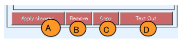

 Copy ボタン押下後、下図のように複製後の Summary Statistic データの設定ができます。(A)にデータ名を、(B)にコメントを記入します。また、現在選択中のデータを変更なしにコピーする場合は、チェックボックス(C)にチェックします。逆に現在のGUIから情報を取得し、統計量を再計算する場合はチェックを外します。

全ての設定を終えると、Copy(D)ボタンにて複製を行います。なお、キャンセルボタン(E)はいつでも有効に使えます。

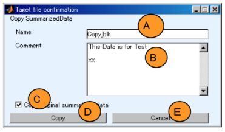

[目次へ](#Research Mode 操作マニュアル)

# 統計的検定

Researchモード画面で[Stat]トグルボタンを押下状態にすることにより、統計的検定状態に遷移します。統計的検定状態では[Stat]トグルボタンは、[Statistical Test]と表示されます。

統計的検定状態では、[Summary Statistics Computation:要約統計量の算出](Summary Statistics Computation:要約統計量の算出)で作成した要約統計量(Summary Statistic データ)に対して統計的検定を行います。
統計的検定のメインウィンドウは4つの領域に分けられます。

I) Summary Statistic データを選択するための領域

II) 検定対象のデータの情報を参照する領域

III) 選択中の Summary Statistic データを出力するための領域

IV) 検定を実施するための領域

以下、それぞれの領域について説明します。

## Summary Statistic データの選択

最初に統計的検定を実施する要約統計量 (Summary Statistic データ)をポップアップメニュー(A) で選択します。ポップアップメニュー (A)には保存されている Summary Statistic デ ータ名と要約検定量算出のために用いた関数名が表示されています。

ポップアップメニュー(A)にて Summary Statistic データを選択すると、リストボックス(B)に、対応するデータのコメントが表示されます。

この Summary Statistic データに対して統計解析を行う場合、Add ボタン(C)を押します。その結果、統計的検定で利用する Summary Statistic データを示すリストボックス(E)にデータが追加され ます。

データをリストから削除したいときは、リストボックス(E)で削除したい Summary Statistic データを選択し、Remove ボタン(D)を押してください。

## 検定対象データ情報

[Summary Statistic データの選択](Summary Statistic データの選択)には、選択した統計的検定の対象となるデータの情報が示されます。検定対象となるデータ情報は、選択している Summary Statistic データ1つを1つのグループとして扱います。

グループ内に含まれるデータ数と、Summary Statistic データを作る際に利用した Analysis データ名が表示されます。

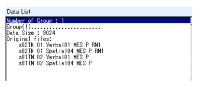

## Summary Statisticデータの出力

選択中の Summary Statistic データを展開し出力する方法を示しま す。
Text Out ボタン(A)は検定対象データをCSVファイルに出力します。 

CSV ファイルの例は次のようになります。4行目に各列のヘッダが記載され、5行目以下に対応するデータが出力されます。

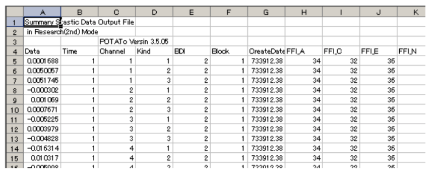

Export WS ボタン(B)は検定対象データを MATLAB Workspace に出力します。出力される変数 名は ExpandedSummaryzedData で、構造体になります。

ExpandedSummaryzedData.header にはヘッダがセルストリングとして格納されています。

ExpandedSummaryzedData.data には各列が ExpandedSummaryzedData.header に対応したデー タがセルの2次元行列で格納されます。

## 統計的検定の実施

選択中の Summary Statistic データに対し統計的検定を行います。
最初に、ポップアップメニュー(A)から検定関数を選択します。
関数を選択するとパラメータ設定領域に GUI が表示されます。これらの GUI を操作し、統計量算出のためのパラメータを設定します。GUIは関数に依存し、ここでは説明しません。
設定パラメータは、保存ボタン(B)でファイルに保存でき、ロードボタン(C)で読み込むことができます。
選択した関数のオンラインヘルプを確認する場合はヘルプトグルボタン(D)を押下状態にしてください。

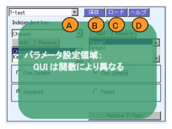

[目次へ](#Research Mode 操作マニュアル)

###  

