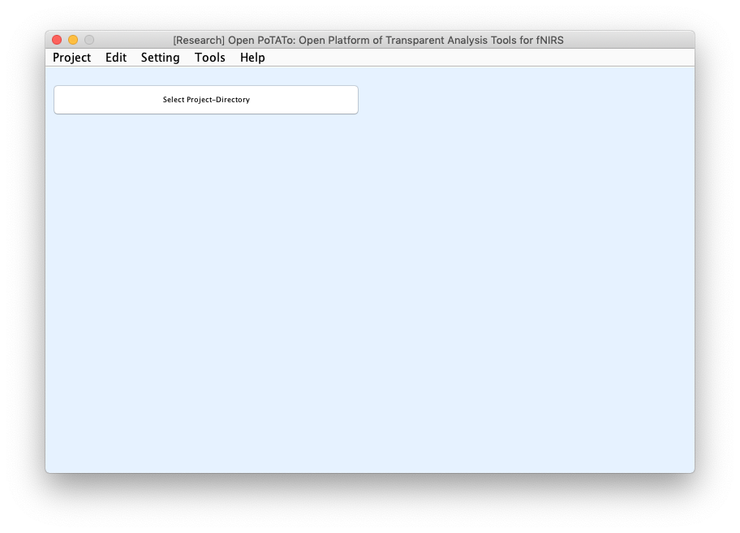
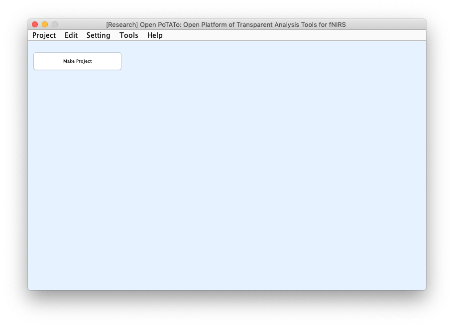
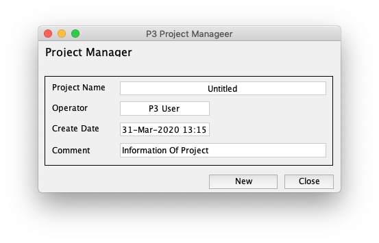
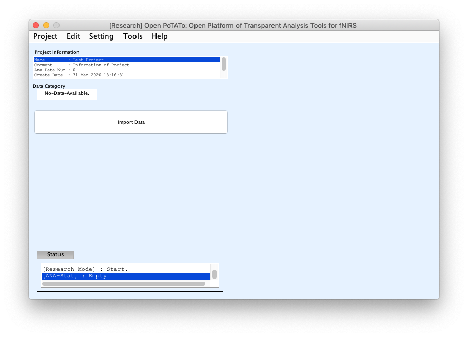
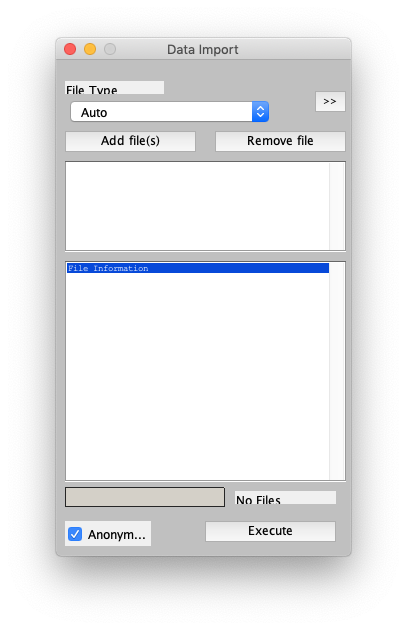
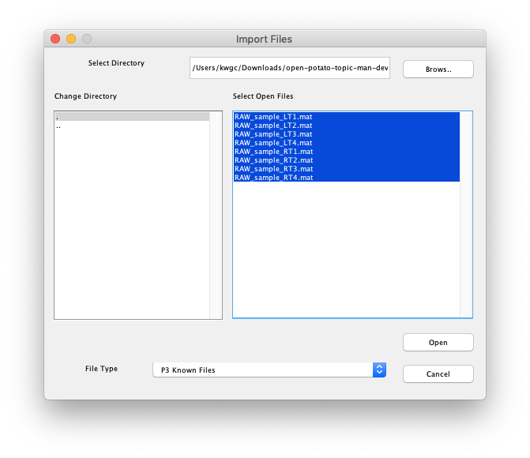
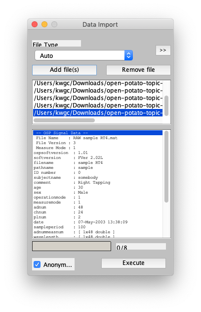
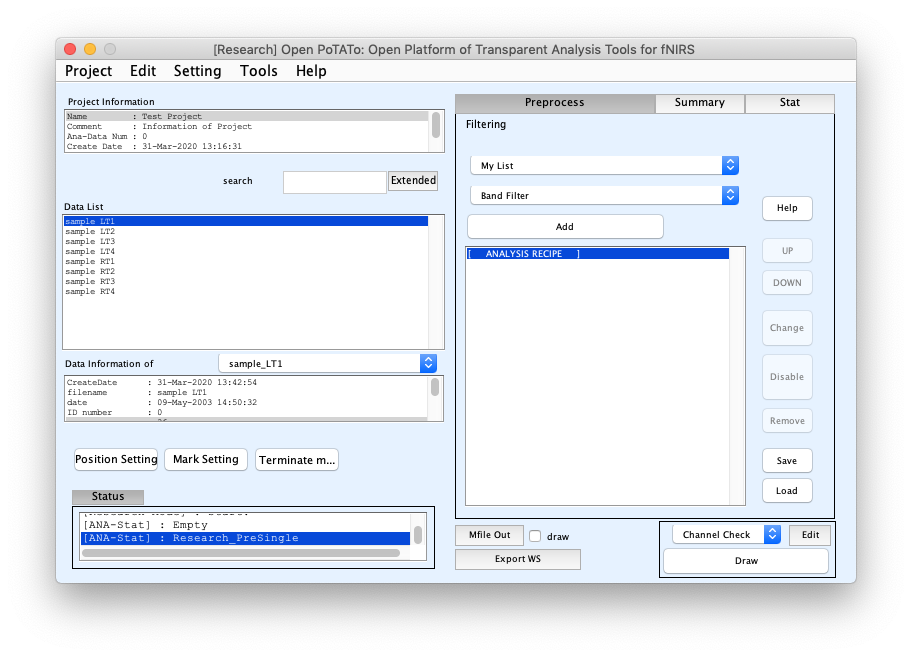
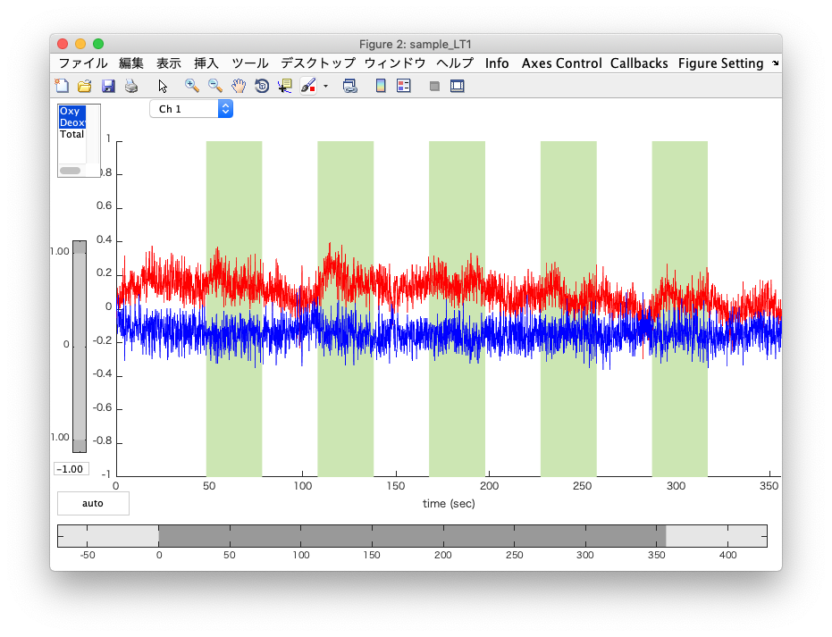

# はじめての起動

## Project Directoryの作成

はじめて起動したときには**Project Directory**を設定するウィンドウが開きます。また、操作ガイドも開きます。ウィンドウの **[Select Projrct-Directory]** と書かれたボタンをクリックして、コンピュータの任意のフォルダをひとつ選択してください。Open PoTAToではこのフォルダを「Project Directory」として利用します。「Project Directory」は、解析するためのRAWデータや解析結果などの解析関連データを保存する「Project」が保管される場所です。「Project」の作成方法は次の節で説明します。



``` 
### 補足説明 ###
複数の利用者が同一の環境で作業をする場合は、「Project Directory」を利用者ごとに設定すれば、
ほかの人のデータを壊してしまう心配はありません。

「Project Directory」は、Platformの起動後、
メインウィンドウのメニュー「Setting」→「Project Directory」から変更できます。

「Project Directory」に、すでに解析データが含まれる場合は、自動的に認識され、読み出しが可能になります。
```


<!-- ここからさきは[ステップガイド](Step-Guide.md)と重複 -->


## Projectの作成

Project Directoryの作成が完了すると、ウィンドウには **[Make Project]** ボタンが表示されます。



 **[Make Project]** ボタンをクリックすると、**Project Manager** ダイアログが起動します。このダイアログでは、Projectを作成することができます。Projectは実験テーマなどデータを管理しやすいまとまりごとに作成するとよいでしょう。Project NameにはProjectの名称、Operatorには作成者など、Commentにはコメントを記入してください。ただし、ここで使える文字は**半角文字** のうちフォルダ名やファイル名使える文字と同じです。ダイアログ右下の **[New]** ボタンをクリックするとProjectが作成されます。




## データの読み込みと表示

Projectの作成が完了すると、メインウィンドウの表示が変わり、左上にプロジェクトの情報が表示されるようになります。 **[Import Data]** ボタンを押すと **Data Import** ダイアログが起動し、データの読み込みができるようになります。



 **Data Import** ダイアログでは **Add file(s)** ボタンをクリックするとファイルが選択できるようになります。




Open PoTAToをインストールしたフォルダの **man/sample/フォルダ** にサンプルデータがあります。すべて選択して右下の **Open** ボタンを押してみましょう。




すると、 **Data Import** ダイアログにファイルのリストが表示されます。ダイアログではファイルの内容を確認することができます。右下の **Execute** ボタンを押すと、ファイルが読み込まれ、ダイアログが閉じます。




データが読み込まれるとメインウィンドウが更新されます。左側中段に読み込んだデータのリストがあります。

Open PoTAToではこのような状態のメインウィンドウをつかって、データのフィルタリングをしたり、データを表示したりできます。詳細な操作は他のマニュアルを参照してください。

ここでは試しに、グラフを表示してみましょう。データを一つ選択してメインウィンドウ右下にある **[Draw]** ボタンを押してみましょう。



このグラフは選択したデータ「sample LT1」のCh1の波形を示しています。このようなグラフの他にも様々なパターンでデータを表示することができます。



次はあなたのデータを読み込んでみましょう。各社から提供されている[読み込みプラグインのインストール](InstallPrepro.md)に進んでください。

サンプルデータを使ってOpen PoTAToの試用をする場合は、[Open PoTAToファーストステップガイド](Step-Guide.md)に進んでください。


[Open PoTAToドキュメントリストへ](index.md)


