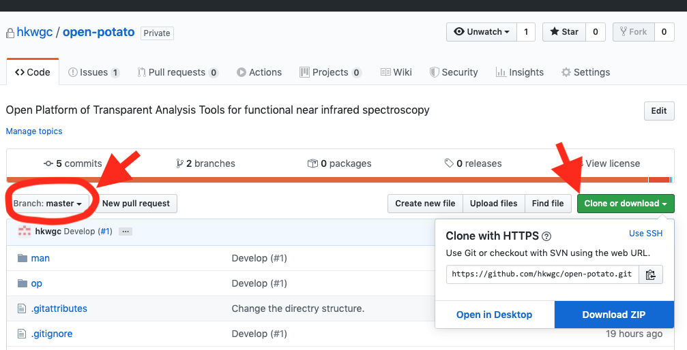

# Open PoTATo インストールマニュアル


1. MATLABをインストールしてください。

2. [トップページ](https://github.com/hkwgc/open-potato)からファイルをダウンロードします。
下図のトップページの左上方の赤丸の箇所が **[Branch: master]** であることを確認してください。
右上方の **[Clone or Download]** をクリックするとポップアップが表示されるので、 **[Download ZIP]** をクリックします。




ダウンロードしたファイルの名前は下記のとおりです。

```
open-potato-master.zip
```


3. ダウンロードしたopen-potato-master.zipを適当なフォルダに解凍してください[^1] 
   解凍後のフォルダ構成は以下のようになります。

```
-\op
-\man
-LISENCE
-README.md
-README_EN.md
```

4. カレントディレクトリ(現在のフォルダー)を変更してください。
   MATLABを起動し，カレントディレクトリを展開したフォルダの

```
op\
```

に設定します。設定は MATLAB メイン画面中の MATLAB ツールバー:「現在のフォルダー」からできます。


5. PoTAToを起動します。MATLABコマンドラインに

``` matlab
>> P3
```

と入力し、Enterキーを押すとOpen PoTAToが起動します。[^2]


