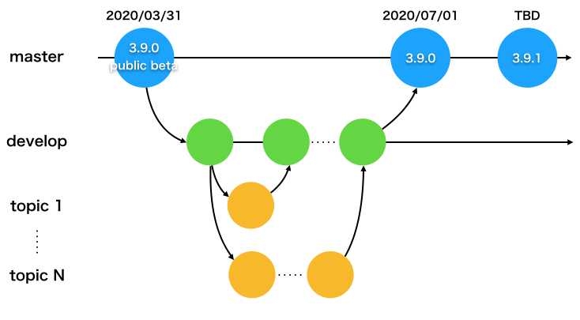

# Open PoTATo Developper Manual

## 概要

Open PoTAToの開発指針です。

git, github, MATLAB, Markdown, htmlに関して基本的な知識があることを前提に記載しています。

## 開発環境

### gitとgithub

ソースコード/ドキュメントのバージョン管理はgitとgithubの機能を使います。

githubには3つのリポジトリを用意してあります。

- [Open PoTATo本体](https://github.com/hkwgc/open-potato)

- [アドオンリスト](https://github.com/hkwgc/open-potato-add-on-lists)

- [フォーラム](https://github.com/hkwgc/open-potato-forum)

Open PoTAToの開発や運営に関わるissueはOpen PoTATo本体のリポジトリのissueに記載してください。アドオンリストやフォーラムの運営方針に関しても本体のリポジトリのissueで議論するようにしてください。

アドオンリストには読み込みプラグイン、開発プラグイン、レシピのリストのみを掲載します。

フォーラムにはユーザーからの質問とFAQのみを掲載します。ユーザーからの質問はこのリポジトリのissueに記載していただくこととします。

### MATLAB

ソースコードはMATLABで開発します。

MATLABは半年に1回アップデートされます。開発にはR2016a以降のバージョン(バージョン 9.x)の何れかを使ってください。

### ドキュメント

Open PoTATo本体に関するドキュメントの原文はMarkdown形式で作成します。Markdown形式のドキュメントはインターネットにアクセスできる場合には、Githubで閲覧することができます。ただし、Markdown形式のドキュメントはMATLABのヘルプブラウザでは表示できません。インターネットに接続できないPCにインストールしたユーザーにもドキュメントを提供したい場合は、htmlファイル(もしくはPDFファイル)も併せて作成してください。ほとんどのMarkdownエディタにはhtmlやpdfにエクスポートする機能があるはずです。

#### ドキュメント作成用ソフトウェアの紹介
3.9.0 public betaのドキュメント作成の際にはMarkdownエディタ/ビューワとして、[Typora](https://typora.io/)を使用しました。

ただし、GithubではTOCによる目次の自動生成をしてくれません。目次の作成とhtmlの出力は[Visual Studio Code](https://azure.microsoft.com/ja-jp/products/visual-studio-code/)に下記のプラグインを入れて実行しています。

**Name: Auto Markdown TOC**
Id: huntertran.auto-markdown-toc
Description: Markdown TOC (Table Of Contents) Plugin for Visual Studio Code.
Publisher: Hunter Tran
VS Marketplace Link: https://marketplace.visualstudio.com/items?itemName=huntertran.auto-markdown-toc
Markdown の目次を作成するためのプラグインです。

**Name: Markdown PDF**
Id: yzane.markdown-pdf
Description: Convert Markdown to PDF
Publisher: yzane
VS Marketplace Link: https://marketplace.visualstudio.com/items?itemName=yzane.markdown-pdf
Markdownファイルの保存時に自動的にhtmlやpdfのファイルを作成するためのプラグインです。htmlのスタイルシートは⁨op/ ⁨html/ ⁨ja⁩/github-markdown.cssをお使いください。

## 開発方針

### ブランチ

本体のリポジトリにはmasterとdevelopの2つのブランチを常に用意します。個別の開発/修正案件のためにはtopicブランチを随時作成してください。

masterブランチはユーザーにダウンロードしていただくソフトウェアそのものです。masterブランチはdevelopブランチを「Create a merge commit」して更新します。

developブランチは開発者向けのブランチです。開発/修正の案件ごとにdevelopブランチからtopic ブランチをForkしてください。開発/修正が完了したらtopicブランチを「Squash and merge」して、developブランチを更新してください。

topicブランチの名称は任意です。開発途中のコミットメッセージはメモ書き適当でかまいません。developブランチに「Squash and merge」するときのコミットメッセージは変更点をわかりやすくまとめてください。

## ご意見・ご質問

この運営方針に関してのご意見は本体のリポジトリのissueに記載してください。記載ミスの修正などの些細な修正は、topical ブランチを作成してpull requestしていただけると助かります。

